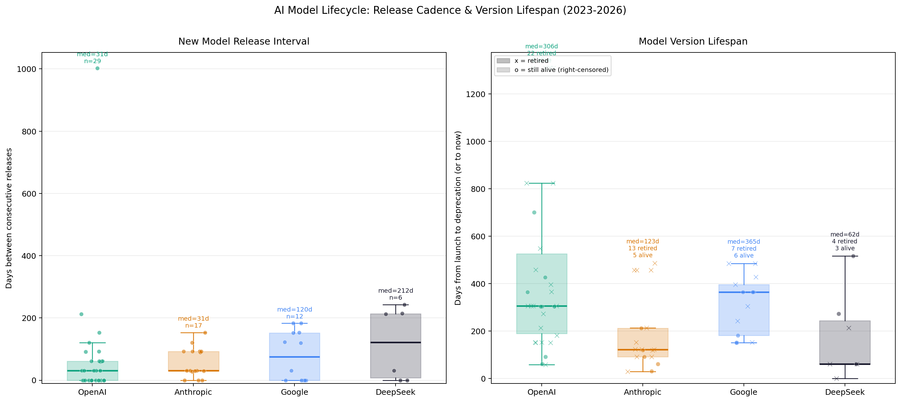

# AI Model Lifecycle: Release Cadence & Version Lifespan

数据源 `token-price.csv`。去除同模型降价/缓存变体/促销切换后的纯新模型发布事件。
退市日期来自 DEPRECATED 表（CSV notes + Reddit 退市帖 + 官方公告）。
仍在售模型的寿命为右删失（right-censored，截至 2026-06）。

## 图表

- **左图**：各家连续新模型发布的间隔天数（箱线图 + 散点）。
- **右图**：各具体版本从发布到退市的天数（x = 已退市，o = 仍在售/右删失）。

## 发布间隔统计

| Provider | Models | Min (days) | Median | Max | Mean |
|---|---|---|---|---|---|
| OpenAI | 30 | 0 | 31 | 1003 | 73 |
| Anthropic | 18 | 0 | 31 | 153 | 59 |
| Google | 13 | 0 | 120 | 183 | 79 |
| DeepSeek | 7 | 0 | 212 | 243 | 117 |

## 各版本寿命明细（按寿命降序）

| Provider | Model | Days | Months | Status |
|---|---|---|---|---|
| OpenAI | GPT-3 Davinci | 1309 | 43.6 | retired |
| OpenAI | GPT-3 Curie | 1309 | 43.6 | retired |
| OpenAI | GPT-3 Babbage | 1309 | 43.6 | retired |
| OpenAI | GPT-3 Ada | 1309 | 43.6 | retired |
| OpenAI | gpt-4 (8K) | 823 | 27.4 | retired |
| OpenAI | gpt-4-32k | 823 | 27.4 | retired |
| OpenAI | gpt-4o-mini | 700 | 23.3 | alive |
| OpenAI | gpt-4o-2024-08-06 | 549 | 18.3 | retired |
| OpenAI | gpt-3.5-turbo-0301 | 458 | 15.3 | retired |
| OpenAI | o3 | 426 | 14.2 | alive |
| OpenAI | gpt-4-turbo (1106-preview) | 396 | 13.2 | retired |
| OpenAI | gpt-3.5-turbo-16k-0613 | 366 | 12.2 | retired |
| OpenAI | o3-pro | 365 | 12.2 | alive |
| OpenAI | gpt-4.1 | 306 | 10.2 | retired |
| OpenAI | gpt-4.1-mini | 306 | 10.2 | retired |
| OpenAI | gpt-4.1-nano | 306 | 10.2 | retired |
| OpenAI | o4-mini | 306 | 10.2 | retired |
| OpenAI | gpt-5 | 304 | 10.1 | alive |
| OpenAI | gpt-5-mini | 304 | 10.1 | alive |
| OpenAI | gpt-5-nano | 304 | 10.1 | alive |
| OpenAI | o1-mini | 273 | 9.1 | retired |
| OpenAI | gpt-3.5-turbo-1106 | 213 | 7.1 | retired |
| OpenAI | o1 (GA) | 182 | 6.1 | retired |
| OpenAI | gpt-4o-2024-05-13 | 153 | 5.1 | retired |
| OpenAI | o1-preview | 153 | 5.1 | retired |
| OpenAI | gpt-3.5-turbo-0125 | 152 | 5.1 | retired |
| OpenAI | o3-mini | 151 | 5.0 | retired |
| OpenAI | gpt-5.4 | 92 | 3.1 | alive |
| OpenAI | gpt-5.5 | 61 | 2.0 | alive |
| OpenAI | gpt-4.5-preview | 59 | 2.0 | retired |
| Anthropic | Claude 2.1 | 486 | 16.2 | retired |
| Anthropic | Claude 3 Opus | 457 | 15.2 | retired |
| Anthropic | Claude 3 Sonnet | 457 | 15.2 | retired |
| Anthropic | Claude 3 Haiku | 457 | 15.2 | retired |
| Anthropic | Claude Instant 1.2 | 213 | 7.1 | retired |
| Anthropic | Claude Opus 4.5 | 212 | 7.1 | alive |
| Anthropic | Claude Sonnet 4.5 | 153 | 5.1 | retired |
| Anthropic | Claude Sonnet 4 | 123 | 4.1 | retired |
| Anthropic | Claude Haiku 4.5 | 123 | 4.1 | retired |
| Anthropic | Claude 3.5 Sonnet | 122 | 4.1 | retired |
| Anthropic | Claude 3.7 Sonnet | 120 | 4.0 | retired |
| Anthropic | Claude Sonnet 4.6 | 120 | 4.0 | alive |
| Anthropic | Claude Opus 4 | 92 | 3.1 | retired |
| Anthropic | Claude Opus 4.1 | 92 | 3.1 | retired |
| Anthropic | Claude Opus 4.6 | 92 | 3.1 | alive |
| Anthropic | Claude Opus 4.7 | 61 | 2.0 | alive |
| Anthropic | Claude Opus 4.8 | 31 | 1.0 | alive |
| Anthropic | Claude 3.5 Haiku (launch) | 30 | 1.0 | retired |
| Google | Gemini 2.0 Flash | 485 | 16.2 | retired |
| Google | Gemini 2.0 Flash-Lite | 485 | 16.2 | retired |
| Google | Gemini 1.0 Pro | 428 | 14.3 | retired |
| Google | Gemini 1.5 Flash (<=128K) | 396 | 13.2 | retired |
| Google | Gemini 2.5 Pro (<=200K) | 365 | 12.2 | alive |
| Google | Gemini 2.5 Flash | 365 | 12.2 | alive |
| Google | Gemini 2.5 Flash-Lite | 365 | 12.2 | alive |
| Google | PaLM 2 text-bison | 305 | 10.2 | retired |
| Google | Gemini 1.5 Flash-8B (<=128K) | 243 | 8.1 | retired |
| Google | Gemini 3.1 Pro (<=200K) | 182 | 6.1 | alive |
| Google | Gemini 1.5 Pro (<=128K) | 153 | 5.1 | retired |
| Google | Gemini 3.5 Flash | 151 | 5.0 | alive |
| Google | Gemini 3.1 Flash-Lite | 151 | 5.0 | alive |
| DeepSeek | DeepSeek-R1 (deepseek-reasoner) | 516 | 17.2 | alive |
| DeepSeek | DeepSeek-V3.2-Exp | 273 | 9.1 | alive |
| DeepSeek | DeepSeek-V2 (deepseek-chat) | 214 | 7.1 | retired |
| DeepSeek | DeepSeek-V3 (promo) | 62 | 2.1 | retired |
| DeepSeek | DeepSeek-V4 Flash | 61 | 2.0 | alive |
| DeepSeek | DeepSeek-V4 Pro (promo 75% off) | 61 | 2.0 | retired |
| DeepSeek | DeepSeek-V3.1 (unified) | 0 | 0.0 | retired |

## 观察

- **OpenAI 发布最密**：中位间隔 31 天，2025Q2 一个月同时发 5 个模型（gpt-4.1 全家 + o3 + o4-mini）。
- **Anthropic 节奏稳定**：中位间隔 31 天，但 2024Q2-Q4 有 153 天空窗（3.5 Sonnet 到 3.5 Haiku）。
  2025Q4 起 Opus 进入月更节奏（4.5→4.6→4.7→4.8）。
- **Google 最稀疏**：中位间隔 120 天，在大版本间有长空窗（1.0→1.5 半年，1.5→2.0 四个月）。
- **DeepSeek 最年轻**：仅 7 个模型，中位间隔最长（212 天），但正在加速（V4 两个变体同月发布）。
- **寿命**：OpenAI 模型平均寿命最短（gpt-4.5-preview 仅 59 天），且 2026-01 批量退市 4 个模型。
  gpt-4-32k 最长寿（~27 个月），但大部分时间用户很少访问到它——它活着只因为没人退它。
