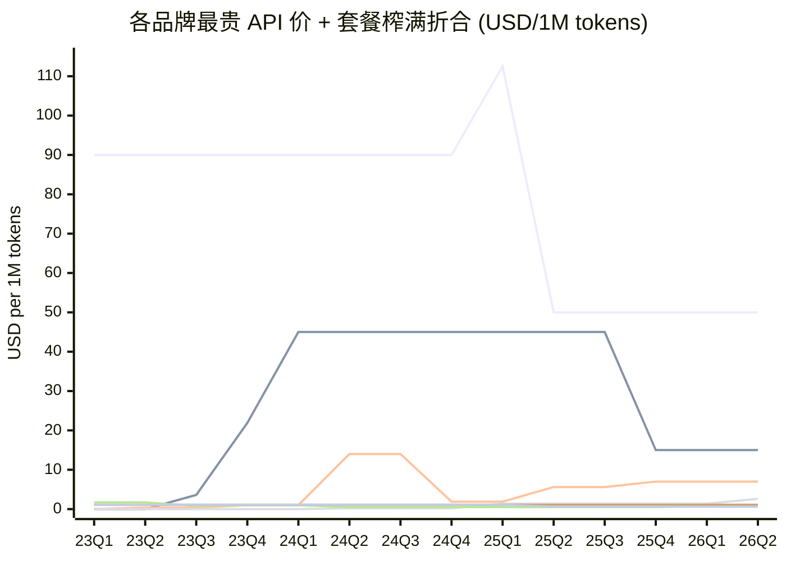

# 各品牌最贵 API 价格 + 套餐榨满折合 per-token（2023–2026）

**旗舰 = 同一厂家在同一时段 API 目录里最贵的文本模型**（含推理模型），
而不是钉死某个产品线。模型退市后自动让位给次高价。
这样看到的是**各品牌能卖出的天花板价**随时间的变化。

套餐折算假设用户全用这个最贵的模型（因为套餐内用哪个模型不影响价格）。
全部画在一张图上比较。数据源 `chat/token-price.csv`，本文由 `token-price.py` 生成。

## 折算口径

- **API 最贵模型** blended =（input + output）/ 2，每季度取目录中**在售且最贵**的那个。
  模型退市（DEPRECATED 表）后自动让位给次高价。排除音频 / embedding 等非文本模型。
- **套餐折合 per-token**：只看「把配额用满」。每条消息 = 2000 token。
  - **最高折合（最便宜套餐榨满）**：折扣率低、单价高。
  - **最低折合（最贵套餐榨满）**：批量折扣大、单价低。
  - 相对配额「N× Pro」= 倍数 × Pro token 配额。/N 小时按 24×7 满载。

## 对比图

线序（颜色按此顺序）：

1. **OpenAI API 最贵** — 终值 $50.0/1M
2. **Anthropic API 最贵** — 终值 $15.0/1M
3. **Google API 最贵** — 终值 $7.0/1M
4. **DeepSeek API 最贵** — 终值 $2.6/1M
5. **OpenAI Plus 榨满** — 终值 $0.8/1M
6. **Anthropic Pro 榨满(最高)** — 终值 $1.1/1M
7. **Anthropic Max20x 榨满(最低)** — 终值 $0.6/1M

## 各季度最贵模型是谁（变更点）

| 品牌 | 季度 | 当期最贵模型 | blended $/1M |
|---|---|---|---|
| OpenAI | 23Q1 | gpt-4-32k | 90.00 |
| OpenAI | 25Q1 | gpt-4.5-preview | 112.50 |
| OpenAI | 25Q2 | o3-pro | 50.00 |
| Anthropic | 23Q3 | Claude Instant 1.2 | 3.57 |
| Anthropic | 23Q4 | Claude 2.1 | 21.85 |
| Anthropic | 24Q1 | Claude 3 Opus | 45.00 |
| Anthropic | 25Q2 | Claude Opus 4 | 45.00 |
| Anthropic | 25Q3 | Claude Opus 4.1 | 45.00 |
| Anthropic | 25Q4 | Claude Opus 4.5 | 15.00 |
| Google | 23Q2 | PaLM 2 text-bison | 0.38 |
| Google | 23Q4 | Gemini 1.0 Pro | 1.00 |
| Google | 24Q2 | Gemini 1.5 Pro (<=128K) | 14.00 |
| Google | 24Q4 | Gemini 1.5 Pro (<=128K cut) | 1.88 |
| Google | 25Q2 | Gemini 2.5 Pro (<=200K) | 5.62 |
| Google | 25Q4 | Gemini 3.1 Pro (<=200K) | 7.00 |
| DeepSeek | 24Q2 | DeepSeek-V2 (deepseek-chat) | 0.21 |
| DeepSeek | 24Q4 | DeepSeek-V3 (promo) | 0.21 |
| DeepSeek | 25Q1 | DeepSeek-R1 (deepseek-reasoner) | 1.37 |
| DeepSeek | 26Q2 | DeepSeek-V4 Pro (standard) | 2.61 |

## 套餐榨满折合明细

| 品牌 | 生效 | 套餐 | 月价 | 榨满折合 $/1M |
|---|---|---|---|---|
| OpenAI | 2023-03 | ChatGPT Plus | $20 | 1.67 |
| OpenAI | 2023-07 | ChatGPT Plus | $20 | 0.83 |
| OpenAI | 2023-11 | ChatGPT Plus | $20 | 1.04 |
| OpenAI | 2024-05 | ChatGPT Plus | $20 | 0.52 |
| OpenAI | 2025-08 | ChatGPT Plus | $20 | 0.52 |
| OpenAI | 2026-03 | ChatGPT Plus | $20 | 0.78 |
| Anthropic | 2023-09 | Claude Pro | $20 | 1.11 |
| Anthropic | 2025-04 | Claude Max 5x | $100 | 1.11 |
| Anthropic | 2025-04 | Claude Max 20x | $200 | 0.56 |

## 假设与局限

- **每条消息 2000 token** 是折算口径；改它会整体平移套餐线但不改品牌间相对关系。
- **模型退市时间**来自 CSV notes + 官方公告，部分为近似（±1 月）。退市判断影响「某季度谁最贵」的答案，
  但跨品牌相对高低不受单条退市日期影响。
- **可量化套餐有限**：OpenAI 只有 Plus $20 可量化（Pro $200 标称无限，无配额可榨满）；
  Anthropic 借「N× Pro」得到 Pro→Max20x 区间。Google（无数字配额）、DeepSeek（免费无付费档）、
  Cursor（按量透传 ≈ API 价）无法折算，未入图。
- 套餐配额取自 CSV `usage_limit`，多为 Reddit 实测某时点观察（OpenAI 多次静默改配额）；
  Claude Pro 后期叠加的周限未量化。
