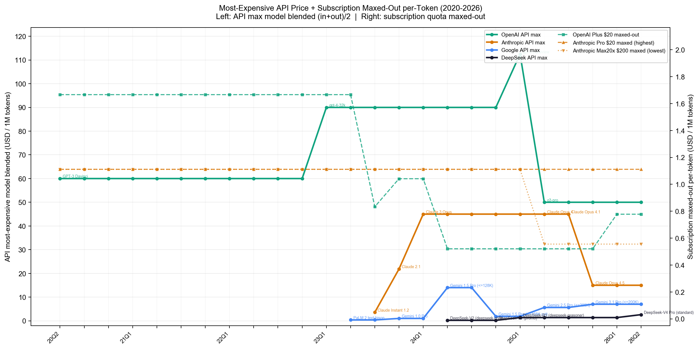
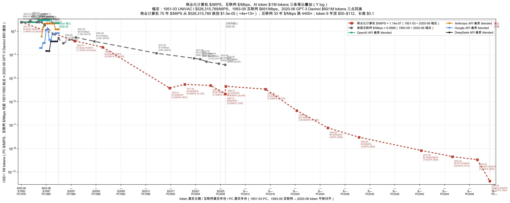
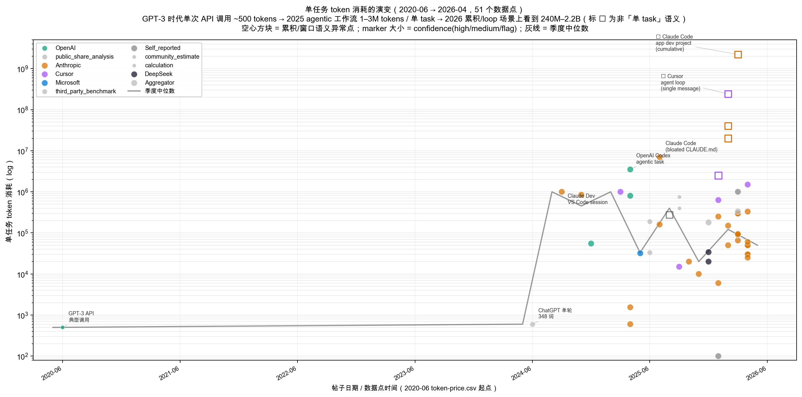
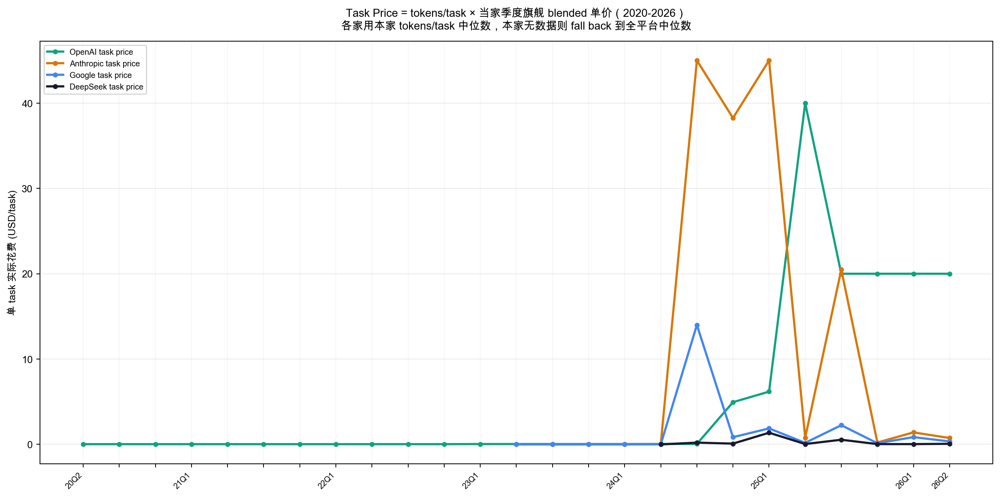
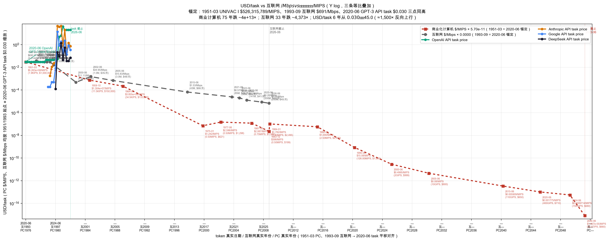

# 各品牌最贵 API 价格 + 套餐榨满折合 per-token（2020–2026）

**旗舰 = 同一厂家在同一时段 API 目录里最贵的文本模型**（含推理模型），
模型退市后自动让位给次高价。这样看到的是**各品牌天花板价**随时间的变化。

套餐折算假设用户全用最贵模型（套餐内用哪个不影响价格）。
数据源 `token-price.csv`，本文由 `token-price.py` 生成。

## 对比图

- **左轴（实线）**：各家 API 目录中在售最贵模型的 blended 价（(input+output)/2，USD/1M tokens）。
  线上标注了当期最贵模型名。
- **右轴（虚线）**：套餐把配额用满后的折合 per-token。每条消息按 2000 token 折算。
  - **最高折合**（最便宜套餐榨满）= 折扣率低、单价高。
  - **最低折合**（最贵套餐榨满）= 批量折扣大、单价低。

## 折算口径

- API blended 每季度取在售最贵；退市模型（DEPRECATED 表）让位次高价。排除音频/embedding 模型。
- 套餐折合 = 月价 ÷（月配额 × 2000）。相对配额「N× Pro」= 倍数 × Pro 配额。
  /N 小时按 24×7 满载。

## 各季度最贵模型是谁（变更点）

| 品牌 | 季度 | 当期最贵模型 | blended $/1M |
|---|---|---|---|
| OpenAI | 20Q2 | GPT-3 Davinci | 60.00 |
| OpenAI | 23Q1 | gpt-4-32k | 90.00 |
| OpenAI | 25Q1 | gpt-4.5-preview | 112.50 |
| OpenAI | 25Q2 | o3-pro | 50.00 |
| Anthropic | 23Q3 | Claude Instant 1.2 | 3.57 |
| Anthropic | 23Q4 | Claude 2.1 | 21.85 |
| Anthropic | 24Q1 | Claude 3 Opus | 45.00 |
| Anthropic | 25Q2 | Claude Opus 4 | 45.00 |
| Anthropic | 25Q3 | Claude Opus 4.1 | 45.00 |
| Anthropic | 25Q4 | Claude Opus 4.5 | 15.00 |
| Google | 23Q2 | PaLM 2 text-bison | 0.38 |
| Google | 23Q4 | Gemini 1.0 Pro | 1.00 |
| Google | 24Q2 | Gemini 1.5 Pro (<=128K) | 14.00 |
| Google | 24Q4 | Gemini 1.5 Pro (<=128K cut) | 1.88 |
| Google | 25Q2 | Gemini 2.5 Pro (<=200K) | 5.62 |
| Google | 25Q4 | Gemini 3.1 Pro (<=200K) | 7.00 |
| DeepSeek | 24Q2 | DeepSeek-V2 (deepseek-chat) | 0.21 |
| DeepSeek | 24Q4 | DeepSeek-V3 (promo) | 0.21 |
| DeepSeek | 25Q1 | DeepSeek-R1 (deepseek-reasoner) | 1.37 |
| DeepSeek | 26Q2 | DeepSeek-V4 Pro (standard) | 2.61 |

## 套餐榨满折合明细

| 品牌 | 生效 | 套餐 | 月价 | 榨满折合 $/1M |
|---|---|---|---|---|
| OpenAI | 2023-03 | ChatGPT Plus | $20 | 1.67 |
| OpenAI | 2023-07 | ChatGPT Plus | $20 | 0.83 |
| OpenAI | 2023-11 | ChatGPT Plus | $20 | 1.04 |
| OpenAI | 2024-05 | ChatGPT Plus | $20 | 0.52 |
| OpenAI | 2025-08 | ChatGPT Plus | $20 | 0.52 |
| OpenAI | 2026-03 | ChatGPT Plus | $20 | 0.78 |
| Anthropic | 2023-09 | Claude Pro | $20 | 1.11 |
| Anthropic | 2025-04 | Claude Max 5x | $100 | 1.11 |
| Anthropic | 2025-04 | Claude Max 20x | $200 | 0.56 |

## 与商业化计算机 $/MIPS、互联网 $/Mbps 的三条等比叠加

把商业化计算机（1951-）、美国互联网接入（1993-）、AI token（2020-）三条曲线统一到
token 坐标系：

- **时间平移**：三条线各自起点对齐到 token 2020-06，
  - 商业计算机 1951-03 → 2020-06（+833 月，**69 年**），最后点 2026-06 落到 token 2095-06；
  - 互联网 1993-09 → 2020-06（+321 月），最后点 2026-06 落到 token 2053-03；
  - token 自身原位。
- **指标统一**：均取"行业核心通缩指标"——
  - 计算机：**$/MIPS**（整机售价 ÷ 每秒指令数）。横跨电子管（UNIVAC 1.9 KIPS）→
    晶体管（IBM 1401 11.5 KIPS）→ 集成电路（System/360 34.5 KIPS）→ 微处理器（Intel 8080）→
    多核（i5 4-10c）→ NPU（45 TOPS）。
  - 互联网：**$/Mbps**（月费 ÷ 典型下行速率）；
  - token：**$/1M tokens**（API 最贵模型 blended）。
- **等比缩放**：三条线起点价 ≡ 2020-06 GPT-3 Davinci $60/1M tokens，
  - 计算机：1951-03 UNIVAC I 约 **$5.26 亿/MIPS**（$1M ÷ 0.0019 MIPS）→ $60；
  - 互联网：1993-09 约 $691/Mbps → $60；
  - token 不缩放。
- **Y 轴 log**：商业计算机 75 年 $/MIPS 跌约 **3.6 × 10^13 ×**（5.26 亿 → 1.47e-5），
  互联网 33 年 $/Mbps 跌 ~4400×，token 6 年最贵在 $50–$112 + 长尾 $0.1。

- **红虚线**：商业化计算机 $/MIPS，方形 marker（含 1951 UNIVAC I 起点的电子管时代）。
- **灰虚线**：互联网 $/Mbps，圆形 marker。
- **彩实线**：各家 token API 最贵模型 blended。

**观感**：log 空间里 75 年计算机 $/MIPS 曲线接近完美指数下行——可清晰看到 1959 晶体管
（IBM 1401）一刀切下来、1971 微处理器再切一刀、1995 Pentium 起每年 ×1.5–2、2026 NPU 再
跳一阶。互联网斜率明显比计算机缓；**token 6 年下行斜率若延长，理论上 8–10 年能覆盖
计算机 75 年走过的下行幅度**——AI token 是历史科技品类中"通缩斜率"最陡的一类。

### 商业化计算机整机价 → $/MIPS 数据点

| 日期 | 整机售价 | 算力 | $/MIPS | 备注 |
|---|---|---|---|---|
| 1951-03 | $1,000,000.00 | 1.9 KIPS | $5.263e+08 | UNIVAC I：5000 电子管 @ 2.25 MHz；1.9 KIPS |
| 1959-10 | $150,000.00 | 11.5 KIPS | $1.304e+07 | IBM 1401：晶体管 @ 87 KHz；11.5 KIPS |
| 1964-04 | $133,000.00 | 34.5 KIPS | $3.855e+06 | IBM System/360 M30：SLT @ 1 MHz；34.5 KIPS |
| 1975-01 | $621.00 | 0.50 MIPS | $1,242 | Altair 8800：Intel 8080 @ 2.0 MHz；0.5 MIPS |
| 1977-06 | $1,298.00 | 0.50 MIPS | $2,596 | Apple II：MOS 6502 @ 1.02 MHz |
| 1981-08 | $1,565.00 | 0.75 MIPS | $2,087 | IBM PC 5150：Intel 8088 @ 4.77 MHz |
| 1983-12 | $199.00 | 0.50 MIPS | $398 | C64 价格战钉死 $199；MOS 6510 |
| 1984-01 | $2,495.00 | 1.40 MIPS | $1,782 | Macintosh 128K：MC68000 @ 7.83 MHz |
| 1990-06 | $2,500.00 | 2.50 MIPS | $1,000 | Compaq 386SX @ 16 MHz |
| 1995-06 | $1,900.00 | 126.00 MIPS | $15.08 | Pentium 75；超标量 |
| 2000-06 | $999.00 | 2 GIPS | $0.4995 | Athlon / Pentium III @ 1.0 GHz |
| 2005-06 | $800.00 | 10 GIPS | $0.08 | Pentium 4 Prescott @ 3.0 GHz；主频墙 |
| 2015-06 | $650.00 | 110 GIPS | $0.005909 | i5-6500 4c；~110 GFLOPS |
| 2020-06 | $710.00 | 400 GIPS | $0.001775 | Ryzen 5 3600 / i5-10400 6c；~400 GFLOPS |
| 2024-06 | $680.00 | 700 GIPS | $0.0009714 | i5-14400 10c；~700 GFLOPS |
| 2026-06 | $660.00 | 45.0 TIPS | $1.467e-05 | AI PC 12-14c + NPU；~45 TOPS |

数据来源：US Census Bureau（UNIVAC I）、IBM Archives（1401 / System/360 / IBM PC）、
Computer History Museum、Smithsonian（Altair 8800）、Apple Inc. 官方目录（Apple II）、
NYT Archive（1983 TI 退出）、IEEE Spectrum（C64 价格战）、Stanford "Making the Macintosh"、
PC Magazine via Google Books、Washington Post（1995 Pentium）、Gartner/IDC（2000 $999 价格战）、
BLS Computer Price Deflation、Intel ARK / AMD 官方处理器规格。

### 互联网月费 → $/Mbps 数据点

| 日期 | 名义月费 | 速率 (Mbps) | $/Mbps | 备注 |
|---|---|---|---|---|
| 1993-09 | $9.95 | 0.0144 | $690.97 | AOL $9.95/5h + $3.50/h；14.4k modem |
| 1994-12 | $9.95 | 0.0144 | $690.97 | AOL 跟进 Prodigy；14.4k 仍主流 |
| 1995-02 | $24.95 | 0.0288 | $866.32 | CompuServe $24.95/20h；28.8k modem |
| 1996-03 | $19.95 | 0.0288 | $692.71 | 独立 ISP $19.95 不限时；28.8k |
| 1996-07 | $19.95 | 0.0288 | $692.71 | AOL 双轨套餐；28.8k |
| 1996-12 | $19.95 | 0.0288 | $692.71 | AOL 全美无限拨号；28.8k |
| 1997-06 | $20.95 | 0.056 | $374.11 | 全行业锁死 $19.95–21.95；V.90 56k |
| 2000-06 | $49.99 | 4.5 | $11.11 | 早期宽带 3–6 Mbps；取均值 4.5 |
| 2002-06 | $34.95 | 1.0 | $34.95 | ADSL 入门级 ~1 Mbps（电信抢市场） |
| 2005-06 | $47.50 | 3.0 | $15.83 | Cable broadband typical 3 Mbps |
| 2015-06 | $65.62 | 43 | $1.53 | USTelecom BPI: 43 Mbps avg |
| 2021-06 | $48.42 | 85 | $0.57 | BPI: 85 Mbps avg |
| 2022-06 | $45.97 | 98 | $0.47 | BPI: 98 Mbps avg |
| 2023-06 | $41.31 | 141 | $0.29 | BPI: 141 Mbps avg |
| 2025-06 | $39.90 | 200 | $0.20 | BPI: 200+ Mbps |
| 2026-06 | $39.50 | 250 | $0.16 | BPI: 250+ Mbps |

互联网数据来源：EH.Net、NYT Archive (1994)、Computerworld、CNET、Smithsonian、Pew Research、
FCC Historical Reports、WSJ、Bruce Kushnick / Teletruth、**USTelecom Broadband Pricing Index**、
NCTA、BLS CPI (Internet Access Services)。

## 单任务 token 消耗的演变

token 单价跌了，但**单任务消耗的 token 量同期也涨了**——这是判断"用户实际净支出"是否真降的
关键变量。数据来自 `token-usage-amount.csv`（含 agent web 研究 + 从 Reddit 三步法挖出的
163 个高置信度数据点），其中 `unit=tokens_per_task` 原始 51 条，**剔除"累积/窗口"语义异常点
（如 Claude Code 5h 窗口聚合 20–40M、Cursor agent loop 单 message 241M、Claude Code app dev
累积 2.2B 等）后剩 45 个有效数据点**，时间跨 **2020-06 → 2026-04**。

- **散点**：每个数据点 = 一次"单任务/单 session"用量观察；颜色按 provider（OpenAI 绿、
  Anthropic 橙、Cursor 紫、其他灰），marker 大小按 confidence。
- **灰实线**：季度中位数趋势——直观看到 2020 → 2024 中位数从 ~500 tokens 涨到 ~10K-100K，
  2025 agentic 工作流后跳到 1–3M tokens/task 量级。

**结论**：单任务 token 量在 6 年内涨了 **~1000×–10000×**（GPT-3 API 调用 ~500 → Claude Code
session 1–3M）。同期最贵 API 单价大约跌 ~50%（$60 → $25–$50），便宜端跌 ~500×（DeepSeek $0.1）。
**净影响**：用户实际净支出仍在涨——单任务花钱量级是 6 年前的 ~10–100 倍。这与各家平台
吞吐 20–50× / 年的增长是同源现象（更长任务 + 更多用户 + 更高频调用）。

## 单 task 实际花费 USD（task-price）

把 **tokens/task** 和 **单价** 按品牌相乘，得到"用该家旗舰跑一个 task 要花多少钱"的
季度演变。与 token-price.png 同风格：4 家 API 实线 + 3 条套餐摊销虚线/点线，X 轴季度。

- **实线（4 条 API 旗舰）**：task price = 该家季度旗舰 blended × 该家季度 tokens/task 中位数 ÷ 1e6。
- **虚/点线（3 条套餐摊销）**：
  - **ChatGPT Plus $20 摊销** = OpenAI Plus 每 token 折合 × OpenAI tokens/task 中位数 ÷ 1e6
  - **Claude Pro $20 摊销** = Anthropic Pro per-token × Anthropic tokens/task 中位数
  - **Claude Max 20x $200 摊销** = Max20x per-token × Anthropic tokens/task 中位数
- **fallback 顺序**：本家本季度数据 → 全平台本季度中位数 → 上一季度沿用（forward-fill）。
- **provider 映射**：Cursor → Anthropic、Microsoft → OpenAI、community_estimate /
  third_party_benchmark / public_share_analysis / calculation 按归属厂家映射；
  Aggregator / Self_reported 不归本家、仅进全平台中位数。

**语义**：token-price.png（单价）× tokens-per-task.png（用量）= 用户实际感知的
**「每完成一件事要花多少钱」**。单价跌 ~10–100×、用量涨 ~1000–10000×，**净花费仍上行**
——这就是 ChatGPT Plus / Claude Pro / Cursor $20–$200 套餐 2025–2026 年纷纷加套使用限制
（周限、autocompact、premium request 配额）的根因。

## USD/task 与商业计算机 $/MIPS、互联网 $/Mbps 的等比叠加

用与 token 单价等比叠加图相同的方法（计算机 1951-03、互联网 1993-09、token 2020-06 三起点
平移到同一 Y 高度，Y 轴 log），把"按 API 价计算的 USD/task"作为 token 端的对照量替进去。
锚点：**2020-06 GPT-3 API typical task ≈ $0.03/task**（$60/1M × 500 tokens）。

- **红虚线**：商业计算机 $/MIPS（含 1951 UNIVAC I 起点）。
- **灰虚线**：互联网 $/Mbps。
- **彩实线**：4 家 API 旗舰 task price，2020-06 OpenAI 起 $0.03，2024–2026 agentic 后蹿到 $1–$45。

**核心反差**：商业计算机 75 年 $/MIPS 跌约 **3.6×10^13×**（5.26 亿 → 1.47e-5）、
互联网 33 年 $/Mbps 跌 ~4400×——这两条都是**指数下行**；而 USD/task 6 年从 $0.03
**反向上行到 $20–$45**（≈1000×）。**当历史上"单位资源价格 → 0"的曲线在 AI 时代是
"单任务花费 → ∞"**。

## 假设与局限

- **每条消息 2000 token** 是折算口径；改它整体平移套餐线但不改品牌相对关系。
- **模型退市时间**来自 CSV notes + Reddit 退市帖 + 官方公告，部分近似（±1 月）。
- **可量化套餐有限**：OpenAI 只有 Plus $20（Pro $200 无限不可榨满）；Anthropic 借「N× Pro」
  得到区间。Google/DeepSeek/Cursor 无法独立折算。
- 套餐配额多为 Reddit 实测某时点观察；Claude Pro 后期叠加的周限未量化。
- **互联网 $/Mbps** 由"名义月费 ÷ 该时段典型下行速率"算出，**未做通胀调整**。
  - **拨号时代速率**用主流 modem 标准估算（1993-1995 取 14.4k = 0.0144 Mbps、1995-1996 取
    28.8k = 0.0288 Mbps、1997 取 V.90 56k = 0.056 Mbps）——这是 ITU 标准 + 行业普及曲线
    的合理近似，但并非用户实测带宽（实际拨号常因线路衰减跑不满）。
  - **宽带初期速率**（2000–2005）用入门 tier 典型值：2000-06 取 4.5 Mbps（早期宽带 3–6 Mbps
    均值）、2002-06 取 1 Mbps（ADSL 入门级）、2005-06 取 3 Mbps（Cable 入门）；不同 tier
    取值会让 $/Mbps 上下浮动 ~2×。
  - **2015 后速率**采用 USTelecom Broadband Pricing Index 的 avg 下行——这是带宽与套餐价
    最权威的年度配对数据，置信度最高。
  - 月费均为名义美元；如做 CPI 调整后 1990s 价格还要再上浮 ~70%，会让早期 $/Mbps 更高，
    与现代的差距进一步拉大。
- **商业计算机 $/MIPS** 统一了 75 年的算力指标，但口径在不同时代有偏差：
  早期电子管 / 晶体管 / 集成电路时代的 KIPS / MIPS 是直接每秒指令数；
  Pentium 之后 superscalar + OOO 使 IPC > 1，2015+ 用 GFLOPS 近似 MIPS（FLOPS 包含 SIMD），
  2026 加上 NPU TOPS（AI 加速、非通用算力）——这些数字间存在 ~2–5× 的口径差，
  但量级上不影响曲线的指数下行斜率。
