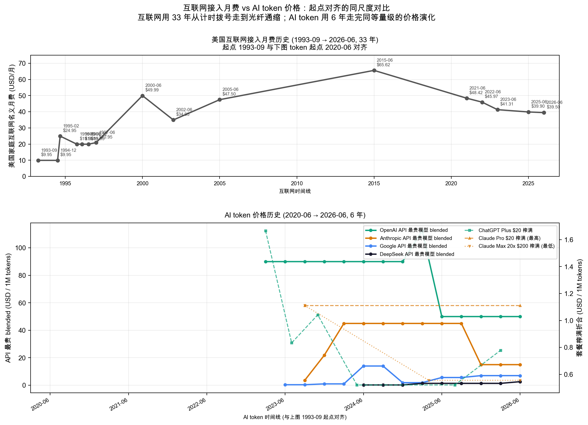

# 各品牌最贵 API 价格 + 套餐榨满折合 per-token（2020–2026）

**旗舰 = 同一厂家在同一时段 API 目录里最贵的文本模型**（含推理模型），
模型退市后自动让位给次高价。这样看到的是**各品牌天花板价**随时间的变化。

套餐折算假设用户全用最贵模型（套餐内用哪个不影响价格）。
数据源 `token-price.csv`，本文由 `token-price.py` 生成。

## 对比图

- **左轴（实线）**：各家 API 目录中在售最贵模型的 blended 价（(input+output)/2，USD/1M tokens）。
  线上标注了当期最贵模型名。
- **右轴（虚线）**：套餐把配额用满后的折合 per-token。每条消息按 2000 token 折算。
  - **最高折合**（最便宜套餐榨满）= 折扣率低、单价高。
  - **最低折合**（最贵套餐榨满）= 批量折扣大、单价低。

## 折算口径

- API blended 每季度取在售最贵；退市模型（DEPRECATED 表）让位次高价。排除音频/embedding 模型。
- 套餐折合 = 月价 ÷（月配额 × 2000）。相对配额「N× Pro」= 倍数 × Pro 配额。
  /N 小时按 24×7 满载。

## 各季度最贵模型是谁（变更点）

| 品牌 | 季度 | 当期最贵模型 | blended $/1M |
|---|---|---|---|
| OpenAI | 20Q2 | GPT-3 Davinci | 60.00 |
| OpenAI | 23Q1 | gpt-4-32k | 90.00 |
| OpenAI | 25Q1 | gpt-4.5-preview | 112.50 |
| OpenAI | 25Q2 | o3-pro | 50.00 |
| Anthropic | 23Q3 | Claude Instant 1.2 | 3.57 |
| Anthropic | 23Q4 | Claude 2.1 | 21.85 |
| Anthropic | 24Q1 | Claude 3 Opus | 45.00 |
| Anthropic | 25Q2 | Claude Opus 4 | 45.00 |
| Anthropic | 25Q3 | Claude Opus 4.1 | 45.00 |
| Anthropic | 25Q4 | Claude Opus 4.5 | 15.00 |
| Google | 23Q2 | PaLM 2 text-bison | 0.38 |
| Google | 23Q4 | Gemini 1.0 Pro | 1.00 |
| Google | 24Q2 | Gemini 1.5 Pro (<=128K) | 14.00 |
| Google | 24Q4 | Gemini 1.5 Pro (<=128K cut) | 1.88 |
| Google | 25Q2 | Gemini 2.5 Pro (<=200K) | 5.62 |
| Google | 25Q4 | Gemini 3.1 Pro (<=200K) | 7.00 |
| DeepSeek | 24Q2 | DeepSeek-V2 (deepseek-chat) | 0.21 |
| DeepSeek | 24Q4 | DeepSeek-V3 (promo) | 0.21 |
| DeepSeek | 25Q1 | DeepSeek-R1 (deepseek-reasoner) | 1.37 |
| DeepSeek | 26Q2 | DeepSeek-V4 Pro (standard) | 2.61 |

## 套餐榨满折合明细

| 品牌 | 生效 | 套餐 | 月价 | 榨满折合 $/1M |
|---|---|---|---|---|
| OpenAI | 2023-03 | ChatGPT Plus | $20 | 1.67 |
| OpenAI | 2023-07 | ChatGPT Plus | $20 | 0.83 |
| OpenAI | 2023-11 | ChatGPT Plus | $20 | 1.04 |
| OpenAI | 2024-05 | ChatGPT Plus | $20 | 0.52 |
| OpenAI | 2025-08 | ChatGPT Plus | $20 | 0.52 |
| OpenAI | 2026-03 | ChatGPT Plus | $20 | 0.78 |
| Anthropic | 2023-09 | Claude Pro | $20 | 1.11 |
| Anthropic | 2025-04 | Claude Max 5x | $100 | 1.11 |
| Anthropic | 2025-04 | Claude Max 20x | $200 | 0.56 |

## 与互联网 $/Mbps 价格的等比叠加对比

把美国互联网接入服务的价格历史**先换算成 $/Mbps**（每月费 ÷ 该时段典型下行速率），
再**平移并等比缩放**到 token 坐标系：

- **时间平移**：假设互联网 1993-09 那一刻发生在 token 的 2020-06，即互联网每个日历日期 +321 个月
  落到 token 时间轴上。互联网最后一个数据点 2026-06 落到 token 时间 2053 附近，X 轴顺延到装下。
- **$/Mbps 等比缩放**：用 1993-09 互联网 ≈$691/Mbps（$9.95 ÷ 14.4k modem 0.0144 Mbps）
  ≡ 2020-06 GPT-3 Davinci $60/1M tokens 作锚点，互联网所有 $/Mbps × **0.0868** 后画到同一 Y 轴。
- **Y 轴 log**：互联网 $/Mbps 从 $691 跌到 $0.16（≈4400×），跨 ~3.6 个数量级，线性轴
  会把后期点压成 0。
- 2026-06 后 token 没数据则留空（图中竖虚线标出 token 数据截止）。

- **灰线**：缩放后的互联网 $/Mbps，标签同时给出真实日期、原始 $/Mbps、速率、月费。
- **彩线**：各家 API 最贵模型 blended（与第一张图一致）。
- **观感**：换成 $/Mbps 后互联网线呈现**指数下行**——拨号 33 年压缩成几段台阶，2000 年宽带
  普及后陡降一个量级，2015 后 USTelecom BPI 时代再降两个量级。**token 6 年的最贵 API 在
  $50–$112 区间小幅波动，但 DeepSeek 已把同等天花板的便宜端按到 $0.1 量级**——
  与互联网 $/Mbps 跌幅相比，AI token 的下行斜率更陡，时间窗仅互联网的 1/5。

### 互联网月费 → $/Mbps 数据点

| 日期 | 名义月费 | 速率 (Mbps) | $/Mbps | 备注 |
|---|---|---|---|---|
| 1993-09 | $9.95 | 0.0144 | $690.97 | AOL $9.95/5h + $3.50/h；14.4k modem |
| 1994-12 | $9.95 | 0.0144 | $690.97 | AOL 跟进 Prodigy；14.4k 仍主流 |
| 1995-02 | $24.95 | 0.0288 | $866.32 | CompuServe $24.95/20h；28.8k modem |
| 1996-03 | $19.95 | 0.0288 | $692.71 | 独立 ISP $19.95 不限时；28.8k |
| 1996-07 | $19.95 | 0.0288 | $692.71 | AOL 双轨套餐；28.8k |
| 1996-12 | $19.95 | 0.0288 | $692.71 | AOL 全美无限拨号；28.8k |
| 1997-06 | $20.95 | 0.056 | $374.11 | 全行业锁死 $19.95–21.95；V.90 56k |
| 2000-06 | $49.99 | 4.5 | $11.11 | 早期宽带 3–6 Mbps；取均值 4.5 |
| 2002-06 | $34.95 | 1.0 | $34.95 | ADSL 入门级 ~1 Mbps（电信抢市场） |
| 2005-06 | $47.50 | 3.0 | $15.83 | Cable broadband typical 3 Mbps |
| 2015-06 | $65.62 | 43 | $1.53 | USTelecom BPI: 43 Mbps avg |
| 2021-06 | $48.42 | 85 | $0.57 | BPI: 85 Mbps avg |
| 2022-06 | $45.97 | 98 | $0.47 | BPI: 98 Mbps avg |
| 2023-06 | $41.31 | 141 | $0.29 | BPI: 141 Mbps avg |
| 2025-06 | $39.90 | 200 | $0.20 | BPI: 200+ Mbps |
| 2026-06 | $39.50 | 250 | $0.16 | BPI: 250+ Mbps |

数据来源：EH.Net、NYT Archive (1994)、Computerworld、CNET、Smithsonian、Pew Research、
FCC Historical Reports、WSJ、Bruce Kushnick / Teletruth、**USTelecom Broadband Pricing Index**、
NCTA、BLS CPI (Internet Access Services)。

## 假设与局限

- **每条消息 2000 token** 是折算口径；改它整体平移套餐线但不改品牌相对关系。
- **模型退市时间**来自 CSV notes + Reddit 退市帖 + 官方公告，部分近似（±1 月）。
- **可量化套餐有限**：OpenAI 只有 Plus $20（Pro $200 无限不可榨满）；Anthropic 借「N× Pro」
  得到区间。Google/DeepSeek/Cursor 无法独立折算。
- 套餐配额多为 Reddit 实测某时点观察；Claude Pro 后期叠加的周限未量化。
- **互联网价格是名义月费**，未做通胀调整，也未折算到"每 Mbps"；对比的是**用户每月掏多少钱**
  与"AI 套餐每月掏多少钱 / API 每 1M token 多少钱"两条独立轴。
