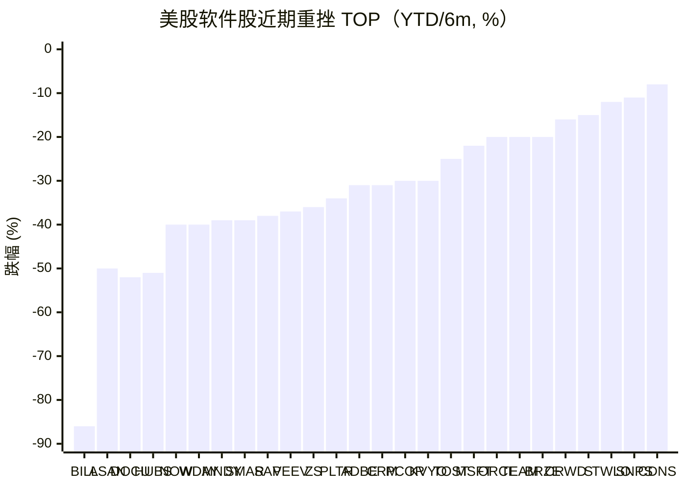
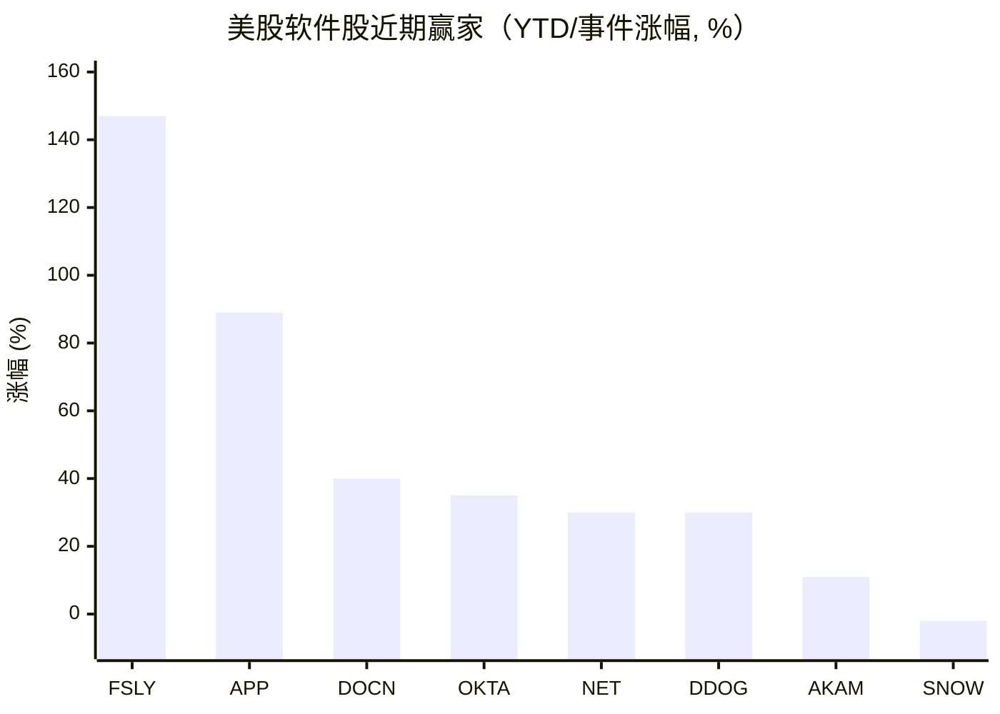

# 2026-05-13：美股软件股近期表现盘点（"SaaSpocalypse" vs AI 基础设施赢家）

## 背景

2026 年初的软件板块经历了被卖方戏称为 "SaaSpocalypse" / "SaaSmageddon" 的系统性重估。导火索是 2026-02-03 Anthropic 发布 Claude Cowork 企业 Agent 演示，单日抹掉约 2 850 亿美元市值 [[1]](https://www.benzinga.com/trading-ideas/movers/26/04/51740497/saas-stock-meltdown-servicenow-salesforce-cloudflare-snowflake-hit-hard)；对冲基金到 2026-02 已经在做空软件股上赚到约 240 亿美元，并继续加仓 [[2]](https://www.cnbc.com/2026/02/04/hedge-funds-made-24-billion-shorting-software-stocks-so-far-in-2026-and-they-are-increasing-the-bet.html)。基础逻辑是 AI Agent 可能替代按席位收费 (seat-based) 的传统 SaaS，软件 P/S 估值从 9x 压到 6x，回到 2010 年代中期水平 [[3]](https://ai2.work/technology/the-2026-saas-apocalypse-why-wall-street-is-dumping-software-stocks/)。

板块整体：iShares Expanded Tech-Software ETF (IGV) 在 2026-04 一度跌到 52 周低点 74.62，截至 2026-04-21 YTD 跌幅 19.42%，半年区间从约 117.99 跌至 86.30 附近，约 −27% [[4]](https://www.ebc.com/forex/is-this-software-etfs-rebound-built-to-last-after-a-brutal-selloff)。

---

## 数据口径说明

- **时间窗口**：用户问的是"近几个月"。下面表格里大多数公司能查到的精确数字是 **2026 YTD**（2025-12-31 收盘 → 2026-05-13 前后），少数是 **TTM/12 月**，个别是真正的 **6 个月**。我把每行的时间窗口标出来，**不强行折算**——折算反而失真。
- 标 **未核** 表示搜到的二手摘要里没给精确数字，只说"falling / down sharply"等定性描述，**没有伪造数值**。
- 表里**优先选 IGV 成分股和市值前 100 的纯软件 / SaaS / 应用层公司**；硬件 EDA（SNPS/CDNS）和混合型平台（ORCL/MSFT）也保留，因为它们历史上被算入软件板块。

---

## 一、重挫名单（近 6 个月 / 2026 YTD，按跌幅粗略由深到浅）

| 排序 | 代码 | 公司 | 跌幅 | 时间窗口 | 触发因素 |
|---|---|---|---|---|---|
| 1 | BILL | BILL Holdings | −86%（距 ATH）；YTD −25% | 长期/YTD | 中小企支付，AI 替代 SMB 后台 [[5]](https://www.fool.com/investing/2026/02/24/is-this-software-stock-buy-86-decline-wall-street/) |
| 2 | ASAN | Asana | YTD −50% / 1y −59% | YTD / TTM | 工作管理 SaaS 被 AI Agent 直接威胁 [[6]](https://www.tikr.com/blog/heres-why-asana-stocks-50-crash-in-2026-may-overstate-the-ai-disruption-risk) |
| 3 | DOCU | DocuSign | TTM −52% / 距 ATH −85% | TTM | 电子签 + 合同流，AI 法律 Agent 威胁 [[7]](https://247wallst.com/investing/2026/02/05/the-saaspocalypse-has-cut-these-stocks-in-half/) |
| 4 | HUBS | HubSpot | 1y −51% | 12 月 | SMB CRM / 营销自动化 [[8]](https://www.saastr.com/the-performing-major-b2b-stocks-of-2025-what-the-ai-divide-tells-us-about-the-future-of-saas/) |
| 5 | WDAY | Workday | 距高点 −40%+ | YTD | 席位定价模型受 AI 冲击 [[8]](https://www.saastr.com/the-performing-major-b2b-stocks-of-2025-what-the-ai-divide-tells-us-about-the-future-of-saas/) |
| 6 | NOW | ServiceNow | YTD −40% | 2026 YTD | Q1 中东本地部署订单滑出，叠加 AI 担忧 [[9]](https://247wallst.com/investing/2026/04/27/which-software-stock-has-been-the-worst-performer-in-2026-adobe-salesforce-or-servicenow/) |
| 7 | MNDY | Monday.com | 早 Feb YTD −39%（后部分回收）| YTD | 与 ASAN/SMAR 同组工作流 [[10]](https://tomtunguz.com/ai-sector-pricing-2026-02-06/) |
| 8 | SMAR | Smartsheet | 早 Feb YTD −39% | YTD | 同上 [[10]](https://tomtunguz.com/ai-sector-pricing-2026-02-06/) |
| 9 | SAP | SAP | 6 月 −38% / YTD −27.77% | 6 个月 | 2026 云业务展望不及预期，单日跌幅 2020 以来最大 [[11]](https://www.tikr.com/blog/sap-stock-is-down-38-in-6-months-heres-what-could-drive-18-annual-returns) |
| 10 | VEEV | Veeva Systems | 6 月 −37% / YTD −30% | 6 个月 / YTD | 生命科学垂直 SaaS，AI 重估 [[12]](https://seekingalpha.com/article/4889896-veeva-systems-not-a-likely-victim-of-total-ai-disruption-buy-the-dip-upgrade) |
| 11 | ZS | Zscaler | YTD −36% | 2026 YTD | 零信任，Q2 FY26 仍 26% 增长但估值压缩 [[13]](https://stocktwits.com/news-articles/markets/equity/crowd-strike-zscaler-palo-alto-fortinet-which-cybersecurity-stock-will-win-next-year/cLIaSlnRE0A) |
| 12 | PLTR | Palantir | 6 月 −34%（207.18 → 136.00，2025-11-03 → 2026-05-12）| 6 个月 | ATH 之后估值回落 [[14]](https://www.macrotrends.net/stocks/charts/PLTR/palantir-technologies/stock-price-history) |
| 13 | ADBE | Adobe | YTD −31% | 2026 YTD | 创意 SaaS 被生成式 AI 模型蚕食 [[9]](https://247wallst.com/investing/2026/04/27/which-software-stock-has-been-the-worst-performer-in-2026-adobe-salesforce-or-servicenow/) |
| 14 | CRM | Salesforce | YTD −31% | 2026 YTD | CRM 被 Agent 威胁 [[9]](https://247wallst.com/investing/2026/04/27/which-software-stock-has-been-the-worst-performer-in-2026-adobe-salesforce-or-servicenow/) |
| 15 | PCOR | Procore | 12 月 −30% | TTM | 建筑垂直 SaaS [[15]](https://www.tikr.com/blog/down-30-in-last-12-months-is-procore-technologies-pcor-stock-a-good-buy-in-2026) |
| 16 | KVYO | Klaviyo | 近期 −30%（Q1 财报后单日 −30%） | 近月 | CFO 离职 + 2026 指引不明 [[16]](https://ts2.tech/en/klaviyo-stock-plunges-nearly-30-after-q1-beat-as-cfo-exit-clouds-2026-outlook/) |
| 17 | TOST | Toast | YTD −25%（盘中曾 −43%）；6 月 −23% | YTD / 6 个月 | 餐饮 SaaS，AI 替代担忧（IndexBox 测算 6 月 −23%）[[17]](https://www.indexbox.io/blog/toast-stock-down-23-over-six-months-despite-strong-recurring-revenue/) |
| 18 | MSFT | Microsoft | YTD −22% | 2026 YTD | 2025 高点之后回撤 22% [[18]](https://www.fool.com/investing/2026/02/02/buy-microsoft-growth-stock-2026/) |
| 19 | ORCL | Oracle | YTD 一度 −20%+（TTM 仍 +18%）| YTD | 自由现金流 -438 亿（前三季 FY26）拖累 [[19]](https://www.tradingkey.com/analysis/stocks/us-stocks/261783354-oracle-microsoft-ai-cloud-cashflow-valuation-saas-openai-software-stocks-tradingkey) |
| 20 | TEAM | Atlassian | YTD < −20% | 2026 YTD | 协作平台 [[20]](https://247wallst.com/investing/2026/04/27/which-software-stock-has-been-the-worst-performer-in-2026-adobe-salesforce-or-servicenow/) |
| 21 | BRZE | Braze | YTD < −20% | 2026 YTD | 客户互动 SaaS [[20]](https://247wallst.com/investing/2026/04/27/which-software-stock-has-been-the-worst-performer-in-2026-adobe-salesforce-or-servicenow/) |
| 22 | CRWD | CrowdStrike | YTD −16% | 2026 YTD | 网安增速从 30%+ 减速到 22% [[13]](https://stocktwits.com/news-articles/markets/equity/crowd-strike-zscaler-palo-alto-fortinet-which-cybersecurity-stock-will-win-next-year/cLIaSlnRE0A) |
| 23 | S | SentinelOne | 1y −14.7% | TTM | 端点安全，达到 10 亿美金 ARR 但估值受压 [[13]](https://stocktwits.com/news-articles/markets/equity/crowd-strike-zscaler-palo-alto-fortinet-which-cybersecurity-stock-will-win-next-year/cLIaSlnRE0A) |
| 24 | GTLB | GitLab | 2025 −33%，2026 继续走低；5 月 11 日再裁员 | 长期 | DevOps 被 AI Coding 替代担忧 [[21]](https://www.nasdaq.com/articles/why-gitlab-stock-lost-33-2025) |
| 25 | TWLO | Twilio | YTD −12.3%（距 52 周高 −15.8%）| 2026 YTD | CPaaS [[22]](https://www.theglobeandmail.com/investing/markets/stocks/TWLO/pressreleases/1227142/okta-twilio-and-samsara-stocks-trade-down-what-you-need-to-know/) |
| 26 | SNPS | Synopsys | YTD −11.1% | 2026 YTD | EDA，等 FY Q2 财报 [[23]](https://www.trefis.com/articles/597499/between-applovin-and-synopsys-which-stock-looks-set-to-break-out-2/2026-04-25) |
| 27 | CDNS | Cadence | YTD −7.8% | 2026 YTD | EDA，Q1 实际超预期但估值已经被压 [[24]](https://www.ad-hoc-news.de/boerse/news/ueberblick/cadence-design-systems-stock-us12541w1027-strong-q1-2026-results-and/69296435) |
| 28 | FTNT | Fortinet | 2026 YTD 为负（被定性为"this year cheapest"）| 2026 YTD | 未核精确数字 [[13]](https://stocktwits.com/news-articles/markets/equity/crowd-strike-zscaler-palo-alto-fortinet-which-cybersecurity-stock-will-win-next-year/cLIaSlnRE0A) |
| 29 | TENB | Tenable | 2026-02-23 单日 −12% | 单日 | 网安随板块下跌 [[25]](https://www.cnbc.com/2026/02/23/cybersecurity-stocks-anthropic-ai-crowdstrike.html) |
| 30 | PEGA | Pegasystems | YTD 一度走低（4 月有所反弹）| YTD | 未核精确数字 [[26]](https://www.indexbox.io/blog/pegasystems-stock-rises-on-software-sector-recovery-interest/) |

> ⚠ **声明**：第 20–21 行 (TEAM/BRZE) 只在汇总报道中被列为 "down more than 20% YTD"，没给精确数字；第 7–8 行 (MNDY/SMAR) 数字来自 2026-02-06 一篇文章，**之后** MNDY 因 Q1 财报 24% YoY 增长有所回收，所以"近 6 个月"净跌幅可能小于 −39%。

---

## 二、抗跌或上涨名单（近 6 个月 / 2026 YTD）

数据基础比 decliner 一侧薄，公开摘要里只有少数被点名为"赢家"。**不强凑 30**。

| 排序 | 代码 | 公司 | 涨幅 | 时间窗口 | 驱动逻辑 |
|---|---|---|---|---|---|
| 1 | FSLY | Fastly | YTD +147.5% | 2026 YTD | CDN / 边缘推理算力卖铲子（注：5/7 财报后单日 −38%，但 YTD 仍大幅领先板块）[[27]](https://www.tradingview.com/news/zacks:4dc783b96094b:0-is-fastly-stock-s-5-21x-p-s-still-worth-it-buy-sell-or-hold/) |
| 2 | APP | AppLovin | TTM +89.3%（远超 S&P500 的 30.1%）| TTM | 广告 AI / 移动游戏变现 [[28]](https://www.trefis.com/stock/snps/articles/599223/is-applovin-a-better-buy-than-synopsys-2/2026-05-13) |
| 3 | DOCN | DigitalOcean | Q1 财报后单日 +40%；早期 YTD +12% | YTD + 事件 | AI 客户 ARR 单季 +221%，开发者云"卖铲" [[29]](https://www.fool.com/investing/2026/05/13/i-recently-predicted-that-digitalocean-would-becom/) [[30]](https://www.saastr.com/digitalocean-its-up-12-in-2026-while-the-rest-of-software-is-down-24-heres-why/) |
| 4 | OKTA | Okta | YTD +35%（5/27 之后又 −15%）| 2026 YTD | 身份基础设施 [[22]](https://www.theglobeandmail.com/investing/markets/stocks/TWLO/pressreleases/1227142/okta-twilio-and-samsara-stocks-trade-down-what-you-need-to-know/) |
| 5 | NET | Cloudflare | YTD +30.25%；TTM +106% | 2026 YTD / TTM | 边缘平台 + AI Workers（**注**：5 月初宣布裁员 20% 后单日 −15%）[[31]](https://io-fund.com/cloud-platforms/cybersecurity/encouraging-growth-in-key-metrics-drives-60-gain-ytd-for-cloudflare-stock) |
| 6 | DDOG | Datadog | 2026-05-07 财报后单日 +30%（首破 10 亿单季收入）| 事件 | 可观测性受 AI 工作负载推动 [[32]](https://www.cnbc.com/2026/05/07/ai-winners-software-datadog-stock.html) |
| 7 | AKAM | Akamai | YTD +11.3% | 2026 YTD | CDN / 安全 [[27]](https://www.tradingview.com/news/zacks:4dc783b96094b:0-is-fastly-stock-s-5-21x-p-s-still-worth-it-buy-sell-or-hold/) |
| 8 | SNOW | Snowflake | TTM −1.89%（基本持平）| TTM | 数据云，下跌不显著被归到"抗跌"档 [[8]](https://www.saastr.com/the-performing-major-b2b-stocks-of-2025-what-the-ai-divide-tells-us-about-the-future-of-saas/) |
| 9 | MDB | MongoDB | 2025 底曾 TTM +70%，2026 进入"$300B SaaS 拐点"叙事，**净走势分歧**，未核 | 2025 / 2026 | 文档数据库 + AI 向量 [[33]](https://eu.36kr.com/en/p/3672724687217281) |
| 10 | CFLT | Confluent | 已被 IBM 以 110 亿现金收购（2025-12 宣布、2026-03-17 完成，作价 $31.00/股，对宣布前 35% 溢价）| 收购 | 实时数据，被并购退市，股东锁定上行 [[34]](https://www.cnbc.com/2025/12/08/ibm-confluent-deal-data.html) |

> ⚠ **声明**：第 9 行 (MDB) 公开二手摘要里给出的方向相互矛盾——既有 2025 年底 TTM +70% 的说法，也有"2026 SaaSpocalypse 重创 MDB"的说法。**没找到一手 6 月数据**，不写定性结论。
>
> 第 5 行 (NET)、第 1 行 (FSLY) 都属于"YTD 大涨但近期事件性回撤"，画图时用 YTD 数字。
>
> 我尝试搜了 PEGA / TYL / MANH / CSU / OTEX / MSTR 等 "稳健派"，公开摘要里没有清晰的 YTD 数据，**不计入榜单**。

---

## 三、可视化

### 重挫榜（YTD 或近 6 个月，单位 %）

### 抗跌 / 上涨榜（YTD 或事件涨幅，单位 %）

---

## 四、几条值得记下的判断

1. **割裂大于熊市**：板块不是齐跌，**应用层 SaaS（席位计费、被 Agent 直接威胁）**遭重挫；**基础设施层 / 边缘 / 数据云 / 安全身份**反而抗跌甚至大涨。这是"卖铲子 vs 卖席位"逻辑的具体体现。
2. **IGV 半年 −27% 是均值，掩盖了内部 σ**：FSLY +147% 和 BILL −86% 同时存在。
3. **事件驱动 vs 趋势**：DDOG 财报后 +30%、Cloudflare 裁员后 −15%、FSLY 财报后 −38%、KVYO 财报后 −30% —— 高 β 板块在不确定期事件波动很剧烈，**用单一日期的 YTD 截图理解结构**是不够的。
4. **Anthropic Claude Cowork（2026-02-03）是这波重估的事件性触发点**，但板块从 2025-12 起就已经开始 derate（SAP 6 月跌幅一半发生在 12-1 月），AI Agent 取代企业软件的**叙事**和**估值压缩**早于演示日。

---

## 信源

[1] Benzinga, "SaaS Stock Meltdown: ServiceNow, Salesforce, Cloudflare, Snowflake Hit Hard," Apr 2026. (Anthropic Claude Cowork 单日抹去约 $285B 软件市值) [Online]. Available: <https://www.benzinga.com/trading-ideas/movers/26/04/51740497/saas-stock-meltdown-servicenow-salesforce-cloudflare-snowflake-hit-hard>

[2] CNBC, "Hedge funds made $24 billion shorting software stocks so far in 2026 — and they are increasing the bet," Feb 4, 2026. [Online]. Available: <https://www.cnbc.com/2026/02/04/hedge-funds-made-24-billion-shorting-software-stocks-so-far-in-2026-and-they-are-increasing-the-bet.html>

[3] AI2.work, "The 2026 SaaS Apocalypse: Why Wall Street Is Dumping Software Stocks," 2026. (软件 P/S 从 9x → 6x；IGV YTD −22~−25%) [Online]. Available: <https://ai2.work/technology/the-2026-saas-apocalypse-why-wall-street-is-dumping-software-stocks/>

[4] EBC Financial, "Is This Software ETF's Rebound Built to Last After a Brutal Selloff?," Apr 2026. (IGV YTD −19.42%；52 周区间 73.93–117.99) [Online]. Available: <https://www.ebc.com/forex/is-this-software-etfs-rebound-built-to-last-after-a-brutal-selloff>

[5] Motley Fool, "Is This Super Software Stock a Buy After Its Dramatic 86% Decline?," Feb 24, 2026. (BILL 距 ATH −86%) [Online]. Available: <https://www.fool.com/investing/2026/02/24/is-this-software-stock-buy-86-decline-wall-street/>

[6] TIKR, "Here's Why Asana Stock's 50% Crash in 2026 May Overstate the AI Disruption Risk," 2026. (ASAN YTD −50%) [Online]. Available: <https://www.tikr.com/blog/heres-why-asana-stocks-50-crash-in-2026-may-overstate-the-ai-disruption-risk>

[7] 24/7 Wall St., "The SaaSpocalypse Has Cut These Stocks In Half," Feb 5, 2026. (ASAN 1y −59.28% / 距 ATH −92%；DOCU 1y −51.58% / 距 ATH −85%) [Online]. Available: <https://247wallst.com/investing/2026/02/05/the-saaspocalypse-has-cut-these-stocks-in-half/>

[8] SaaStr, "The Great B2B Bifurcation of 2025…," 2025. (HUBS −51%；WDAY 距高点 −40%+；SNOW TTM −1.89%；MDB TTM +70%) [Online]. Available: <https://www.saastr.com/the-performing-major-b2b-stocks-of-2025-what-the-ai-divide-tells-us-about-the-future-of-saas/>

[9] 24/7 Wall St., "Which Software Stock Has Been the Worst Performer in 2026: Adobe, Salesforce, or ServiceNow?," Apr 27, 2026. (NOW YTD −40%；CRM/ADBE YTD −31%) [Online]. Available: <https://247wallst.com/investing/2026/04/27/which-software-stock-has-been-the-worst-performer-in-2026-adobe-salesforce-or-servicenow/>

[10] Tomasz Tunguz, "How Markets Price AI Risk," Feb 6, 2026. (MNDY / ASAN / SMAR 一起 YTD −39%) [Online]. Available: <https://tomtunguz.com/ai-sector-pricing-2026-02-06/>

[11] TIKR, "SAP Stock Is Down 38% in 6 Months. Here's What Could Drive 18% Annual Returns," 2026. (SAP 6m −38%；YTD −27.77%) [Online]. Available: <https://www.tikr.com/blog/sap-stock-is-down-38-in-6-months-heres-what-could-drive-18-annual-returns>

[12] Seeking Alpha, "Veeva Systems: Not A Likely Victim Of Total AI Disruption (Upgrade)," 2026. (VEEV 6 月 −37%；YTD −30%) [Online]. Available: <https://seekingalpha.com/article/4889896-veeva-systems-not-a-likely-victim-of-total-ai-disruption-buy-the-dip-upgrade>

[13] StockTwits, "CrowdStrike, Zscaler, Palo Alto, Fortinet: Which Cybersecurity Stock Will Win Next Year?," 2026. (ZS YTD −36%；CRWD YTD −16%；S 1y −14.7%；FTNT YTD 为负) [Online]. Available: <https://stocktwits.com/news-articles/markets/equity/crowd-strike-zscaler-palo-alto-fortinet-which-cybersecurity-stock-will-win-next-year/cLIaSlnRE0A>

[14] MacroTrends, "Palantir Technologies — 6 Year Stock Price History (PLTR)," 2026. (ATH $207.18 @ 2025-11-03；2026-05-12 收盘 $136.00；6 月 −34.3%) [Online]. Available: <https://www.macrotrends.net/stocks/charts/PLTR/palantir-technologies/stock-price-history>

[15] TIKR, "Down 30% In Last 12 Months, Is Procore Technologies Stock A Good Buy In 2026?," 2026. (PCOR 12m −30%) [Online]. Available: <https://www.tikr.com/blog/down-30-in-last-12-months-is-procore-technologies-pcor-stock-a-good-buy-in-2026>

[16] TS2, "Klaviyo Stock Plunges Nearly 30% After Q1 Beat as CFO Exit Clouds 2026 Outlook," May 2026. [Online]. Available: <https://ts2.tech/en/klaviyo-stock-plunges-nearly-30-after-q1-beat-as-cfo-exit-clouds-2026-outlook/>

[17] IndexBox, "Toast Stock Analysis: 6-Month Decline vs. Revenue Growth | 2026," 2026. (TOST 6m −23%；Motley Fool 同期报道 TOST 一度 YTD −43%) [Online]. Available: <https://www.indexbox.io/blog/toast-stock-down-23-over-six-months-despite-strong-recurring-revenue/>

[18] Motley Fool, "I Predicted Microsoft Would Hit an All-Time High in 2025, but the Stock Is Down 22% From That Record," Feb 2, 2026. [Online]. Available: <https://www.fool.com/investing/2026/02/02/buy-microsoft-growth-stock-2026/>

[19] TradingKey, "Software Stocks Are Continuing to Rebound, Should Investors Buy Oracle or Microsoft Now?," 2026. (ORCL YTD 一度 −20%+；前三季 FY26 FCF −$43.8B) [Online]. Available: <https://www.tradingkey.com/analysis/stocks/us-stocks/261783354-oracle-microsoft-ai-cloud-cashflow-valuation-saas-openai-software-stocks-tradingkey>

[20] 24/7 Wall St., "Which Software Stock Has Been the Worst Performer in 2026," Apr 27, 2026. (TEAM / BRZE YTD 跌幅 >20%；HUBS YTD >20%) [Online]. Available: <https://247wallst.com/investing/2026/04/27/which-software-stock-has-been-the-worst-performer-in-2026-adobe-salesforce-or-servicenow/>

[21] Nasdaq.com, "Why GitLab Stock Lost 33% in 2025," Jan 20, 2026. (GTLB 2025 全年 −33%；2026 继续走低，5/11 再裁员) [Online]. Available: <https://www.nasdaq.com/articles/why-gitlab-stock-lost-33-2025>

[22] Globe and Mail / StockStory, "Okta, Twilio, and Samsara Stocks Trade Down," 2026. (TWLO YTD −12.3%；OKTA YTD +35%) [Online]. Available: <https://www.theglobeandmail.com/investing/markets/stocks/TWLO/pressreleases/1227142/okta-twilio-and-samsara-stocks-trade-down-what-you-need-to-know/>

[23] Trefis, "Between AppLovin and Synopsys, Which Stock Looks Set to Break Out?," Apr 25, 2026. (SNPS 2026 YTD −11.1%) [Online]. Available: <https://www.trefis.com/articles/597499/between-applovin-and-synopsys-which-stock-looks-set-to-break-out-2/2026-04-25>

[24] Ad-hoc-news, "Cadence Design Systems stock: Strong Q1 2026 results and raised guidance," 2026. (CDNS YTD −7.8%) [Online]. Available: <https://www.ad-hoc-news.de/boerse/news/ueberblick/cadence-design-systems-stock-us12541w1027-strong-q1-2026-results-and/69296435>

[25] CNBC, "Cybersecurity stocks drop for a second day as new Anthropic tool fuels AI disruption fears," Feb 23, 2026. (TENB / Netskope 单日 −12%；NET −9%；OKTA −6%；SailPoint −9%) [Online]. Available: <https://www.cnbc.com/2026/02/23/cybersecurity-stocks-anthropic-ai-crowdstrike.html>

[26] IndexBox, "Pegasystems Shares Gain Amid Software Sector Recovery — 2026 Market Update," 2026. (PEGA YTD 一度走低，4 月反弹；未给精确 YTD 数字) [Online]. Available: <https://www.indexbox.io/blog/pegasystems-stock-rises-on-software-sector-recovery-interest/>

[27] TradingView/Zacks, "Is Fastly Stock's 5.21X P/S Still Worth it?," 2026. (FSLY YTD +147.5%；AKAM YTD +11.3%；5/7 财报后 FSLY 单日 −38%) [Online]. Available: <https://www.tradingview.com/news/zacks:4dc783b96094b:0-is-fastly-stock-s-5-21x-p-s-still-worth-it-buy-sell-or-hold/>

[28] Trefis, "Is AppLovin a Better Buy Than Synopsys?," May 13, 2026. (APP TTM +89.3% vs S&P500 +30.1%) [Online]. Available: <https://www.trefis.com/stock/snps/articles/599223/is-applovin-a-better-buy-than-synopsys-2/2026-05-13>

[29] Motley Fool, "I Recently Predicted That DigitalOcean Would Become a Multibagger By Next Year, and It Surged 40% After Its Earnings Report," May 13, 2026. (DOCN 财报后 +40%；AI 客户 ARR +221%) [Online]. Available: <https://www.fool.com/investing/2026/05/13/i-recently-predicted-that-digitalocean-would-becom/>

[30] SaaStr, "DigitalOcean? It's Up 12% in 2026. While The Rest of Software Is Down 24%. Here's Why," 2026. (DOCN 早期 YTD +12%；板块 −24%) [Online]. Available: <https://www.saastr.com/digitalocean-its-up-12-in-2026-while-the-rest-of-software-is-down-24-heres-why/>

[31] io Fund, "Encouraging Growth in Key Metrics Drives 60% Gain YTD for Cloudflare Stock," 2026. (NET YTD +30.25%；TTM +106.57%；52w 高 $260) [Online]. Available: <https://io-fund.com/cloud-platforms/cybersecurity/encouraging-growth-in-key-metrics-drives-60-gain-ytd-for-cloudflare-stock>

[32] CNBC, "Datadog stock soars 31% on blockbuster earnings as AI winners emerge in software," May 7, 2026. (DDOG 单季首破 $1B；财报后 +30%) [Online]. Available: <https://www.cnbc.com/2026/05/07/ai-winners-software-datadog-stock.html>

[33] 36kr (英文版), "$300 Billion Evaporated Overnight: MongoDB CEO Nadella Declares Traditional SaaS Reached Inflection Point," 2026. [Online]. Available: <https://eu.36kr.com/en/p/3672724687217281>

[34] CNBC, "Confluent stock soars 29% as IBM announces $11 billion acquisition deal," Dec 8, 2025. (CFLT $31.00/股现金收购，宣布前 35% 溢价；2026-03-17 完成) [Online]. Available: <https://www.cnbc.com/2025/12/08/ibm-confluent-deal-data.html>
