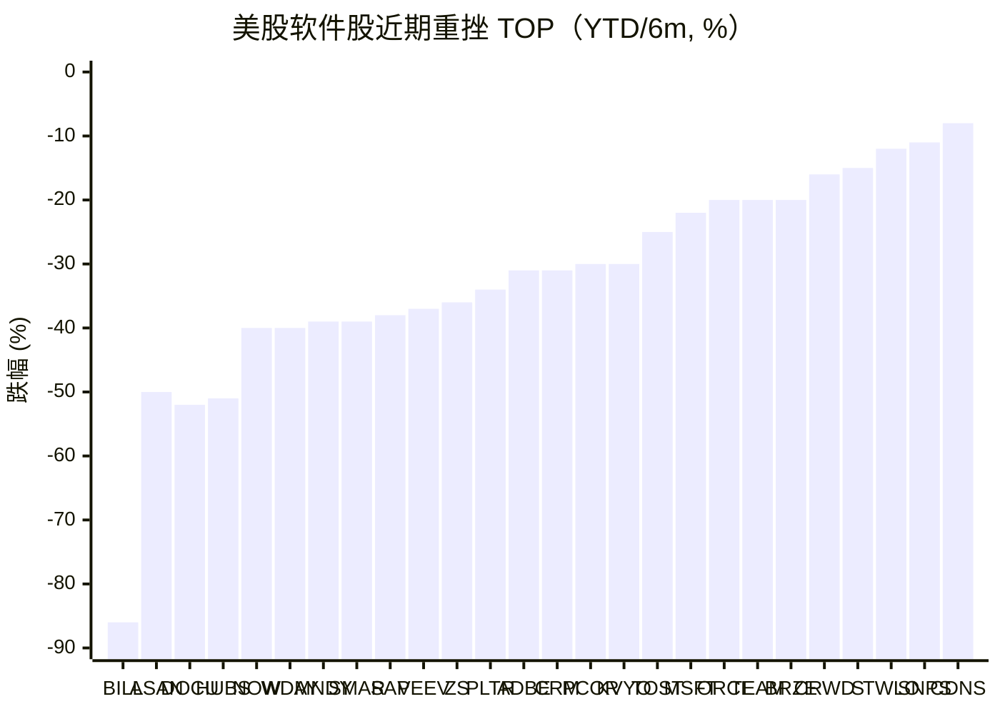
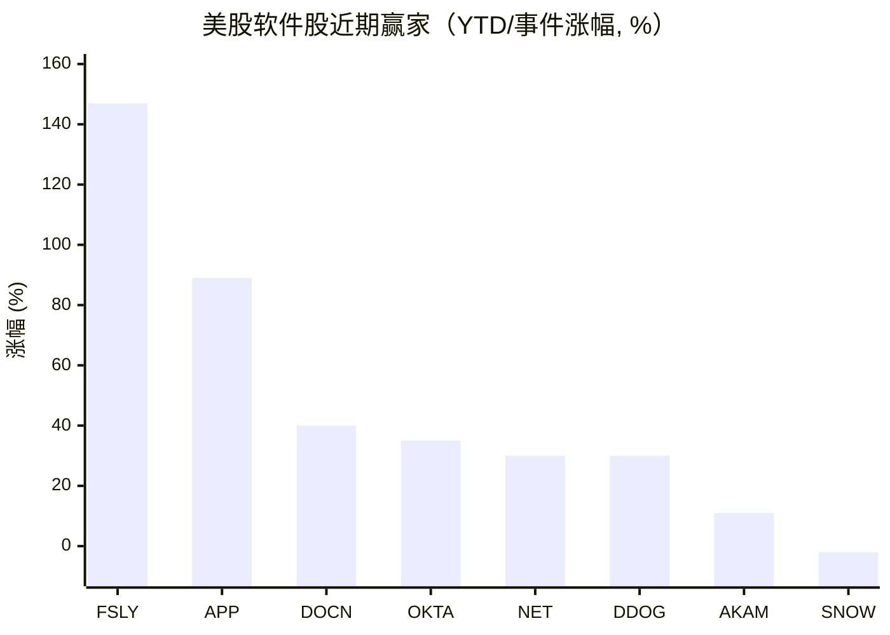

# 2026-05-13：美股软件股近期表现盘点（"SaaSpocalypse" vs AI 基础设施赢家）

## 背景

2026 年初的软件板块经历了被卖方戏称为 "SaaSpocalypse" / "SaaSmageddon" 的系统性重估。导火索是 2026-02-03 Anthropic 发布 Claude Cowork 企业 Agent 演示，单日抹掉约 2 850 亿美元市值 [[1]](https://www.benzinga.com/trading-ideas/movers/26/04/51740497/saas-stock-meltdown-servicenow-salesforce-cloudflare-snowflake-hit-hard)；对冲基金到 2026-02 已经在做空软件股上赚到约 240 亿美元，并继续加仓 [[2]](https://www.cnbc.com/2026/02/04/hedge-funds-made-24-billion-shorting-software-stocks-so-far-in-2026-and-they-are-increasing-the-bet.html)。基础逻辑是 AI Agent 可能替代按席位收费 (seat-based) 的传统 SaaS，软件 P/S 估值从 9x 压到 6x，回到 2010 年代中期水平 [[3]](https://ai2.work/technology/the-2026-saas-apocalypse-why-wall-street-is-dumping-software-stocks/)。

板块整体：iShares Expanded Tech-Software ETF (IGV) 在 2026-04 一度跌到 52 周低点 74.62，截至 2026-04-21 YTD 跌幅 19.42%，半年区间从约 117.99 跌至 86.30 附近，约 −27% [[4]](https://www.ebc.com/forex/is-this-software-etfs-rebound-built-to-last-after-a-brutal-selloff)。

---

## 数据口径说明

- **时间窗口**：用户问的是"近几个月"。下面表格里大多数公司能查到的精确数字是 **2026 YTD**（2025-12-31 收盘 → 2026-05-13 前后），少数是 **TTM/12 月**，个别是真正的 **6 个月**。我把每行的时间窗口标出来，**不强行折算**——折算反而失真。
- 标 **未核** 表示搜到的二手摘要里没给精确数字，只说"falling / down sharply"等定性描述，**没有伪造数值**。
- 表里**优先选 IGV 成分股和市值前 100 的纯软件 / SaaS / 应用层公司**；硬件 EDA（SNPS/CDNS）和混合型平台（ORCL/MSFT）也保留，因为它们历史上被算入软件板块。

---

## 一、重挫名单（近 6 个月 / 2026 YTD，按跌幅粗略由深到浅）

| 排序 | 代码 | 公司 | 跌幅 | 时间窗口 | 触发因素 |
|---|---|---|---|---|---|
| 1 | BILL | BILL Holdings | −86%（距 ATH）；YTD −25% | 长期/YTD | 中小企支付，AI 替代 SMB 后台 [[5]](https://www.fool.com/investing/2026/02/24/is-this-software-stock-buy-86-decline-wall-street/) |
| 2 | ASAN | Asana | YTD −50% / 1y −59% | YTD / TTM | 工作管理 SaaS 被 AI Agent 直接威胁 [[6]](https://www.tikr.com/blog/heres-why-asana-stocks-50-crash-in-2026-may-overstate-the-ai-disruption-risk) |
| 3 | DOCU | DocuSign | TTM −52% / 距 ATH −85% | TTM | 电子签 + 合同流，AI 法律 Agent 威胁 [[7]](https://247wallst.com/investing/2026/02/05/the-saaspocalypse-has-cut-these-stocks-in-half/) |
| 4 | HUBS | HubSpot | 1y −51% | 12 月 | SMB CRM / 营销自动化 [[8]](https://www.saastr.com/the-performing-major-b2b-stocks-of-2025-what-the-ai-divide-tells-us-about-the-future-of-saas/) |
| 5 | WDAY | Workday | 距高点 −40%+ | YTD | 席位定价模型受 AI 冲击 [[8]](https://www.saastr.com/the-performing-major-b2b-stocks-of-2025-what-the-ai-divide-tells-us-about-the-future-of-saas/) |
| 6 | NOW | ServiceNow | YTD −40% | 2026 YTD | Q1 中东本地部署订单滑出，叠加 AI 担忧 [[9]](https://247wallst.com/investing/2026/04/27/which-software-stock-has-been-the-worst-performer-in-2026-adobe-salesforce-or-servicenow/) |
| 7 | MNDY | Monday.com | 早 Feb YTD −39%（后部分回收）| YTD | 与 ASAN/SMAR 同组工作流 [[10]](https://tomtunguz.com/ai-sector-pricing-2026-02-06/) |
| 8 | SMAR | Smartsheet | 早 Feb YTD −39% | YTD | 同上 [[10]](https://tomtunguz.com/ai-sector-pricing-2026-02-06/) |
| 9 | SAP | SAP | 6 月 −38% / YTD −27.77% | 6 个月 | 2026 云业务展望不及预期，单日跌幅 2020 以来最大 [[11]](https://www.tikr.com/blog/sap-stock-is-down-38-in-6-months-heres-what-could-drive-18-annual-returns) |
| 10 | VEEV | Veeva Systems | 6 月 −37% / YTD −30% | 6 个月 / YTD | 生命科学垂直 SaaS，AI 重估 [[12]](https://seekingalpha.com/article/4889896-veeva-systems-not-a-likely-victim-of-total-ai-disruption-buy-the-dip-upgrade) |
| 11 | ZS | Zscaler | YTD −36% | 2026 YTD | 零信任，Q2 FY26 仍 26% 增长但估值压缩 [[13]](https://stocktwits.com/news-articles/markets/equity/crowd-strike-zscaler-palo-alto-fortinet-which-cybersecurity-stock-will-win-next-year/cLIaSlnRE0A) |
| 12 | PLTR | Palantir | 6 月 −34%（207.18 → 136.00，2025-11-03 → 2026-05-12）| 6 个月 | ATH 之后估值回落 [[14]](https://www.macrotrends.net/stocks/charts/PLTR/palantir-technologies/stock-price-history) |
| 13 | ADBE | Adobe | YTD −31% | 2026 YTD | 创意 SaaS 被生成式 AI 模型蚕食 [[9]](https://247wallst.com/investing/2026/04/27/which-software-stock-has-been-the-worst-performer-in-2026-adobe-salesforce-or-servicenow/) |
| 14 | CRM | Salesforce | YTD −31% | 2026 YTD | CRM 被 Agent 威胁 [[9]](https://247wallst.com/investing/2026/04/27/which-software-stock-has-been-the-worst-performer-in-2026-adobe-salesforce-or-servicenow/) |
| 15 | PCOR | Procore | 12 月 −30% | TTM | 建筑垂直 SaaS [[15]](https://www.tikr.com/blog/down-30-in-last-12-months-is-procore-technologies-pcor-stock-a-good-buy-in-2026) |
| 16 | KVYO | Klaviyo | 近期 −30%（Q1 财报后单日 −30%） | 近月 | CFO 离职 + 2026 指引不明 [[16]](https://ts2.tech/en/klaviyo-stock-plunges-nearly-30-after-q1-beat-as-cfo-exit-clouds-2026-outlook/) |
| 17 | TOST | Toast | YTD −25%（盘中曾 −43%）；6 月 −23% | YTD / 6 个月 | 餐饮 SaaS，AI 替代担忧（IndexBox 测算 6 月 −23%）[[17]](https://www.indexbox.io/blog/toast-stock-down-23-over-six-months-despite-strong-recurring-revenue/) |
| 18 | MSFT | Microsoft | YTD −22% | 2026 YTD | 2025 高点之后回撤 22% [[18]](https://www.fool.com/investing/2026/02/02/buy-microsoft-growth-stock-2026/) |
| 19 | ORCL | Oracle | YTD 一度 −20%+（TTM 仍 +18%）| YTD | 自由现金流 -438 亿（前三季 FY26）拖累 [[19]](https://www.tradingkey.com/analysis/stocks/us-stocks/261783354-oracle-microsoft-ai-cloud-cashflow-valuation-saas-openai-software-stocks-tradingkey) |
| 20 | TEAM | Atlassian | YTD < −20% | 2026 YTD | 协作平台 [[20]](https://247wallst.com/investing/2026/04/27/which-software-stock-has-been-the-worst-performer-in-2026-adobe-salesforce-or-servicenow/) |
| 21 | BRZE | Braze | YTD < −20% | 2026 YTD | 客户互动 SaaS [[20]](https://247wallst.com/investing/2026/04/27/which-software-stock-has-been-the-worst-performer-in-2026-adobe-salesforce-or-servicenow/) |
| 22 | CRWD | CrowdStrike | YTD −16% | 2026 YTD | 网安增速从 30%+ 减速到 22% [[13]](https://stocktwits.com/news-articles/markets/equity/crowd-strike-zscaler-palo-alto-fortinet-which-cybersecurity-stock-will-win-next-year/cLIaSlnRE0A) |
| 23 | S | SentinelOne | 1y −14.7% | TTM | 端点安全，达到 10 亿美金 ARR 但估值受压 [[13]](https://stocktwits.com/news-articles/markets/equity/crowd-strike-zscaler-palo-alto-fortinet-which-cybersecurity-stock-will-win-next-year/cLIaSlnRE0A) |
| 24 | GTLB | GitLab | 2025 −33%，2026 继续走低；5 月 11 日再裁员 | 长期 | DevOps 被 AI Coding 替代担忧 [[21]](https://www.nasdaq.com/articles/why-gitlab-stock-lost-33-2025) |
| 25 | TWLO | Twilio | YTD −12.3%（距 52 周高 −15.8%）| 2026 YTD | CPaaS [[22]](https://www.theglobeandmail.com/investing/markets/stocks/TWLO/pressreleases/1227142/okta-twilio-and-samsara-stocks-trade-down-what-you-need-to-know/) |
| 26 | SNPS | Synopsys | YTD −11.1% | 2026 YTD | EDA，等 FY Q2 财报 [[23]](https://www.trefis.com/articles/597499/between-applovin-and-synopsys-which-stock-looks-set-to-break-out-2/2026-04-25) |
| 27 | CDNS | Cadence | YTD −7.8% | 2026 YTD | EDA，Q1 实际超预期但估值已经被压 [[24]](https://www.ad-hoc-news.de/boerse/news/ueberblick/cadence-design-systems-stock-us12541w1027-strong-q1-2026-results-and/69296435) |
| 28 | FTNT | Fortinet | 2026 YTD 为负（被定性为"this year cheapest"）| 2026 YTD | 未核精确数字 [[13]](https://stocktwits.com/news-articles/markets/equity/crowd-strike-zscaler-palo-alto-fortinet-which-cybersecurity-stock-will-win-next-year/cLIaSlnRE0A) |
| 29 | TENB | Tenable | 2026-02-23 单日 −12% | 单日 | 网安随板块下跌 [[25]](https://www.cnbc.com/2026/02/23/cybersecurity-stocks-anthropic-ai-crowdstrike.html) |
| 30 | PEGA | Pegasystems | YTD 一度走低（4 月有所反弹）| YTD | 未核精确数字 [[26]](https://www.indexbox.io/blog/pegasystems-stock-rises-on-software-sector-recovery-interest/) |

> ⚠ **声明**：第 20–21 行 (TEAM/BRZE) 只在汇总报道中被列为 "down more than 20% YTD"，没给精确数字；第 7–8 行 (MNDY/SMAR) 数字来自 2026-02-06 一篇文章，**之后** MNDY 因 Q1 财报 24% YoY 增长有所回收，所以"近 6 个月"净跌幅可能小于 −39%。

---

## 二、抗跌或上涨名单（近 6 个月 / 2026 YTD）

数据基础比 decliner 一侧薄，公开摘要里只有少数被点名为"赢家"。**不强凑 30**。

| 排序 | 代码 | 公司 | 涨幅 | 时间窗口 | 驱动逻辑 |
|---|---|---|---|---|---|
| 1 | FSLY | Fastly | YTD +147.5% | 2026 YTD | CDN / 边缘推理算力卖铲子（注：5/7 财报后单日 −38%，但 YTD 仍大幅领先板块）[[27]](https://www.tradingview.com/news/zacks:4dc783b96094b:0-is-fastly-stock-s-5-21x-p-s-still-worth-it-buy-sell-or-hold/) |
| 2 | APP | AppLovin | TTM +89.3%（远超 S&P500 的 30.1%）| TTM | 广告 AI / 移动游戏变现 [[28]](https://www.trefis.com/stock/snps/articles/599223/is-applovin-a-better-buy-than-synopsys-2/2026-05-13) |
| 3 | DOCN | DigitalOcean | Q1 财报后单日 +40%；早期 YTD +12% | YTD + 事件 | AI 客户 ARR 单季 +221%，开发者云"卖铲" [[29]](https://www.fool.com/investing/2026/05/13/i-recently-predicted-that-digitalocean-would-becom/) [[30]](https://www.saastr.com/digitalocean-its-up-12-in-2026-while-the-rest-of-software-is-down-24-heres-why/) |
| 4 | OKTA | Okta | YTD +35%（5/27 之后又 −15%）| 2026 YTD | 身份基础设施 [[22]](https://www.theglobeandmail.com/investing/markets/stocks/TWLO/pressreleases/1227142/okta-twilio-and-samsara-stocks-trade-down-what-you-need-to-know/) |
| 5 | NET | Cloudflare | YTD +30.25%；TTM +106% | 2026 YTD / TTM | 边缘平台 + AI Workers（**注**：5 月初宣布裁员 20% 后单日 −15%）[[31]](https://io-fund.com/cloud-platforms/cybersecurity/encouraging-growth-in-key-metrics-drives-60-gain-ytd-for-cloudflare-stock) |
| 6 | DDOG | Datadog | 2026-05-07 财报后单日 +30%（首破 10 亿单季收入）| 事件 | 可观测性受 AI 工作负载推动 [[32]](https://www.cnbc.com/2026/05/07/ai-winners-software-datadog-stock.html) |
| 7 | AKAM | Akamai | YTD +11.3% | 2026 YTD | CDN / 安全 [[27]](https://www.tradingview.com/news/zacks:4dc783b96094b:0-is-fastly-stock-s-5-21x-p-s-still-worth-it-buy-sell-or-hold/) |
| 8 | SNOW | Snowflake | TTM −1.89%（基本持平）| TTM | 数据云，下跌不显著被归到"抗跌"档 [[8]](https://www.saastr.com/the-performing-major-b2b-stocks-of-2025-what-the-ai-divide-tells-us-about-the-future-of-saas/) |
| 9 | MDB | MongoDB | 2025 底曾 TTM +70%，2026 进入"$300B SaaS 拐点"叙事，**净走势分歧**，未核 | 2025 / 2026 | 文档数据库 + AI 向量 [[33]](https://eu.36kr.com/en/p/3672724687217281) |
| 10 | CFLT | Confluent | 已被 IBM 以 110 亿现金收购（2025-12 宣布、2026-03-17 完成，作价 $31.00/股，对宣布前 35% 溢价）| 收购 | 实时数据，被并购退市，股东锁定上行 [[34]](https://www.cnbc.com/2025/12/08/ibm-confluent-deal-data.html) |

> ⚠ **声明**：第 9 行 (MDB) 公开二手摘要里给出的方向相互矛盾——既有 2025 年底 TTM +70% 的说法，也有"2026 SaaSpocalypse 重创 MDB"的说法。**没找到一手 6 月数据**，不写定性结论。
>
> 第 5 行 (NET)、第 1 行 (FSLY) 都属于"YTD 大涨但近期事件性回撤"，画图时用 YTD 数字。
>
> 我尝试搜了 PEGA / TYL / MANH / CSU / OTEX / MSTR 等 "稳健派"，公开摘要里没有清晰的 YTD 数据，**不计入榜单**。

---

## 三、可视化

### 重挫榜（YTD 或近 6 个月，单位 %）



### 抗跌 / 上涨榜（YTD 或事件涨幅，单位 %）



---

## 四、几条值得记下的判断

1. **割裂大于熊市**：板块不是齐跌，**应用层 SaaS（席位计费、被 Agent 直接威胁）**遭重挫；**基础设施层 / 边缘 / 数据云 / 安全身份**反而抗跌甚至大涨。这是"卖铲子 vs 卖席位"逻辑的具体体现。
2. **IGV 半年 −27% 是均值，掩盖了内部 σ**：FSLY +147% 和 BILL −86% 同时存在。
3. **事件驱动 vs 趋势**：DDOG 财报后 +30%、Cloudflare 裁员后 −15%、FSLY 财报后 −38%、KVYO 财报后 −30% —— 高 β 板块在不确定期事件波动很剧烈，**用单一日期的 YTD 截图理解结构**是不够的。
4. **Anthropic Claude Cowork（2026-02-03）是这波重估的事件性触发点**，但板块从 2025-12 起就已经开始 derate（SAP 6 月跌幅一半发生在 12-1 月），AI Agent 取代企业软件的**叙事**和**估值压缩**早于演示日。

---

## 信源

[1] Benzinga, "SaaS Stock Meltdown: ServiceNow, Salesforce, Cloudflare, Snowflake Hit Hard," Apr 2026. (Anthropic Claude Cowork 单日抹去约 $285B 软件市值) [Online]. Available: <https://www.benzinga.com/trading-ideas/movers/26/04/51740497/saas-stock-meltdown-servicenow-salesforce-cloudflare-snowflake-hit-hard>

[2] CNBC, "Hedge funds made $24 billion shorting software stocks so far in 2026 — and they are increasing the bet," Feb 4, 2026. [Online]. Available: <https://www.cnbc.com/2026/02/04/hedge-funds-made-24-billion-shorting-software-stocks-so-far-in-2026-and-they-are-increasing-the-bet.html>

[3] AI2.work, "The 2026 SaaS Apocalypse: Why Wall Street Is Dumping Software Stocks," 2026. (软件 P/S 从 9x → 6x；IGV YTD −22~−25%) [Online]. Available: <https://ai2.work/technology/the-2026-saas-apocalypse-why-wall-street-is-dumping-software-stocks/>

[4] EBC Financial, "Is This Software ETF's Rebound Built to Last After a Brutal Selloff?," Apr 2026. (IGV YTD −19.42%；52 周区间 73.93–117.99) [Online]. Available: <https://www.ebc.com/forex/is-this-software-etfs-rebound-built-to-last-after-a-brutal-selloff>

[5] Motley Fool, "Is This Super Software Stock a Buy After Its Dramatic 86% Decline?," Feb 24, 2026. (BILL 距 ATH −86%) [Online]. Available: <https://www.fool.com/investing/2026/02/24/is-this-software-stock-buy-86-decline-wall-street/>

[6] TIKR, "Here's Why Asana Stock's 50% Crash in 2026 May Overstate the AI Disruption Risk," 2026. (ASAN YTD −50%) [Online]. Available: <https://www.tikr.com/blog/heres-why-asana-stocks-50-crash-in-2026-may-overstate-the-ai-disruption-risk>

[7] 24/7 Wall St., "The SaaSpocalypse Has Cut These Stocks In Half," Feb 5, 2026. (ASAN 1y −59.28% / 距 ATH −92%；DOCU 1y −51.58% / 距 ATH −85%) [Online]. Available: <https://247wallst.com/investing/2026/02/05/the-saaspocalypse-has-cut-these-stocks-in-half/>

[8] SaaStr, "The Great B2B Bifurcation of 2025…," 2025. (HUBS −51%；WDAY 距高点 −40%+；SNOW TTM −1.89%；MDB TTM +70%) [Online]. Available: <https://www.saastr.com/the-performing-major-b2b-stocks-of-2025-what-the-ai-divide-tells-us-about-the-future-of-saas/>

[9] 24/7 Wall St., "Which Software Stock Has Been the Worst Performer in 2026: Adobe, Salesforce, or ServiceNow?," Apr 27, 2026. (NOW YTD −40%；CRM/ADBE YTD −31%) [Online]. Available: <https://247wallst.com/investing/2026/04/27/which-software-stock-has-been-the-worst-performer-in-2026-adobe-salesforce-or-servicenow/>

[10] Tomasz Tunguz, "How Markets Price AI Risk," Feb 6, 2026. (MNDY / ASAN / SMAR 一起 YTD −39%) [Online]. Available: <https://tomtunguz.com/ai-sector-pricing-2026-02-06/>

[11] TIKR, "SAP Stock Is Down 38% in 6 Months. Here's What Could Drive 18% Annual Returns," 2026. (SAP 6m −38%；YTD −27.77%) [Online]. Available: <https://www.tikr.com/blog/sap-stock-is-down-38-in-6-months-heres-what-could-drive-18-annual-returns>

[12] Seeking Alpha, "Veeva Systems: Not A Likely Victim Of Total AI Disruption (Upgrade)," 2026. (VEEV 6 月 −37%；YTD −30%) [Online]. Available: <https://seekingalpha.com/article/4889896-veeva-systems-not-a-likely-victim-of-total-ai-disruption-buy-the-dip-upgrade>

[13] StockTwits, "CrowdStrike, Zscaler, Palo Alto, Fortinet: Which Cybersecurity Stock Will Win Next Year?," 2026. (ZS YTD −36%；CRWD YTD −16%；S 1y −14.7%；FTNT YTD 为负) [Online]. Available: <https://stocktwits.com/news-articles/markets/equity/crowd-strike-zscaler-palo-alto-fortinet-which-cybersecurity-stock-will-win-next-year/cLIaSlnRE0A>

[14] MacroTrends, "Palantir Technologies — 6 Year Stock Price History (PLTR)," 2026. (ATH $207.18 @ 2025-11-03；2026-05-12 收盘 $136.00；6 月 −34.3%) [Online]. Available: <https://www.macrotrends.net/stocks/charts/PLTR/palantir-technologies/stock-price-history>

[15] TIKR, "Down 30% In Last 12 Months, Is Procore Technologies Stock A Good Buy In 2026?," 2026. (PCOR 12m −30%) [Online]. Available: <https://www.tikr.com/blog/down-30-in-last-12-months-is-procore-technologies-pcor-stock-a-good-buy-in-2026>

[16] TS2, "Klaviyo Stock Plunges Nearly 30% After Q1 Beat as CFO Exit Clouds 2026 Outlook," May 2026. [Online]. Available: <https://ts2.tech/en/klaviyo-stock-plunges-nearly-30-after-q1-beat-as-cfo-exit-clouds-2026-outlook/>

[17] IndexBox, "Toast Stock Analysis: 6-Month Decline vs. Revenue Growth | 2026," 2026. (TOST 6m −23%；Motley Fool 同期报道 TOST 一度 YTD −43%) [Online]. Available: <https://www.indexbox.io/blog/toast-stock-down-23-over-six-months-despite-strong-recurring-revenue/>

[18] Motley Fool, "I Predicted Microsoft Would Hit an All-Time High in 2025, but the Stock Is Down 22% From That Record," Feb 2, 2026. [Online]. Available: <https://www.fool.com/investing/2026/02/02/buy-microsoft-growth-stock-2026/>

[19] TradingKey, "Software Stocks Are Continuing to Rebound, Should Investors Buy Oracle or Microsoft Now?," 2026. (ORCL YTD 一度 −20%+；前三季 FY26 FCF −$43.8B) [Online]. Available: <https://www.tradingkey.com/analysis/stocks/us-stocks/261783354-oracle-microsoft-ai-cloud-cashflow-valuation-saas-openai-software-stocks-tradingkey>

[20] 24/7 Wall St., "Which Software Stock Has Been the Worst Performer in 2026," Apr 27, 2026. (TEAM / BRZE YTD 跌幅 >20%；HUBS YTD >20%) [Online]. Available: <https://247wallst.com/investing/2026/04/27/which-software-stock-has-been-the-worst-performer-in-2026-adobe-salesforce-or-servicenow/>

[21] Nasdaq.com, "Why GitLab Stock Lost 33% in 2025," Jan 20, 2026. (GTLB 2025 全年 −33%；2026 继续走低，5/11 再裁员) [Online]. Available: <https://www.nasdaq.com/articles/why-gitlab-stock-lost-33-2025>

[22] Globe and Mail / StockStory, "Okta, Twilio, and Samsara Stocks Trade Down," 2026. (TWLO YTD −12.3%；OKTA YTD +35%) [Online]. Available: <https://www.theglobeandmail.com/investing/markets/stocks/TWLO/pressreleases/1227142/okta-twilio-and-samsara-stocks-trade-down-what-you-need-to-know/>

[23] Trefis, "Between AppLovin and Synopsys, Which Stock Looks Set to Break Out?," Apr 25, 2026. (SNPS 2026 YTD −11.1%) [Online]. Available: <https://www.trefis.com/articles/597499/between-applovin-and-synopsys-which-stock-looks-set-to-break-out-2/2026-04-25>

[24] Ad-hoc-news, "Cadence Design Systems stock: Strong Q1 2026 results and raised guidance," 2026. (CDNS YTD −7.8%) [Online]. Available: <https://www.ad-hoc-news.de/boerse/news/ueberblick/cadence-design-systems-stock-us12541w1027-strong-q1-2026-results-and/69296435>

[25] CNBC, "Cybersecurity stocks drop for a second day as new Anthropic tool fuels AI disruption fears," Feb 23, 2026. (TENB / Netskope 单日 −12%；NET −9%；OKTA −6%；SailPoint −9%) [Online]. Available: <https://www.cnbc.com/2026/02/23/cybersecurity-stocks-anthropic-ai-crowdstrike.html>

[26] IndexBox, "Pegasystems Shares Gain Amid Software Sector Recovery — 2026 Market Update," 2026. (PEGA YTD 一度走低，4 月反弹；未给精确 YTD 数字) [Online]. Available: <https://www.indexbox.io/blog/pegasystems-stock-rises-on-software-sector-recovery-interest/>

[27] TradingView/Zacks, "Is Fastly Stock's 5.21X P/S Still Worth it?," 2026. (FSLY YTD +147.5%；AKAM YTD +11.3%；5/7 财报后 FSLY 单日 −38%) [Online]. Available: <https://www.tradingview.com/news/zacks:4dc783b96094b:0-is-fastly-stock-s-5-21x-p-s-still-worth-it-buy-sell-or-hold/>

[28] Trefis, "Is AppLovin a Better Buy Than Synopsys?," May 13, 2026. (APP TTM +89.3% vs S&P500 +30.1%) [Online]. Available: <https://www.trefis.com/stock/snps/articles/599223/is-applovin-a-better-buy-than-synopsys-2/2026-05-13>

[29] Motley Fool, "I Recently Predicted That DigitalOcean Would Become a Multibagger By Next Year, and It Surged 40% After Its Earnings Report," May 13, 2026. (DOCN 财报后 +40%；AI 客户 ARR +221%) [Online]. Available: <https://www.fool.com/investing/2026/05/13/i-recently-predicted-that-digitalocean-would-becom/>

[30] SaaStr, "DigitalOcean? It's Up 12% in 2026. While The Rest of Software Is Down 24%. Here's Why," 2026. (DOCN 早期 YTD +12%；板块 −24%) [Online]. Available: <https://www.saastr.com/digitalocean-its-up-12-in-2026-while-the-rest-of-software-is-down-24-heres-why/>

[31] io Fund, "Encouraging Growth in Key Metrics Drives 60% Gain YTD for Cloudflare Stock," 2026. (NET YTD +30.25%；TTM +106.57%；52w 高 $260) [Online]. Available: <https://io-fund.com/cloud-platforms/cybersecurity/encouraging-growth-in-key-metrics-drives-60-gain-ytd-for-cloudflare-stock>

[32] CNBC, "Datadog stock soars 31% on blockbuster earnings as AI winners emerge in software," May 7, 2026. (DDOG 单季首破 $1B；财报后 +30%) [Online]. Available: <https://www.cnbc.com/2026/05/07/ai-winners-software-datadog-stock.html>

[33] 36kr (英文版), "$300 Billion Evaporated Overnight: MongoDB CEO Nadella Declares Traditional SaaS Reached Inflection Point," 2026. [Online]. Available: <https://eu.36kr.com/en/p/3672724687217281>

[34] CNBC, "Confluent stock soars 29% as IBM announces $11 billion acquisition deal," Dec 8, 2025. (CFLT $31.00/股现金收购，宣布前 35% 溢价；2026-03-17 完成) [Online]. Available: <https://www.cnbc.com/2025/12/08/ibm-confluent-deal-data.html>

---

# 附录：SAP 案例——以 SAP 自身价值链为轴，逐环评估 AI Agent 对营收的冲击

## A. 为什么挑 SAP

SAP 在前面 decliner 榜里 6 个月 −38%、YTD −27.77%，跌幅大于平均板块（IGV 半年 −27%），跑赢"应用层 SaaS 整体被重估"的市场叙事但**没有跑赢板块均值**——市场显然在把 SAP 当 "Agent 暴露大、护城河深、最终结局不明" 的中间档定价。这正是适合做"全价值链拆解 → 看每一环的 AI 风险有多真"这种结构性分析的标本。

SAP 的特殊性在于：

1. **它同时是受害者也是守门人**：传统按席位/容量收费的 SuccessFactors/Concur/Ariba 是 Agent 直接威胁的对象，但 S/4HANA 又是几乎所有第三方 Agent 想"写回"企业数据的最终写入点。
2. **它在 2026 Q1 已经划了围栏**：任何非 SAP Agent 通过 OData 调用 S/4HANA 都"不合规"，除非经 Joule / MCP Gateway / BTP 路由 [[35]](https://aheadcrm.medium.com/sap-draws-a-perimeter-around-agentic-ai-and-what-that-means-for-the-rest-of-us-934d8f80a204)。
3. **它的 FY25 财务结构是公开的，AI 战略也已经具体落地（Joule Studio GA、35 个解决方案集成、30+ 专属 Agent）**[[36]](https://news.sap.com/2026/04/sap-business-ai-release-highlights-q1-2026/) [[37]](https://research.aimultiple.com/sap-ai-agents/) ——可以做有数字依据的暴露度估算。

## B. SAP FY2025 营收结构 ground truth

来自 SAP 官方 Q4/FY25 财报 [[38]](https://news.sap.com/2026/01/sap-announces-q4-and-fy-2025-results/) [[39]](https://www.prnewswire.com/news-releases/sap-quarterly-statement-q4-2025-302673209.html)：

| 项目 | FY25 营收 | YoY | 性质 |
|---|---|---|---|
| 云收入 (Cloud Revenue) | €21.02B | +23% | 订阅，含 S/4HANA Cloud / SuccessFactors / Ariba / Concur / Fieldglass / CX |
| 其中：Cloud ERP Suite | €18.12B | +28% | 占云收入 86% |
| 软件许可证 (Software Licenses) | €0.45B | −34% | 一次性，加速消亡 |
| 软件支持 (Software Support) | ~€11.0B（估算）| 个位数下滑 | 传统本地部署维保 |
| 服务 (Services) | €1.07B | −4% | SAP 直接咨询/实施 |
| **总营收** | **~€33.6B** | +8% | — |
| 可预测收入占比 | 84% (+3pp) | — | — |
| 期末云积压订单 (Cloud Backlog) | €77B | +30%(cc) | 锁定未来 2-4 年现金流 |

> Cloud ERP Suite €18.12B 内部进一步拆分官方没给精确数字。**业界估算**（综合 IDC/Gartner 历史口径 + SAP 历年 Investor Day 披露）大致比例：
> - S/4HANA Cloud (核心 ERP) ≈ 45–55%，即 **€8–10B**
> - SuccessFactors (HCM) ≈ 12–15%，即 **€2.2–2.7B**
> - Ariba (Spend / Procurement) ≈ 10–13%，即 **€1.8–2.4B**
> - Concur (T&E) ≈ 8–10%，即 **€1.5–1.8B**
> - CX (CRM/Commerce) ≈ 5–7%，即 **€0.9–1.3B**
> - Fieldglass / Analytics Cloud / BTP / 其他 ≈ 10–15%
>
> ⚠ **声明**：上述 Cloud ERP Suite 内部拆分**是估算**，SAP 不分项披露。后续的暴露度数字基于这个估算范围，相应**有不确定性区间**。

## C. SAP 自身价值链 — 上游 / 中游 / 下游

### 上游（SAP 的供应商和成本结构）

| 上游环节 | 现状 | AI Agent 时代的变化 | 对 SAP 营收影响 |
|---|---|---|---|
| **超算云**（AWS / Azure / GCP，跑 RISE） | SAP 自己不再建数据中心，全部租用，年合同规模数十亿欧 | Joule + 第三方 Agent 调用都走 BTP → 算力 / token 消耗暴增 | **成本压力 +**，但 BTP 计费模式让 SAP 可以加价转嫁 |
| **基础模型**（OpenAI / Anthropic / Google，经 GenAI Hub） | 按 token / 调用付费 | Agent 越多 token 越多 | 同上，毛利率可能 −1~3pp |
| **SI / 咨询合作伙伴**（Accenture / Deloitte / Capgemini / Infosys / EY） | 给 SAP 项目带来 70-80% 的实施收入，**SAP 自己只赚 €1.07B 服务费**，大头在合伙伴 | Accenture 实测 Joule Studio 三周做出能用的 Agent，过去需数月 [[37]](https://research.aimultiple.com/sap-ai-agents/) | **正负参半**：SI 工时压缩 → 项目预算可能转向 SAP 软件订阅，**净对 SAP 偏正向**；但 SI 议价能力下降，可能要求 SAP 给更深许可折扣 |
| **开发者 / SAP 员工** | ~110k 全职员工，~30-40% 工程 | Agent 加速内部研发 | 长期降本，不直接影响营收 |

**上游结论**：上游对 SAP 营收的直接传导**不显著**。最值得盯的反而是 SI 合伙伴的萎缩：如果 Accenture 实施工时被砍 50%，**SI 的收入压力可能转嫁给 SAP，表现为长期价格谈判中的折扣压力**——这是间接的、慢性的，**估算 1-3% 营收侵蚀（5 年累积）**。

### 中游（SAP 产品组合按 AI 暴露度分层）

下表是核心。每一层我给出"基准营收 / 暴露度 / 3-5 年压力区间"。

| 产品层 | FY25 估算营收 | 占总营收 | AI Agent 暴露度 | 3-5 年压缩区间 | 关键判断依据 |
|---|---|---|---|---|---|
| **L1 — System of Record (S/4HANA 核心)**：GL、库存、MRP、订单到现金 | €8–10B | 24–30% | **低**。AI Agent 需要一个可审计的写入端，反而**增强**核心 ERP 的"必要性"。迁移成本通常 2-5 年、数千万欧元 | **0% ~ −5%** | 审计 / SOX 合规 / 数据重力都站在 SAP 一侧；BDC 锁定供应数据 |
| **L2 — S/4HANA 内部工作流模块**（审批、AP/AR 自动化、生产排程） | €2–3B | 6–9% | **中**。这是 Joule Agent 最先吃自己席位的地方——AP 处理、采购审批等流程能被 Agent 直接替代。但定价模式可以从"席位"切换到"per-output / per-token"，SAP 可以**重定价而非丢失** | **−10% ~ −20% 席位收入，但 Joule 消费补回 5–15%** → 净 **−5% ~ −10%** | SAP 自己已经动手做这件事 [[40]](https://news.sap.com/2026/05/new-joule-studio-enterprise-scale-agentic-development/) |
| **L3 — SuccessFactors (HCM)**：招聘、绩效、学习、薪酬 | €2.2–2.7B | 7–8% | **高（席位部分）/ 低（HR core 数据库）**。Agent 已经能写 JD、筛简历、生成绩效初稿。但 employee record / 工资单结构性合规仍粘在 SF Core | **−20% ~ −35% 席位收入**，对应 **整模块 −15% ~ −25%** | Workday 已被市场用 −40% 定价过，SAP HCM 同质风险 |
| **L4 — Ariba (Spend & Procurement)** | €1.8–2.4B | 5–7% | **中**。商品供应商网络（**networks effect**）是真护城河；Agent 取代的是 RFQ / 发票匹配 / 合同审核这类工作流 | **−10% ~ −20%** | 网络效应使 Ariba 比 SuccessFactors 更难替代 |
| **L5 — Concur (T&E)** | €1.5–1.8B | 4–5% | **极高**。读发票、识别政策、生成报销已经是 Anthropic Cowork / OpenAI Agent 的演示标配 | **−30% ~ −50%** | 几乎没有不可替代的护城河，唯一壁垒是企业财务系统已对接 |
| **L6 — CX (CRM/Commerce)** | €0.9–1.3B | 3–4% | **高**。Salesforce 同类业务 YTD 已 −31%；SAP CX 市场地位更弱，相对暴露更大 | **−20% ~ −35%** | 参考 CRM/HUBS 的市场定价 |
| **L7 — Fieldglass / Analytics Cloud / BTP / 其他** | €2–3B | 6–9% | **混合，BTP 偏正向**。BTP + Joule Studio + GenAI Hub 是 SAP 想做"Agent 平台收过路费"的核心——这一块**可能成为净增长引擎**。**SAP Joule MCP Gateway 是 "产品供给侧 Agent 化"（详见 [SDLC-stack/10b-agent-interfaces.md](SDLC-stack/10b-agent-interfaces.md)）的企业级先驱**，与 Cloudflare HTTP 402 pay-per-crawl [[57]](https://blog.cloudflare.com/introducing-pay-per-crawl/)、Stripe Agent Toolkit、Anthropic Agent Skills（2025-10 公布）[[58]](https://www.anthropic.com/news/agent-skills) 同源 | **−5% ~ +20%** | 见 D 节的 Agent toll-booth 模型 |
| **L8 — 软件支持（传统本地维保）** | ~€11B | ~33% | **低**。AI 不直接威胁维保收入；威胁来自客户加速迁移到 RISE → 维保 → 云转化 | **−5% ~ −15%（自然衰减）** | 与 AI 无关，主要是 cloud transition |
| **L9 — 软件许可证（传统）** | €0.45B | 1.3% | NA（已经在 −34% 自由落体）| — | 计入背景 |
| **L10 — 直接服务/咨询** | €1.07B | 3% | **中高**。Joule Studio 让自身实施工时压缩 | **−10% ~ −30%** | 量很小，不是 SAP 价值核心 |

### 下游（SAP 客户和买方行为变化）

- 客户基数：约 40 万家企业，覆盖全球约 75% 的财务交易流水。
- 客户层面的变化：
  1. **采购合同里开始出现"AI outcome SLA"条款**——客户要求按 Agent 完成的工单 / 流程数量定价，而不是按"用户数"。这直接侵蚀 SF / Concur / CX 的 per-seat ARR。
  2. **CIO 把 Microsoft Copilot 当成默认入口**——77% 的活跃 AI 企业用非 SAP 工具，仅 3% SAP 客户在生产环境用 Joule [[37]](https://research.aimultiple.com/sap-ai-agents/)。这意味着 SAP 想做"Agent 时代的 system of record"的窗口期正在快速关闭。
  3. **大客户用并购整合做谈判杠杆**——RISE 续约谈判周期被拉长，单价折扣加深。
- 但行业分布稀释了 AI 风险：
  - 制造业 / 公共部门 / 监管行业（金融、医疗、能源）合规壁垒厚，AI 推进慢；
  - 这些客户合计大约占 SAP 营收的 55-65%，**为 SAP 提供了天然缓冲**。
- **宏观背景的反转**：2025 年是自动化流量首次过人类流量的年份——Imperva *2025 Bad Bot Report* 测得自动化占比 **51%**；HUMAN Security 测得 agentic AI 同比 **+7 851%** [[59]](https://www.imperva.com/resources/resource-library/reports/bad-bot-report/) [[60]](https://www.humansecurity.com/learn/blog/quarterly-threat-report-q3-2025/)。**SaaS 默认 "GUI-first" 的假设第一次被打穿**，所有产品都被迫给 Agent 长一张脸。这把 SAP 的 toll booth 战略从"押注"提到"行业默认走向"——客户不再问 SAP "为什么要做 Joule MCP Gateway"，而问"为什么没早做"。这是 SAP 估值反转最容易被忽视的宏观底盘。

## D. 综合定量：三种情景下的营收影响

把 C 节的"分层暴露度"用 FY25 营收基数加权，得到三档情景（3-5 年累计相对基线的偏移）：

### 基准情景（probable, ~50%）
- L1–L2 净 −2~3%
- L3–L6 净 −15%（行业平均，被 Joule 部分补回）
- L7 净 +10%（BTP/Joule 平台收入兑现）
- L8 净 −10%（云迁移自然换手）
- L10 净 −20%
- **加权后总营收：−4% ~ −7%**
- 含义：SAP 的 €33.6B 基线 5 年后变 €31.2–32.3B，YoY 增速可能从 +8% 降到 +3~5%

### 乐观情景（bull, ~25%）：SAP 成功把自己装成"Agent 时代的 toll booth"
- 围栏策略奏效，所有第三方 Agent 必须通过 Joule/BTP → BTP 收入年增 30%+
- 失血的 SuccessFactors/Concur 收入由 Joule 的"per-output"定价 100% 补回甚至超过
- BDC + AI Core 成为新付费层
- **同盟军变多**：Cloudflare 用 HTTP 402 pay-per-crawl [[57]](https://blog.cloudflare.com/introducing-pay-per-crawl/) 在 web 层验证"Agent 流量收费"商业模式；Stripe Agent Toolkit、Anthropic Agent Skills [[58]](https://www.anthropic.com/news/agent-skills) 把"产品供给侧改造"做成行业标准。SAP 不再是孤军——参考 [SDLC-stack/10b-agent-interfaces.md](SDLC-stack/10b-agent-interfaces.md) 的 SaaS 整体趋势
- **加权后总营收：+5% ~ +15%**
- 含义：SAP 反而从 AI 浪潮中加速

### 悲观情景（bear, ~25%）：客户绕过 Joule，Microsoft Copilot + 直连数据库胜出
- L3 (SF) 席位收入 −40%、L5 (Concur) 收入 −50%、L6 (CX) −35%
- L7 (BTP) 持平甚至下行（被 Azure AI 抢市场）
- L8 (维保) 客户加速去 SAP 化导致 −20%
- **加权后总营收：−12% ~ −18%**
- 含义：5 年后 SAP 收入回到 €28B 量级，"AI 时代的 IBM Mainframe"叙事兑现

### 当前股价隐含的情景
- SAP 6 月 −38% 的下跌、市盈率压缩，大致对应市场对**悲观情景的部分定价**（约 −10% 营收叠加估值倍数压缩）。
- 也就是说，**如果实际兑现的是基准情景（−4~−7%）甚至乐观情景（+5~+15%），当前价格是过度反应**。
- 这也是为什么 Deutsche Bank、Wedbush 在 4 月开始喊 "SaaSpocalypse is over" [[41]](https://www.inc.com/brian-contreras/deutsche-bank-saaspocalypse-software-stocks-trade-discount/91315100)。

## E. 我会把关注点放在哪几个观察变量

下面几条数据更新会非常显著地改变上述情景概率，值得每季度跟踪：

1. **Joule 生产环境采用率**（当前 3%）。3% → 15% 即"toll booth"叙事成立的关键节点。
2. **SuccessFactors / Concur 单客户 ARR YoY**。如果 −10% 以上，悲观情景概率升到 40%+。
3. **BTP 收入 YoY**（混在 "Cloud Other" 里披露不分项）。SAP 是否愿意单独披露 BTP 收入 = 战略信号。
4. **第三方 Agent 经 MCP Gateway 调用 S/4HANA 的合规执法力度**——SAP 是否真敢起诉/拒绝授权非合规调用。
5. **大客户 RISE 续约的折扣深度** — 不公开，但通过分析师备忘录可估。
6. **SI 合伙伴 SAP 业务收入**：Accenture / Capgemini 财报里 ERP 实施收入下滑速度。
7. **SAP 是否对接 Anthropic Agent Skills 标准 / 引入 HTTP 402 类型流量计费** —— 这是 SAP 从"自家 Joule 路由"升级到"行业互操作通行证"的关键信号。若 SAP 2026 内宣布 Skills 兼容、或者 BTP 推出 pay-per-call 定价，乐观情景概率从 25% 升到 35%+。
8. **是否出现第三方 "SAP-CLI" / CLI-Anything 风格 wrapper 绕过 Joule Gateway** —— 写路径上 auth 边界让 toll booth 仍成立，但**只读分析 / 报表 / 数据导出**类操作可能被社区 wrapper 抢走；这会压制 SAP 给 Joule Gateway 加价的能力（参见 [SDLC-stack/10b-agent-interfaces.md](SDLC-stack/10b-agent-interfaces.md) §4.1）。SAP 必须在 2026 内回答"我用什么方法激励生态走 Joule 而不是绕开"（per-call 折扣？Skills 优待？BDC 数据独家？）——否则乐观情景上限收窄到 +5 ~ +10%（而非 +5 ~ +15%）。

---

## 附录信源补充

[35] T. Wieberneit, "SAP Draws a Perimeter around Agentic AI and What That Means for the Rest of Us," *Medium*, Apr 2026. (SAP 强制非 SAP Agent 走 Joule / MCP Gateway / BTP 才合规) [Online]. Available: <https://aheadcrm.medium.com/sap-draws-a-perimeter-around-agentic-ai-and-what-that-means-for-the-rest-of-us-934d8f80a204>

[36] SAP News, "SAP Business AI: Release Highlights Q1 2026," Apr 2026. (Joule Studio GA；35 解决方案集成；30+ 专属 Agent；2 500+ Joule Skills) [Online]. Available: <https://news.sap.com/2026/04/sap-business-ai-release-highlights-q1-2026/>

[37] AIMultiple Research, "SAP AI Agents in 2026: Joule Studio Features & Case Studies," 2026. (Joule 生产环境采用率仅 3%；77% AI 活跃企业用非 SAP 工具；Accenture 三周做出 Optisell Agent) [Online]. Available: <https://research.aimultiple.com/sap-ai-agents/>

[38] SAP News Center, "SAP Announces Q4 and FY 2025 Results," Jan 2026. (FY25 云收入 €21.02B；Cloud ERP Suite €18.12B；许可证 €0.45B；服务 €1.07B；可预测收入占比 84%；云积压 €77B) [Online]. Available: <https://news.sap.com/2026/01/sap-announces-q4-and-fy-2025-results/>

[39] PR Newswire, "SAP Quarterly Statement Q4 2025," Jan 2026. (Q4 总收入 €9.68B) [Online]. Available: <https://www.prnewswire.com/news-releases/sap-quarterly-statement-q4-2025-302673209.html>

[40] SAP News, "Announcing New Joule Studio for Enterprise Scale Agentic Development," May 2026. (Joule Studio 升级；企业级 Agent 构建) [Online]. Available: <https://news.sap.com/2026/05/new-joule-studio-enterprise-scale-agentic-development/>

[41] Inc., "Deutsche Bank Says the SaaSpocalypse Is Over as Software Stocks Trade at a Massive Discount," 2026. [Online]. Available: <https://www.inc.com/brian-contreras/deutsche-bank-saaspocalypse-software-stocks-trade-discount/91315100>

---

# 附录 II：企业软件栈 — Agent 接入前后的层级重构

前面 SAP 是单点案例。把镜头拉远，**整个企业软件栈在 2024 Q4 (MCP 协议发布) 之后发生了 30 年来最显著的结构性重组**：有的层被挤压、有的层被掏空、有的层凭空冒出来。这里逐层做 before / after 对比，并把前面 decliner / winner 榜里的输赢映射到栈的位置上——能直接看到"为什么是这些公司输 / 这些公司赢"。

## A. Pre-Agent 时代的企业软件栈（约 1995–2024）

自上而下（用户接近度从高到低）：

| 层 | 名称 | 典型厂商 | 计价模式 |
|---|---|---|---|
| L11 | 终端用户 (操作员) | — | 人头 |
| L10 | 前端 / UX (Web/Desktop UI) | 厂商内置 | 包含在 SaaS 订阅里 |
| L9 | 生产力 / 协作 | Microsoft 365、Google Workspace、Slack、Zoom、Notion | per-seat |
| L8 | 流程 / 工作流 SaaS | ServiceNow、Workday、Salesforce、HubSpot、Asana、Monday、Concur、DocuSign | **per-seat 为主** |
| L7 | BI / 分析 / 报表 | Tableau、Power BI、Looker、ThoughtSpot | per-viewer |
| L6 | 垂直行业 SaaS | Veeva、Toast、Procore、Klaviyo | per-seat / per-volume |
| L5 | **系统记录层 (System of Record)** | SAP S/4HANA、Oracle ERP、Workday HCM 核心、Salesforce 数据模型 | per-license + 维保 |
| L4 | 中间件 / 集成 / iPaaS | MuleSoft (Salesforce)、Boomi、TIBCO、Informatica、IBM App Connect | per-connection |
| L3 | 数据 / 数据库 / 数仓 | Oracle DB、SQL Server、Snowflake、Databricks、MongoDB、Confluent | per-storage / per-compute |
| L2 | 应用运行时 / 容器 | WebSphere、JBoss、.NET、Kubernetes 发行版 (OpenShift) | per-core |
| L1 | 云基础设施 / 算力 | AWS、Azure、GCP；Cisco、Dell、Intel | per-hour / per-token (出口) |
| L0 | 安全 / 身份 / 可观测（横切） | CrowdStrike、Okta、Zscaler、Palo Alto、Datadog、Splunk | per-endpoint / per-host |

**Pre-Agent 时代的钱在哪里**：

公开口径里没有任何机构按我上面这套 L0–L11 分层去拆分支出。Gartner、IDC 的 taxonomy 颗粒度不同，无法直接套用。下面**先给出有信源的锚点数字**，再给出我自己把锚点二次分配到 L 层的估算（**明确标注为作者综合估算，非机构数据**）。

**有信源的锚点（2024）**：

- 全球 IT 总支出 ≈ **$5.1 万亿** [[46]](https://www.gartner.com/en/newsroom/press-releases/01-17-2024-gartner-forecasts-worldwide-it-spending-to-grow-six-point-eight-percent-in-2024)
- 其中"软件"分项 ≈ **$1.1 万亿**（YoY +11.7%）[[46]](https://www.gartner.com/en/newsroom/press-releases/01-17-2024-gartner-forecasts-worldwide-it-spending-to-grow-six-point-eight-percent-in-2024)
- 公有云终端用户支出 ≈ **$679B**（其中 IaaS +26.6%、PaaS +21.5% 增速最快）[[47]](https://www.gartner.com/en/newsroom/press-releases/11-13-2023-gartner-forecasts-worldwide-public-cloud-end-user-spending-to-reach-679-billion-in-20240)
- 企业应用（ERP/CRM/SCM/HCM/CX 等）市场 ≈ **$356B**，SAP / Salesforce 并列第一 [[48]](https://www.cio.com/article/2496985/sap-salesforce-lead-356-billion-enterprise-applications-market-idc.html)
- 信息安全与风险管理 ≈ **$215B**（YoY +14.3%；其中安全服务 $90B = 42%）[[49]](https://www.gartner.com/en/newsroom/press-releases/2023-09-28-gartner-forecasts-global-security-and-risk-management-spending-to-grow-14-percent-in-2024)
- 云安全 ≈ **$9.0B**（CAGR 25.9% 到 2028 年 $22.6B）[[50]](https://www.gartner.com/en/newsroom/press-releases/2024-06-05-the-expanding-enterprise-investment-in-cloud-security)

**作者综合估算的层级份额**（**非机构数据；非完整 IT 支出，是把"软件 + IaaS/PaaS"约 $1.8T 范围内做的分层**）：

```
L1 云基础设施 (IaaS/PaaS)  ~30%   ← 锚点：公有云 $679B 中的 IaaS+PaaS
L5 系统记录 (ERP/CRM/HCM)  ~15%   ← 锚点：企业应用 $356B 的核心子集
L8 流程 SaaS (workflow)     ~15%   ← 锚点：企业应用 $356B 剩余 + 协作工具
L9 生产力 / 协作            ~10%
L3 数据 / 数仓               ~8%
L0 安全 / 可观测             ~8%   ← 与安全 $215B 中"软件部分"大致同量级
L6 垂直 SaaS                 ~6%
L7 BI                        ~3%
L4 中间件                    ~3%
L2 应用运行时                ~2%
```

> ⚠ **声明**：上述比例是**我自己**把 Gartner / IDC 锚点二次分配到 L0–L11 框架的结果。L 框架本身是为这篇分析自造的、便于和 D / E 节呼应，**没有任何机构按这套分法发布过数据**。如果用到严肃投研或对外引用，应回到 Gartner / IDC / Forrester 的原始 taxonomy，不要直接引这张表。

## B. Post-Agent 时代的栈（2024 Q4 — ，MCP 发布为分水岭）

MCP 协议 2024 年 11 月由 Anthropic 发布，2025 年 12 月连同 A2A 一起捐给 Linux Foundation 的 Agentic AI Foundation，到 2026 Q1 已经被 Anthropic / OpenAI / Google / Microsoft / AWS 全部原生支持，**企业 AI 团队中 78% 在生产环境部署了 MCP-backed Agent（一年前是 31%）**；MCP SDK 月下载量超 9700 万次 [[42]](https://www.digitalapplied.com/blog/mcp-adoption-statistics-2026-model-context-protocol) [[43]](https://www.anthropic.com/news/model-context-protocol)。

栈在这之后变成这样（**红色 = 新增层 / 蓝色 = 既有层被显著重塑**）：

| 层 | 名称 | 状态 | 典型厂商 |
|---|---|---|---|
| L11 | 终端用户 (**监督者** / 例外处理) | 🔵 角色变了 | — |
| L10' | **Agent UI**（自然语言 / 多模态对话） | 🔴 新 | Claude.ai、ChatGPT、Copilot、Gemini、Joule |
| L9' | 生产力 + Copilot 嵌入 | 🔵 重塑 | M365 Copilot、Google Duet/Gemini、Slack AI、Notion AI |
| **L8.5** | **Agent 编排 / 控制平面** | 🔴 新 | Anthropic API、OpenAI Assistants、LangChain、CrewAI、Azure AI Foundry |
| **L8.4** | **MCP / A2A 协议层（工具-Agent 适配器）** | 🔴 新 | Anthropic MCP（标准 + 200+ server 实现，含 GitHub / Slack / Postgres / Salesforce 等）[[44]](https://www.getknit.dev/blog/the-future-of-mcp-roadmap-enhancements-and-whats-next) |
| L8 | 流程 / 工作流 SaaS（**席位被吃 / 改为 outcome 计价**） | 🔵 被挤压 | ServiceNow、Workday、CRM、Asana、Concur、DocuSign |
| **L8.3** | **产品供给侧 Agent 接口层（CLI / 产品 MCP server / 浏览器 Agent）** | 🔴 新 | **Vendor 主动**：Stripe Agent Toolkit、Cloudflare MCP + HTTP 402 [[57]](https://blog.cloudflare.com/introducing-pay-per-crawl/)、Atlassian / Notion / Slack / Figma MCP、Anthropic Agent Skills [[58]](https://www.anthropic.com/news/agent-skills)；浏览器侧 Computer Use / Operator / Browserbase / Manus / Skyvern；CLI 协议化 OpenCLI、跨 Agent CLI 桥 Vercel agent-browser。**第三方被迫 wrap**：CLI-Anything 风格社区项目把拒不改造的 GUI 应用强行 CLI 化——vendor 不能"装睡"。**SAP Joule MCP Gateway 是企业版**。详见 [SDLC-stack/10b-agent-interfaces.md](SDLC-stack/10b-agent-interfaces.md) |
| L7 | BI / 分析（**被自然语言查询替代**） | 🔵 被掏空 | Tableau / Power BI → 转 Copilot；ThoughtSpot 直接 LLM |
| L6 | 垂直 SaaS（**席位风险高**，但行业数据是护城河） | 🔵 部分被吃 | Veeva、Toast、Procore |
| L5 | **系统记录层**（**Agent 写入端，地位增强**） | 🔵 重新加固 | SAP / Oracle / Workday + 自带 Agent gateway（Joule MCP、Oracle AI Apps、Workday AGI） |
| L4 | 中间件 / 集成 | 🔵 被 MCP 蚕食 | MuleSoft / Boomi → 要么转 MCP server 提供方，要么萎缩 |
| **L3.5** | **向量 / 上下文存储 / RAG 索引** | 🔴 新 | Pinecone / Weaviate / Chroma；但 Snowflake / Mongo / Postgres / Databricks 都已经把向量做成原生类型，挤压独立向量 DB |
| L3 | 数据 / 数据库 / 数仓 (**Agent 工作记忆所需，结构性增量**) | 🔵 受益 | Snowflake、Databricks、Mongo、Confluent、Postgres |
| **L1.5** | **基础模型层 (Foundation Model)** | 🔴 新（作为企业支出科目） | Anthropic、OpenAI、Google、Meta(开源)、AWS Bedrock 中转 |
| L2 | 应用运行时 (**被 Agent runtime 部分替代**) | 🔵 萎缩 | 传统 App Server 持续淡出 |
| L1 | 云基础设施 / 算力 (**Agent 推理需求驱动二次扩张**) | 🔵 受益 | AWS / Azure / GCP / CoreWeave；CDN 边缘推理: Fastly / Cloudflare / Akamai |
| L0 | 安全 / 身份 / 可观测（**Agent 越多越关键**） | 🔵 受益 | Okta、Datadog；MCP gateway 安全是新增子赛道 |

## C. 逐层 Before / After 对比表（核心）

| 层 | Pre-Agent 业态 | Post-Agent 业态 | 计价模式变化 | 受益方 | 受损方 |
|---|---|---|---|---|---|
| L11 终端 | 操作员，每天点击 100 次 UI | 监督者，每天审 10 个例外 | 人头 → 任务 outcome | 客户买方 | 卖席位的 SaaS |
| L10 UI | 各家自带 UI | **Agent UI 抢走一级入口**（Copilot 是默认起点） | UI 即默认入口 | Microsoft / Anthropic / OpenAI | 各 SaaS 自家前端 |
| L9 生产力 | M365 / Google Workspace 静态工具 | + Copilot 智能体嵌入 | 升级到 per-seat-AI | Microsoft (Copilot $30/座) | Google 跟不上、Slack 被 Microsoft Teams 进一步压制 |
| **L8.5 Agent 编排** | **不存在** | 数十亿美元新市场，2026 已成基础设施 | per-token / per-task | Anthropic / OpenAI / Azure AI Foundry / LangChain | RPA 纯玩家（UiPath、Automation Anywhere） |
| **L8.4 MCP 协议** | **不存在**（EAI/iPaaS 不成标准） | 事实标准；97M/月 SDK 下载 [[42]](https://www.digitalapplied.com/blog/mcp-adoption-statistics-2026-model-context-protocol) | 开源协议本身无计价；价值在网关 | MCP gateway 厂商、Anthropic 品牌 | 传统 iPaaS (MuleSoft / Boomi) |
| L8 流程 SaaS | per-seat ARR，按部门铺人头 | Agent 替代席位；席位 ARR 萎缩 | 必须切 outcome / per-task 才能续命 | 转型成功者（Salesforce Agentforce） | **decliner 榜重灾区：ASAN/DOCU/HUBS/WDAY/Concur/CRM/NOW** |
| **L8.3 产品供给侧 Agent 接口** | **不存在**（SaaS 只做 GUI + REST API）| 三条路径任选其一：CLI / 产品 MCP server / 浏览器可被 Agent 驱动；2025 自动化流量首次过半（Imperva 51% [[59]](https://www.imperva.com/resources/resource-library/reports/bad-bot-report/)、HUMAN agentic AI +7 851% YoY [[60]](https://www.humansecurity.com/learn/blog/quarterly-threat-report-q3-2025/)）；**重要：决定权部分从 vendor 转给第三方**——OpenCLI 标准化让 CLI 协议化，CLI-Anything（HKUDS，~21K stars）由社区把 GUI 应用强行 wrap 成 CLI | per-call / per-skill / HTTP 402 pay-per-crawl | Cloudflare（HTTP 402 把反 Bot 从成本中心变收入中心）、Stripe Agent Toolkit、Anthropic Skills、SAP Joule Gateway、Browserbase ($300M)、Manus AI；**+ 第三方 wrapper 社区**（CLI-Anything、Vercel agent-browser）| 纯 GUI / 仅 REST 的传统 SaaS——不做 MCP 也躲不掉，会被社区强行 CLI 化 |
| L7 BI | Dashboard，per-viewer | "问数据"，自然语言直查 | per-viewer 死 | Snowflake / Databricks（直接被问） | Tableau、Looker pure-play dashboard |
| L6 垂直 SaaS | 行业 know-how + 数据 + 席位 | 行业 Agent 取代席位但**数据壁垒还在** | 部分 outcome 化 | 数据深的（Veeva 法规库）、网络效应强的（Ariba） | 浅垂直 (Toast、Klaviyo、Procore) |
| L5 系统记录 | 数据写入端 = ERP | **Agent 唯一可信写入端 = ERP**（更不可替代） | License + 自带 Agent 通道 toll fee | SAP（Joule MCP）/ Oracle / Workday | 被绕过的可能性极小 |
| L4 中间件 | per-connection 集成 | **MCP 把"连接"标准化为零摩擦**，传统 iPaaS 失血 | MCP server 部署 → SaaS 化 | MCP server 厂、云平台原生连接器 | MuleSoft、Boomi、Informatica integration |
| **L3.5 向量/RAG** | 不存在 | 检索增强生成的核心 | per-vector / per-query | Snowflake / Mongo / Postgres 把向量做原生 | 独立向量 DB（Pinecone）增长但难独立上市 |
| L3 数据 / 数仓 | per-storage / per-compute | + Agent 工作记忆需求 → **量价齐升** | 同 + 向量 + 计算消费 | **Snowflake / Databricks / Mongo / Confluent** | 自建 Hadoop 残部 |
| **L1.5 基础模型** | 不是企业支出科目 | 单独成"科目"，进 IT 预算 | per-token | Anthropic / OpenAI / Google / Meta(成本) | — |
| L2 应用运行时 | App server / Kubernetes | Agent runtime 部分替代传统应用逻辑 | 持续萎缩 | Agent runtime 厂 | WebSphere / JBoss / 部分 PaaS |
| L1 云基础设施 | per-hour | + Agent 推理 token 推动二次需求 | 量爆涨 | **AWS / Azure / GCP / CoreWeave / FSLY / NET / AKAM** | — |
| L0 安全 / 身份 | per-endpoint | + Agent 身份 / Agent 行为监控 / 数据脱敏 | 同上 + 新子赛道 | **OKTA / DDOG / NET / CrowdStrike**（虽然 CRWD 也跌了，但被认为是错杀） | 老牌 SIEM |

## D. 钱的再分配：估算 5 年后栈的份额

下面是个人估算（**非市调机构数据**，**带不确定区间**），基于 D 节的逐层判断粗加权：

```
                Pre-Agent (2024)   Post-Agent (~2029 估计)   Δ
L1.5 基础模型        0%               6–10%                +6–10pp   🟢
L8.5 Agent 编排      0%               3–6%                 +3–6pp    🟢
L8.4 MCP/A2A 网关    0%               1–2%                 +1–2pp    🟢
L3.5 向量/RAG        0%               1–2%                 +1–2pp    🟢
L1 云基础设施        30%              30–35%               +0–5pp    🟢 (相对持平/略涨)
L3 数据 / 数仓        8%              10–13%               +2–5pp    🟢
L0 安全 / 可观测      8%               9–11%               +1–3pp    🟢
L5 系统记录          15%              13–15%               −0–2pp    🟡 (近持平)
L9 生产力 + Copilot  10%              11–13%               +1–3pp    🟢 (集中到 MSFT)
L8 流程 SaaS         15%               6–9%                −6–9pp    🔴 重灾区
L7 BI                 3%               1–2%                −1–2pp    🔴
L6 垂直 SaaS          6%               4–6%                −0–2pp    🟡 分化
L4 中间件             3%               1–2%                −1–2pp    🔴
L2 应用运行时         2%               1%                  −1pp      🔴
```

**累计净流出**：约 **15–22%** 的企业软件预算份额，**从 L4 / L7 / L8 流向 L1.5 / L8.5 / L3 / L0**。

**这就是 "卖席位的输 / 卖铲子的赢" 在栈层面的具体含义**。

## E. 把前文 decliner / winner 榜放回栈里

这是把前面表 1 / 表 2 的输赢，按它们在栈里的位置重画一遍——**输赢不是随机的，是栈位置决定的**：

| 公司 (跌幅 / 涨幅) | 所在栈层 | 输赢原因（一句话） |
|---|---|---|
| BILL −86%, Concur 内嵌, DOCU −52%, ASAN −50%, MNDY/SMAR −39%, HUBS −51% | **L8 流程 SaaS** | Agent 直接对位替代 |
| NOW −40%, CRM −31%, ADBE −31%, WDAY −40%, TEAM, BRZE | **L8 / L6 (workflow + CX)** | 同上，护城河强一点点 |
| SAP −38%, ORCL YTD 起伏 | **L5 + L8 混合**（核心 ERP 防御 + 周边模块失血）| 跌幅介于两层之间，市场分歧大 |
| VEEV −37%, PCOR −30%, TOST −25%, KVYO −30% | **L6 垂直 SaaS** | 行业数据壁垒部分挡住 Agent，但席位部分仍失血 |
| ZS −36%, CRWD −16%, S −15%, FTNT 微跌 | **L0 安全**——理论受益但被板块情绪拖累 | 错杀，长期反弹空间在这里 |
| SNPS −11%, CDNS −8%, GTLB | **L2 / L4 周边** | 受影响小但被估值压缩拖累 |
| **NET +30%, FSLY +147%, AKAM +11%** | **L1 边缘云 / 推理算力** | 卖铲子，量价齐升 |
| **DDOG +30% (事件)** | **L0 可观测** | Agent 越多越需要追踪 |
| **DOCN ≥ +40% (事件)** | **L1 开发者云** | AI 客户 ARR +221% |
| **APP +89%** | **L8 (广告)** ——但 AppLovin 自己已经是 Agent native | 例外：算法广告本来就是机器人对机器人 |
| **OKTA +35%** | **L0 身份** | Agent 身份验证新增需求 |
| **CFLT 被 IBM 以 110 亿现金收购** | **L3 数据流** | 数据层并购溢价兑现 |

**结论一句话**：6 个月跌幅的内在排序≈"在栈里距离 L8 流程 SaaS 的近邻程度"。L8 重灾，L0 / L1 / L3 受益，L5 持中、且能否做成"Agent toll booth" 决定 SAP/Oracle 的长期命运。

## F. 几个值得记下的判断

1. **MCP 的角色被低估**：2024-11 之前，"集成"是一个昂贵、定制、由咨询公司收税的环节（MuleSoft、Boomi）。2026 Q1 之后，**78% 企业 AI 团队在生产用 MCP-backed Agent**，"集成"近似免费——这把传统中间件 L4 直接推到悬崖边。这才是 ASAN/DOCU 那种纯工作流应用塌方的真正传导链：**集成成本降到零 → Agent 替代成本接近零 → 席位 ARR 失去定价权**。
2. **L5 系统记录层的"反脆弱"**：所有第三方 Agent 想真正改变企业状态，都必须写回 ERP/HCM/CRM 的事务表。SAP、Oracle、Workday 因此**反而**获得 Agent 时代的关键资产——审计的合法写入端。SAP Joule MCP Gateway 不是产品创新，是**把这条护城河变现的发牌权**。
3. **Microsoft 在新栈里同时占住 L1（Azure）、L1.5（OpenAI 关系）、L9（Copilot）、L10' (Copilot UI 作默认入口)**——这是为什么 MSFT 即便 YTD −22%，市场对其长期叙事仍然最完整、不被归入 "SaaSpocalypse" 的核心受害者。
4. **L1.5 基础模型层会不会下沉到 commodity**：如果会，钱重新流回 L1（云）和 L8.5（编排）。Meta 开源的 Llama / 国内 DeepSeek 是主要变量。**这是整张栈未来 3 年最大的不确定性**。
5. **看似零和的"被吃"其实是**：L8 流失的预算并未消失，而是**重组到 L1.5 + L8.5 + L1 + L3**——同一笔钱，分给不同链条。SaaSpocalypse 本质是"分配规则突变"，不是"市场缩水"。Gartner / IDC 口径下 2026 全球软件支出仍 +10% YoY 增长——只是 Microsoft / Anthropic / OpenAI / 云厂商 / Snowflake 这一拨人在拿增量，传统 SaaS 在让出存量。
6. **反 Bot 经济学反转 + L8.3 双轨制**：2025 自动化流量首次过半（Imperva 51% [[59]](https://www.imperva.com/resources/resource-library/reports/bad-bot-report/)、Cloudflare bot 30%、HUMAN agentic AI 同比 **+7 851%** [[60]](https://www.humansecurity.com/learn/blog/quarterly-threat-report-q3-2025/)）把 Pre-Agent 时代"挡 bot = 省成本"的命题完全反转。Cloudflare 用 **HTTP 402 pay-per-crawl** [[57]](https://blog.cloudflare.com/introducing-pay-per-crawl/) 把反 Bot 系统从 cost center 变 revenue center——这是 NET YTD +30% 的真实底盘。但 L8.3 的形成**不只是 vendor 主动**这一条路径：OpenCLI 把 CLI 协议化、HKUDS 的 **CLI-Anything**（约 21K stars）由社区把 GUI 应用强行 wrap 成 CLI——**拒不改造的 vendor 会被"社区被迫 wrap"绕过**。SAP Joule Gateway、Stripe Agent Toolkit、Anthropic Agent Skills [[58]](https://www.anthropic.com/news/agent-skills) 是 vendor 主动一侧的代表，CLI-Anything / Vercel agent-browser 是社区侧的代表。**未来 3 年最被低估的判断之一：CDN / 反 Bot 厂商可能因为"友 Agent 流量收费"重新估值；而决定哪些 SaaS 撑过 SaaSpocalypse 的，不是它们做不做 MCP，而是 vendor 主动改 vs 社区被迫 wrap 两股力量的合力——拒做 MCP 的 vendor 不能"装睡"**。

---

## 附录 II 信源补充

[42] DigitalApplied, "MCP Adoption Statistics 2026: Model Context Protocol," 2026. (78% 企业 AI 团队生产用 MCP；97M 月下载；81k GitHub stars；200+ server) [Online]. Available: <https://www.digitalapplied.com/blog/mcp-adoption-statistics-2026-model-context-protocol>

[43] Anthropic, "Introducing the Model Context Protocol," Nov 2024. (MCP 协议官方发布) [Online]. Available: <https://www.anthropic.com/news/model-context-protocol>

[44] Knit, "Is MCP the Future of AI Integration? Roadmap, What Shipped, and What's Next (2026)," 2026. (2026 路线图：审计、SSO、网关模式、Streamable HTTP、Tasks primitive) [Online]. Available: <https://www.getknit.dev/blog/the-future-of-mcp-roadmap-enhancements-and-whats-next>

[57] Cloudflare, "Introducing pay-per-crawl: enabling content owners to charge AI crawlers for access," 2025. (HTTP 402 状态码，AI 爬虫流量收费，default-block AI 爬虫成默认) [Online]. Available: <https://blog.cloudflare.com/introducing-pay-per-crawl/>

[58] Anthropic, "Equipping agents for the real world with Agent Skills," 2025. (Agent Skills 2025-10 公布，2025-12 开放标准；产品方第一次有标准化方式打包 GUI workflow 给 agent) [Online]. Available: <https://www.anthropic.com/news/agent-skills>

[59] Imperva (Thales), "2025 Bad Bot Report," 2025. (自动化流量 51% 首次超过人类流量；恶意 bot 占总流量 37%) [Online]. Available: <https://www.imperva.com/resources/resource-library/reports/bad-bot-report/>

[60] HUMAN Security, "Quarterly Threat Report Q3 2025," 2025. (agentic AI 流量同比 +7 851%，"代表用户"类 bot 流量爆发) [Online]. Available: <https://www.humansecurity.com/learn/blog/quarterly-threat-report-q3-2025/>

[45] Kai Waehner, "Enterprise Agentic AI Landscape 2026: Trust, Flexibility, and Vendor Lock-in," Apr 2026. (Agentic AI Landscape、AI Gateway 中心化、避免 vendor lock-in) [Online]. Available: <https://www.kai-waehner.de/blog/2026/04/06/enterprise-agentic-ai-landscape-2026-trust-flexibility-and-vendor-lock-in/>

[46] Gartner, "Gartner Forecasts Worldwide IT Spending to Grow 6.8% in 2024," Jan 17, 2024. (2024 全球 IT 支出 $5.1T；软件分项 $1.1T，+11.7%) [Online]. Available: <https://www.gartner.com/en/newsroom/press-releases/01-17-2024-gartner-forecasts-worldwide-it-spending-to-grow-six-point-eight-percent-in-2024>

[47] Gartner, "Gartner Forecasts Worldwide Public Cloud End-User Spending to Reach $679 Billion in 2024," Nov 13, 2023. (公有云 $679B；IaaS +26.6%、PaaS +21.5%) [Online]. Available: <https://www.gartner.com/en/newsroom/press-releases/11-13-2023-gartner-forecasts-worldwide-public-cloud-end-user-spending-to-reach-679-billion-in-20240>

[48] CIO.com / IDC, "SAP, Salesforce lead $356 billion enterprise applications market: IDC," 2024. (企业应用市场 $356B；SAP / Salesforce 并列第一) [Online]. Available: <https://www.cio.com/article/2496985/sap-salesforce-lead-356-billion-enterprise-applications-market-idc.html>

[49] Gartner, "Gartner Forecasts Global Security and Risk Management Spending to Grow 14% in 2024," Sep 28, 2023. (信息安全与风险管理 $215B，+14.3%；服务 $90B 占 42%) [Online]. Available: <https://www.gartner.com/en/newsroom/press-releases/2023-09-28-gartner-forecasts-global-security-and-risk-management-spending-to-grow-14-percent-in-2024>

[50] Gartner, "The Expanding Enterprise Investment in Cloud Security," Jun 5, 2024. (云安全 $9.0B → 2028 $22.6B，CAGR 25.9%) [Online]. Available: <https://www.gartner.com/en/newsroom/press-releases/2024-06-05-the-expanding-enterprise-investment-in-cloud-security>

---

# 附录 III：软件开发 / 运行 / 维护栈 — Coding Agent 接入前后的重构

附录 II 看的是**企业软件被用户使用时**的栈（ERP、CRM、生产力等）。这一节单独抽出**软件工程师自己生产软件**的工具栈——它是另一个独立的生态，被 Coding Agent 改造得比应用 SaaS 更早、更深。整个过程的时间线大致是：

- **2021-06** GitHub Copilot 私测，2022-06 GA — 第一代"补全"
- **2022-11** ChatGPT 出现 — 开发者 Q&A 行为彻底改变
- **2023-03** Cursor (Anysphere) 公测 — 第一个"Agent-native IDE"
- **2024-03** Devin (Cognition) 发布 — 第一个端到端自动 Coding Agent
- **2024-11** MCP 发布 — Dev 工具暴露给 Agent 的标准接口
- **2025-02** Anthropic 发布 **Claude Code** CLI — 终端 Agent
- **2025-07** Google 以 $24 亿 acqui-hire Windsurf 创始人；Cognition 用 $2.5 亿买下 Windsurf 剩余资产 [[51]](https://blink.new/blog/best-ai-coding-agents-2026)
- **2025-11** Google Antigravity 发布 — 6% 采用率 / 三个月内 [[52]](https://www.morphllm.com/ai-coding-agent)
- **2026 Q1** Cursor ARR 突破 $2B；Claude Code 与 Cursor 并列工作中使用率 18% [[53]](https://blog.jetbrains.com/research/2026/04/which-ai-coding-tools-do-developers-actually-use-at-work/) [[54]](https://tech-insider.org/cursor-60-billion-valuation-anysphere-ai-coding-2026/)

## A. Pre-Agent SDLC 工具栈（2010–2023）

按 SDLC（从需求到运维）排：

| 层 | 名称 | 典型厂商 |
|---|---|---|
| D11 | 需求 / 规划 / 工单 | Jira (Atlassian)、Linear、Asana、GitHub Issues、Notion |
| D10 | 设计 / 架构 | Figma、Miro、Lucidchart、PlantUML、C4 |
| D9 | 知识 / 答疑 | **Stack Overflow**、官方文档、Confluence、内部 Wiki |
| D8 | 编辑器 / IDE | **VS Code (MS)**、JetBrains、Vim/Neovim、Sublime、Xcode |
| D7 | 智能补全 (老) | IntelliSense、Kite (死)、TabNine、Codota | 
| D6 | 版本控制 + 托管 | Git；**GitHub (MS)** / GitLab / Bitbucket (Atlassian) |
| D5 | 代码评审 | GitHub PR / GitLab MR / Gerrit；人审为主 |
| D4 | 构建 / CI | Jenkins、CircleCI、**GitHub Actions**、GitLab CI、Buildkite |
| D3 | 静态分析 / 安全 | SonarQube、Snyk、Semgrep、Veracode、Dependabot |
| D2 | 测试 | Jest、Pytest、JUnit、Cypress、Playwright（**人写为主**） |
| D1 | 包 / 制品 | npm、PyPI、Maven、Cargo；Artifactory、Docker Hub、GHCR |
| C5 | 部署 / CD | ArgoCD、Spinnaker、Flux、Octopus |
| C4 | 容器 / 编排 | Docker、Kubernetes、ECS |
| C3 | 运行时 / Serverless | Lambda、Cloud Run、Fargate |
| C2 | Feature flag | LaunchDarkly、Split、Optimizely |
| O5 | 可观测 / 监控 | **Datadog**、New Relic、Splunk、Grafana、Prometheus、Honeycomb |
| O4 | 错误追踪 | **Sentry**、Rollbar、Bugsnag |
| O3 | 日志 | Splunk、Elastic、Loki、Logtail |
| O2 | 告警 / On-call | PagerDuty、Opsgenie、FireHydrant |
| O1 | 事故复盘 | 人工 Postmortem / Notion / Confluence |
| M3 | 内部开发者平台 (IDP) | Backstage (Spotify 开源)、Cortex、Roadie |
| M2 | 密钥管理 | HashiCorp Vault、AWS Secrets Manager、Doppler |
| M1 | 文档 | ReadTheDocs、Mintlify、Docusaurus、Confluence |

**这套栈在 2023 年之前的**特征**：人是 IDE 唯一的输入端，AI 工具只做"括号补全 + 单行补全"，价值有限；钱主要进了 GitHub (Microsoft)、Atlassian、Datadog、JetBrains 这几家。

## B. Post-Agent 重构（2023 Q4 起）

新增的层（红色）和被重塑的层（蓝色）：

| 层 | 状态 | 典型厂商 |
|---|---|---|
| **D7' AI 编辑器内 Agent**（替代旧"补全"层） | 🔴 新 | **Cursor（$2B ARR）**、GitHub Copilot、Windsurf (现归 Cognition)、Cody (Sourcegraph)、Cline、Continue |
| **D6.5 终端 Coding Agent**（脱离 IDE，CLI / 后台运行） | 🔴 新 | **Claude Code (Anthropic)**、Aider、OpenAI Codex CLI、Google Antigravity |
| **D6.4 端到端自治 Agent**（自己跑通"读 issue → 提 PR"） | 🔴 新 | **Devin (Cognition)**、Sweep、GitHub Spark、Replit Agent、Factory |
| **D5' AI 代码评审** | 🔴 新 | **CodeRabbit (2M+ repo, 13M+ PR)**、Greptile、Graphite Diamond、Korbit [[55]](https://ucstrategies.com/news/coderabbit-review-2026-fast-ai-code-reviews-but-a-critical-gap-enterprises-cant-ignore/) |
| **D2' 测试 Agent** | 🔴 新 | Meticulous、Qodo (前 CodiumAI)、Diffblue |
| **M1' 文档 Agent** | 🔴 新 | Mintlify AI、Swimm、Cursor 自带 |
| **D3' 安全 / 漏洞 Agent** | 🔴 新 | Socket、GitGuardian AI、Snyk AI Trust Platform |
| **O1' 事故 / On-call Agent** | 🔴 新 | Resolve.ai、Robusta、Cleric、Parity；Datadog Bits AI |
| **D8.5 代码上下文索引 / RAG-for-code** | 🔴 新 | Sourcegraph Cody、Greptile、Augment、Continue |
| **D6.6 Dev 用 MCP server**（GitHub / Sentry / Postgres / Slack 等都已上线） | 🔴 新 | 200+ MCP server 实现，含 GitHub / Sentry / Slack / Postgres / Notion / Linear 等 |
| **D11 Jira / Linear** | 🔵 工单变成 Agent 输入端 | Linear + 自带 AI；Jira + Atlassian Intelligence |
| **D9 Stack Overflow** | 🔵 **几乎被掏空** | 提问量距 2017 峰值 −76%；2025-05 单月提问回到 2009 创立时水平 [[56]](https://www.allstacks.com/blog/ai-killed-the-stack-overflow-star-the-76-collapse-in-developer-qa) |
| **D8 IDE** | 🔵 VS Code 几乎成为 host shell | VS Code 占绝对优势；JetBrains 在企业 Java/.NET 守住、新项目份额受压 |
| **D6 GitHub / GitLab** | 🔵 GitHub 因 Copilot 受益；GitLab 反而受冲击（前文 GTLB 2025 −33%） | 中央托管+Agent 整合关键 |
| **O5 Datadog / Sentry** | 🔵 **新需求** | Agent 越多越需要可观测；DDOG 因 AI workload 受益（前文 DDOG 5/7 单日 +30%） |

**Vibe coding（非工程师入场）**——另开一个新象限：

| 工具 | 用户画像 | 形态 |
|---|---|---|
| Bolt.new、Lovable、v0、Replit Agent、Vercel v0 | 产品经理 / 设计师 / 非技术创业者 | "对话生成可部署应用"，零编辑器 |

这块在 2024 年几乎不存在，2026 年成数十亿美金赛道，是**纯增量市场**——不抢传统 dev 工具的预算，而是把"以前请不起工程师的人"变成新用户。

## C. 逐层 Before / After 对比表

| 层 | Pre-Agent 业态 | Post-Agent 业态 | 计价模式变化 | 受益方 | 受损方 |
|---|---|---|---|---|---|
| D11 工单 | 人写 user story / 估时 | Agent 直接消费 issue 出 PR | 同上 | Linear、GitHub | Jira (Atlassian) 价值被掏空 |
| D10 设计 | 静态 Figma | "提示词 → UI"（v0、Bolt） | per-generation | Figma + v0 共生 / vibe 工具崛起 | 自上而下：Sketch 等死掉 |
| **D9 知识 / 答疑** | Stack Overflow 一家独大 | **提问量 −76%；ChatGPT 82% / Copilot 41% / Claude 24% 开发者采用率** [[56]](https://www.allstacks.com/blog/ai-killed-the-stack-overflow-star-the-76-collapse-in-developer-qa) | UGC 广告 → AI 订阅 | OpenAI / Anthropic / Microsoft | **Stack Overflow（2023 两轮裁员共 ~38%）；但与 Google/OpenAI 谈数据授权续命** |
| D8 IDE | VS Code（免费）/ JetBrains（$15-25/座/月） | VS Code 作为 Cursor / Cline host；JetBrains 内嵌 AI | 持平 | Microsoft（VS Code 是 Cursor 的宿主，间接受益） | JetBrains 增量被 Cursor 蚕食 |
| **D7' AI 编辑器** | 不存在 | **Cursor $2B ARR (Feb 2026)，70% Fortune 1000 在用** [[54]](https://tech-insider.org/cursor-60-billion-valuation-anysphere-ai-coding-2026/) | per-seat ($20–$40/m) + usage | **Cursor / Copilot / Claude Code 三家占 70%+ 份额** [[52]](https://www.morphllm.com/ai-coding-agent) | Tabnine、Kite (死)、独立补全工具 |
| **D6.5 终端 Agent** | 不存在 | Claude Code、Codex CLI、Aider 重塑工程师 workflow | 按 token 计 | Anthropic / OpenAI | 同上 |
| **D6.4 自治 Agent** | 不存在 | Devin、Sweep、Spark | per-task | Cognition ($10.2B 估值, ~$150M ARR) | — |
| D6 代码托管 | GitHub / GitLab / Bitbucket | GitHub + Copilot 闭环 | per-seat | **GitHub (MS)** | **GitLab (GTLB −33% in 2025)**；Bitbucket（Atlassian 包内）边缘化 |
| **D5' AI 评审** | 人 review（昂贵） | **CodeRabbit 2M repo / 13M PR 已评审** [[55]](https://ucstrategies.com/news/coderabbit-review-2026-fast-ai-code-reviews-but-a-critical-gap-enterprises-cant-ignore/)；Greptile 82% bug catch | per-PR 或 per-seat | CodeRabbit / Greptile / Graphite | 纯人审流程（仍需保留，但工时压缩） |
| D4 CI/CD | Jenkins / GHA / CircleCI | + AI 排查失败原因、自动重试 | 同上 | GitHub Actions、Buildkite + AI | CircleCI（独立 CI 平台被挤压） |
| D3 安全扫描 | SAST / SCA per-repo | + Agent 直接生成补丁 PR | per-repo + per-fix | Socket、GitGuardian、Snyk + AI | 老牌 SAST（Veracode） |
| D2 测试 | 人写 unit / E2E | Agent 自动生成 + 自我修复 | per-test 或 per-coverage | Meticulous、Qodo | 测试工时被压缩 |
| **D8.5 代码索引 / 上下文** | 不存在 | Sourcegraph Cody、Greptile 索引整个 repo | per-repo / per-loc | Sourcegraph、Greptile | 内部自建工具 |
| **D6.6 Dev MCP servers** | 不存在 | GitHub / Sentry / Postgres / Linear 都上线 | 协议开源，价值在网关 | 各 SaaS 的 MCP 端 | iPaaS / 自定义 webhook 集成代码 |
| O5 可观测 | per-host / per-volume | + AI 根因分析（Datadog Bits AI、Honeycomb AI） | 同上 + AI 增值 | **Datadog**（DDOG 财报后 +30%）、Honeycomb | — |
| O4 错误追踪 | per-event | + Sentry MCP 让 Claude Code 直接读错误 | 同上 | Sentry | — |
| **O1' 事故响应** | 人 on-call 排查 | Resolve.ai / Cleric / Parity 自动定位 | per-incident | 新一批事故 Agent | 部分 PagerDuty 上层叙事被吃 |
| M1 文档 | 写时苦、读时无 | Agent 实时生成 + 同步代码 | 同上 | Mintlify、Cursor 自带 | 静态文档生成器 |

> **注（5/14 修订）**：表中 **D6.6 Dev MCP servers** 行的范围在 SDLC-stack/10b-agent-interfaces.md 里已被扩充——除原列的 GitHub / Sentry / Postgres / Linear MCP server 外，还覆盖了**产品供给侧的三条路径**：CLI 化（Stripe Agent Toolkit、Vercel AI SDK、OpenCLI、CLI-Anything）、产品 MCP 化（Atlassian / Cloudflare / Notion / Slack / Figma / Anthropic Agent Skills）、浏览器 Agent 化（Computer Use、Operator、Browserbase、Manus、Skyvern、Vercel agent-browser）。**反 Bot 经济学反转**（Cloudflare HTTP 402 pay-per-crawl）和**社区强 wrap**（vendor 不能"装睡"）的双轨叙事也归入此层。

## D. 钱的再分配：实数据

**Pre-Agent dev tools 营收 anchor（2023 估算）**：

- GitHub（Microsoft 分项）≈ $2B ARR
- JetBrains ≈ $400M
- Atlassian（Jira + Confluence 主力）≈ $4B
- Datadog 全平台 ≈ $2B（dev 相关部分 < 一半）
- Sentry ≈ $100M+
- Stack Overflow ≈ $100M（广告 + Teams）

**Post-Agent dev tools 营收（2026 已发生）**：

| 公司 | ARR | 备注 |
|---|---|---|
| **Cursor (Anysphere)** | **$2B（2026-02），forecast $6B EOY 2026** | 18 个月做到 $1B = 历史最快 SaaS 之一 [[53]](https://blog.jetbrains.com/research/2026/04/which-ai-coding-tools-do-developers-actually-use-at-work/) [[54]](https://tech-insider.org/cursor-60-billion-valuation-anysphere-ai-coding-2026/) |
| Anthropic Claude (含 Claude Code) | $2.5B annualized run rate | Claude Code 18% 开发者工作中采用率 [[52]](https://www.morphllm.com/ai-coding-agent) |
| GitHub Copilot | 28M MAU、37% 市场份额 | 营收未单独披露，但隐含 ARR ~$1B+ |
| Cognition（Devin + Windsurf） | $150M | $10.2B 估值 [[52]](https://www.morphllm.com/ai-coding-agent) |
| CodeRabbit | n/a | 2M+ repo / 13M+ PR 已评审 [[55]](https://ucstrategies.com/news/coderabbit-review-2026-fast-ai-code-reviews-but-a-critical-gap-enterprises-cant-ignore/) |

**18 个月里冒出来 ~$6–8B 增量 ARR**，绝大部分**不是**从 JetBrains / Stack Overflow / Atlassian 抽走的（那几家全部加起来才不到 $5B），而是**全新付费**——开发者愿意为每月 $20–$40 的"AI 加速"单独掏钱。

这一点和应用 SaaS 那边的"分配规则突变"形成对比：dev 工具栈是**增量市场**，而不是零和重新分配。

## E. 把 dev 栈输赢映射到上市公司

| 公司 | 栈位置 | 状况 |
|---|---|---|
| **Microsoft** | D6 (GitHub) + D7' (Copilot) + D8 (VS Code 宿主) | **大赢家**，三层位置都占住，但 Copilot 被 Cursor 反超份额；MSFT 自身 YTD −22% 是估值调整非位置危险 |
| **GitLab (GTLB)** | D6 + D4 + D3 整合平台 | **2025 全年 −33%；2026 继续走低**，5/11 再裁员——一站式 DevOps 被分散到 Cursor / GitHub / Linear / CodeRabbit 等各家"最佳工具"|
| **Atlassian (TEAM)** | D11 (Jira) + D6 (Bitbucket) + M1 (Confluence) | YTD −20%+，三块业务都受冲击，最危险的是 Jira |
| **Datadog (DDOG)** | O5 | **受益**——5/7 财报后 +30%，Bits AI 把可观测变成 Agent 入口 |
| **Sentry**（未上市） | O4 | 受益——Sentry MCP 让 Claude Code 等直读错误 |
| **Cursor / Anthropic / Cognition / Replit** | 全是私募 | **拿走最多增量 ARR**——美股投资者无法直接参与，只能买 Microsoft / Anthropic 战略股东 |
| **Stack Overflow** | D9 | **业务面接近溃败**，靠卖数据授权给 OpenAI/Google/GitHub 续命 |
| **JetBrains**（私募） | D8 IDE | 企业 Java/.NET 守住基本盘，但增量被 Cursor 抢走 |

## F. 几个值得记下的判断

1. **Dev 工具栈和应用 SaaS 栈的命运是相反的**：应用 SaaS 是**预算重新分配**（L8 失血给 L1.5/L3），dev 工具栈是**新增预算**（开发者自掏 $20-40/月）。这是为什么 Cursor 一年做到 $2B ARR 而板块同时 SaaSpocalypse——同一批投资人，被两条相反的曲线打蒙。
2. **VS Code 的角色比想象中关键**：Microsoft 看似"被 Cursor 抢了 Copilot 份额"，但 **Cursor 本身是 VS Code 的 fork**，运行在微软维护的编辑器内核上。微软的护城河变成了 **"我做编辑器内核，谁加 AI 都得在我地基上"**——这是看不见的反脆弱。
3. **Stack Overflow 是第一个被 AI 完全摧毁的中型 SaaS 业务**——并不是被竞品挤垮（ChatGPT 也不是 Q&A 网站），而是用户行为整体跳过了 D9 这一层。这是其他"知识 / 帮助 / 答疑"类工具（Zendesk、Intercom、Confluence search、Notion AI）**未来 3 年的真实剧本**。
4. **GitLab 输的不是产品**，输的是**"一站式 DevOps"的叙事**。AI 时代用户不要 all-in-one，要每层用最锋利的工具（Linear + GitHub + Cursor + CodeRabbit + Datadog）。这预言了 ServiceNow / Workday 等"超级套件"长期会被同样的力量解构。
5. **Vibe coding (Bolt / v0 / Replit Agent) 是真正的新增市场**——不是把开发者预算转移到别处，而是把"以前请不起工程师的人"变成新用户。这一块在 2024 不存在，2026 是数十亿美金赛道。下一波"Made by non-engineers" 的小公司、内部工具的 long tail 都从这里诞生。
6. **MCP 的意义在 dev 栈比在企业应用栈更大**：传统 dev 工具自带丰富 API（GitHub API、Sentry API、Slack API），MCP 把"Agent 调它们"标准化后，每个 SaaS 都被迫**暴露成 Agent 工具**而不仅仅是人类用的 UI——这是 Stack Overflow / Atlassian / GitLab 失血的真实传导：用户不再来网站，Agent 直接调 API。

## G. 分层深度子报告

C 节这张 18 行的对比表里每一格都是高度压缩的判断。每层（含其代表厂商、流量模式突变、新需求、技术架构、配置示例、benchmark）的逐层深度研究放在子目录 [`chat/SDLC-stack/`](SDLC-stack/)（索引见 [`SDLC-stack/README.md`](SDLC-stack/README.md)），合计 ~4 万字、240+ IEEE 引用，全部为 2025–2026 一手数据。

---

## 附录 III 信源补充

[51] Blink, "Best AI Coding Agents in 2026: Claude Code, Cursor, Devin, Cline, Codex — Ranked," 2026. (Windsurf 收购始末：Google $24 亿 acqui-hire 创始人，Cognition $2.5 亿买剩余资产) [Online]. Available: <https://blink.new/blog/best-ai-coding-agents-2026>

[52] MorphLLM, "We Tested 15 AI Coding Agents (2026). Only 3 Changed How We Ship," 2026. (GitHub Copilot 37% 份额 / 28M MAU；Cursor 18% / 14M MAU；Cursor + Copilot + Claude Code = 70%+；Cognition $10.2B 估值 / ~$150M ARR；Google Antigravity 2025-11 发布，三个月 6% 采用) [Online]. Available: <https://www.morphllm.com/ai-coding-agent>

[53] JetBrains Research, "Which AI Coding Tools Do Developers Actually Use at Work?," Apr 2026. (Claude Code 与 Cursor 并列工作中 18% 使用率；Claude Code 2026-01 被 57% 开发者听说过) [Online]. Available: <https://blog.jetbrains.com/research/2026/04/which-ai-coding-tools-do-developers-actually-use-at-work/>

[54] Tech Insider, "Cursor AI Valuation Hits $60B: Anysphere's $2B Revenue Surge [2026]," 2026. (Cursor ARR：2025-01 $100M → 2025-06 $500M → 2025-11 $1B → 2026-02 $2B；70% Fortune 1000 在用；预测 EOY 2026 $6B；估值 $50-60B) [Online]. Available: <https://tech-insider.org/cursor-60-billion-valuation-anysphere-ai-coding-2026/>

[55] UC Strategies, "CodeRabbit Review 2026: Fast AI Code Reviews," 2026. (CodeRabbit 2M+ 仓库 / 13M+ PR 已评审；与 Greptile 对比) [Online]. Available: <https://ucstrategies.com/news/coderabbit-review-2026-fast-ai-code-reviews-but-a-critical-gap-enterprises-cant-ignore/>

[56] AllStacks, "AI Killed the Stack Overflow Star: The 76% Collapse in Developer Q&A," 2025. (Stack Overflow 提问量距 2017 峰值 −76%；2024-12 同比 −60%；2024-10 −42.3%；2025-05 月度提问回到 2009 创立水平；2023-05 + 2023-10 两轮共 ~38% 裁员；84% 开发者用 AI 工具，ChatGPT 82% / Copilot 41% / Claude 24%) [Online]. Available: <https://www.allstacks.com/blog/ai-killed-the-stack-overflow-star-the-76-collapse-in-developer-qa>

