# 2026-05-31：AI 的「Dark Output」——为什么 AI 创造的价值，大概率会从国民账户里蒸发

原文：Malcolm Spittler，《AI Dark Output: The Visible Cost of Invisible Output》，SemiAnalysis Newsletter，发表于 2026 年 5 月 29 日 [1]，配套机构版为《Tokenomics: Dark Output》[2]。

核心主张一句话：AI 的成本（数据中心、GPU、电、水、token 支出）和它造成的岗位流失都清晰可见，但它创造的产出大多不会被现行 GDP／CPI／劳动统计捕捉到——作者把这部分真实存在却统计不可见的产出命名为 **Dark Output**（暗产出），并警告若不补上账本的另一面，AI 繁荣在数据上可能被读成 AI 萧条。

## 用 IBIS 重构这篇文章

下图用 Issue-Based Information System（IBIS）方法重新组织全文逻辑：**议题**（Issue，蓝色六边形，提出待解决的问题）、**立场**（Position，橙色圆角框，对议题的回答／主张）、**支持论据**（＋，绿色）与**反对／限定论据**（－，红色）。实线表示「回应／支持」，虚线表示「该立场进一步引出的子议题」。

⚠ 说明：IBIS 的拆解是本人对原文论证结构的重构方式，并非原文自身的章节划分；下方「议题与立场详解」一节才逐条对应原文内容与数据。

```mermaid
graph TD
    classDef issue fill:#e7f0fb,stroke:#1565c0,stroke-width:2px,color:#0d3c78;
    classDef position fill:#fff6e0,stroke:#e08e0b,stroke-width:2px,color:#6b4a08;
    classDef pro fill:#e7f6ea,stroke:#2e7d32,color:#1b5e20;
    classDef con fill:#fdeaea,stroke:#c62828,color:#8e1414;

    I0{{"议题：现行宏观统计（GDP／CPI／劳动数据）能否如实计量 AI 创造的经济价值？"}}:::issue
    P0("主张：不能——AI 的大量产出是 Dark Output，真实存在却对国民账户不可见或被严重扭曲"):::position
    I0 --> P0

    Am1["＋ 历史先例：计算机革命曾长期不现于生产率统计（Solow 悖论）；2013 把 R&D 计入 GDP 即补记 1990s 约 3.6 万亿美元"]:::pro
    Am2["＋ 服务业用『支出÷价格』倒推数量，没有产出单位，生产率提升天然不可见"]:::pro
    Am3["＋ 没有 token 版的『马力』：同样 100 万 token 可产垃圾亦可产战略决策，价值取决于产出而非用量"]:::pro
    P0 --> Am1
    P0 --> Am2
    P0 --> Am3

    P0 -.-> I1
    P0 -.-> I2
    P0 -.-> I3
    P0 -.-> I4
    P0 -.-> I5
    P0 -.-> I6
    P0 -.-> I7
    P0 -.-> I8

    I1{{"子议题：Dark Output 有哪些类型？"}}:::issue
    P1a("替代型 Substitution：原本人做、现由 AI 做；已识别约 1.5 万亿美元暴露劳动"):::position
    P1b("新增型 New：AI 让从前太贵而没人做的工作变便宜；长期或远大于替代型"):::position
    P1c("被捕获型 Captured：有市场势力者维持原价，产出仍正确入账，仅工资与岗位消失"):::position
    I1 --> P1a
    I1 --> P1b
    I1 --> P1c

    I2{{"子议题：AI 产出为何不像螺丝那样可计量？"}}:::issue
    P2("制造业有可计数单位（螺丝 6 个世纪降价 99% 以上、产量约增 100 亿倍，real GDP 正确记为增长）；服务无单位"):::position
    I2 --> P2

    I3{{"子议题：判断 AI 替代力，该靠基准测试还是市场信号？"}}:::issue
    P3("主张：靠市场信号，而非基准测试"):::position
    A3con["－ 基准测试贵、慢、主观、滞后，且回答了错误的问题（能否在测试条件下取悦专家评审）"]:::con
    A3pro["＋ 证据阶梯：基准→公开声明→生产环境使用→法庭胜诉→保险承保（第三方为失败定价，信号最强）"]:::pro
    I3 --> P3
    P3 --> A3con
    P3 --> A3pro

    I4{{"子议题：1.5 万亿美元这个数字意味着什么？"}}:::issue
    P4("主张：是『暴露劳动』而非『缺失产出』；基于 Tier 4 及以上证据"):::position
    A4pro["＋ 迄今多数证据指向 AI 增强（augmentation）而非替代（replacement）"]:::pro
    A4con["－ 尚未见 Tier 5／6 证据，应读作对 AI 吹捧的警示"]:::con
    I4 --> P4
    P4 --> A4pro
    P4 --> A4con

    I5{{"子议题：统计具体在哪里失灵？"}}:::issue
    P5a("边界移动 Boundary Shift：原本市场购买的工作移入企业／家庭内部，交易消失"):::position
    P5b("价格崩塌 Price Collapse：服务无独立的量／质度量；收据降＋均薪升被读成通胀升、产出降"):::position
    P5c("部门错配 Sector Misrouting：价值在一个部门、交易记在另一个（AI 厂商 NAICS 5415 抢走医生 6211 的产出）"):::position
    P5d("新工作不可见 New Work Invisibility：除 token 外无收据，真实工作只在 token 成本处留痕"):::position
    I5 --> P5a
    I5 --> P5b
    I5 --> P5c
    I5 --> P5d

    I6{{"子议题：Dark Output Monitor 能说与不能说什么？"}}:::issue
    P6("主张：它是一张『压力地图』，不是裁员或产出的预测"):::position
    A6con["－ 高暴露≠岗位已消失；需求弹性与 civic／legal 阻力未知（以自动驾驶推广之缓为鉴）"]:::con
    I6 --> P6
    P6 --> A6con

    I7{{"子议题：Dark Output 是否意味着可以无视 AI 的成本？"}}:::issue
    P7("主张：不。成本可见、收入可见，唯产出难见；这是号召去计量账本的另一面，而非否定成本"):::position
    I7 --> P7

    I8{{"子议题（附录）：国民账户的『生产边界』本身是否客观中立？"}}:::issue
    P8("主张：不。它是被建构、有政治争议的（Feminist／Care Economics 先例）"):::position
    A8a["＋ Waring 1988：SNA 起草委员会 91.7% 为男性，一句话把抚养／家务／照护排除在账户外"]:::pro
    A8b["＋ ILO：每日 164 亿小时无偿照护，年值 11 万亿美元（全球科技业 3 倍），账上为零"]:::pro
    A8con["－ 作者自承：本框架同样只测付费市场劳动，复制了相同排除；行政岗 72% 为女性，冲击或不成比例落在女性"]:::con
    I8 --> P8
    P8 --> A8a
    P8 --> A8b
    P8 --> A8con
```

## 议题与立场详解

以下事实与数据均出自原文 [1]（及其机构版 [2]），不再逐条重复标注来源；带 ⚠ 的为本人补注的解读。

### 核心议题与主张

- **议题**：当 AI 大规模介入经济，现行宏观统计能否如实计量它创造的价值？
- **主张（P0）**：不能。除非 AI 的产出以可见价格售出，否则只有 token 支出会进入 GDP；价值真实存在，却像宇宙暗能量一样只能从它对其他经济要素的影响中间接观察到。
- **总体论据**：
  - ＋ 历史先例。1980–90 年代宏观数据未能捕捉计算机革命的贡献（Solow：「计算机时代无处不在，唯独不在生产率统计里」）；2013 年一次「无聊的」方法修订把 R&D 与知识产权投资计入 GDP，仅此一项就给 1990 年代补记约 3.6 万亿美元，相当于 2000 年全年 GDP 的近 30%。AI 带来的计量问题量级远超以往。
  - ＋ 服务业以「支出 ÷ 价格」倒推「数量」，没有产出单位，因此生产率提升天然不可见，账户只会把更低的收据读成产出下降。
  - ＋ 没有 token 版的「马力」。马力曾让人比较机器与人畜的产出，token 做不到——100 万 token 可以产出垃圾，也可以产出一封有用的邮件摘要、一份法律文书，或一个改变公司战略的决策；价值取决于产出而非 token 数。
  - ＋（旁证）候任美联储主席 Kevin Warsh 于 2025 年 12 月承认：盯着数据看就是向后看、会迟到，将不得不「下注」。

### 子议题 1：Dark Output 的三种类型

- **替代型 Substitution**：原本由人完成、现由 AI 完成的工作。Dark Output Monitor 已识别约 **1.5 万亿美元**当代 AI 可大幅增强或自动化的任务。典型例子：一份简单遗嘱，无论律师写还是 AI 写，对用户的（经通胀调整的）价值理论上相同；但当 AI 接手，律师收据消失、成本被 token 吸收，而政府调查律师费时反而可能发现均价上涨（因为最简单的文书已由 AI 完成）。
- **新增型 New**：AI 便宜到让从前根本没人付费去做的工作得以发生（文献综述从 2000 美元降到 2 美元后，人们不是省下钱，而是每个项目前都做一次）。长期可能远大于替代型，但因藏在 token 的匿名幕布后，量级不透明。
- **被捕获型 Captured**：工作改由 AI 做、但因企业有市场势力仍按原价收费。例：外购 HR 服务 1 万美元 → 改买 AI 版 HR 服务仍 1 万美元，产出照常入账，只是工资与岗位消失；但若同一服务转为内部用 10 美元 token 完成，则 GDP 在同样工作量下凭空减少 9990 美元。

### 子议题 2：服务为何不像商品

- **立场（P2）**：制造业给了统计学家可计数的东西。螺丝过去 6 个世纪降价 99% 以上，产量随之约增 100 亿倍，real GDP 正确地把它记为增长与生产率。服务则缺乏「单位」词汇——没有「一吨文献综述」「一桶咨询」，于是同样的生产率飞跃无法被记录。

### 子议题 3：市场信号 vs 基准测试 + 证据阶梯

- **立场（P3）**：用市场信号，而非专家基准测试来判断 AI 的替代／增强能力。
  - － 基准测试贵、慢、主观、滞后，且回答了错误的问题：它问 AI 能否在测试条件下取悦一个期待专家水准的评审；但劳动替代不要求 AI 打败最好的律师／分析师／工程师，只要「足够好、足够便宜、足够可靠」到能按现行工资水平辅助或取代那个本会做这件事的人。
  - ＋ 证据阶梯（evidence ladder，强度递增，而非是／否二元）：
    1. Tier 1–2：基准驱动，仅用于估算 AI 完成任务的成本；
    2. Tier 3：炒作层／人工核验的基准层——公开声称某产品或公司能做这项工作；
    3. 更强：企业声称工具已在生产环境中使用；
    4. 更强：法庭交锋中企业成功为其 AI 工作辩护；
    5. 最强：保险公司为该风险承保——第三方已为失败模式定价并承担。

### 子议题 4：1.5 万亿美元 = 暴露劳动 ≠ 缺失产出

- **立场（P4）**：头条数字 1.5 万亿美元基于该阶梯 **Tier 4 及以上**的证据。它**不是**说 1.5 万亿美元的劳动已经消失，而是说与约 1.5 万亿美元劳动成本挂钩的任务，落在「当代 AI 具可信替代潜力」的类别里——应读作**暴露劳动（exposed labor）**，而非缺失产出。
  - ＋ 迄今收集到的多数证据指向 AI 增强（augmentation）而非替代（replacement）。
  - － 尚未见到 Tier 5 或 Tier 6 的活动，这本身应读作对 AI 吹捧（boosterism）的一记警示。
- 另一新增型暗产出的早期迹象：在劳动并未快速恶化的领域却出现大量 token 使用。Anthropic 经济指数（2026 年 3 月）显示 37% 的 token 用于「计算机与数学」，而软件投资对 GDP 的贡献却既未脱离 AI 前的趋势、也未创新高。

### 子议题 5：统计失灵的四种机制

作者强调把所有失灵一律说成「GDP 漏算了 AI」会把问题过度简化——不同数据集会以不同方式漏记：

- **边界移动 Boundary Shift**：原本在市场上购买的工作移入企业或家庭内部（付费研究简报 → 内部 AI 工作流，外包任务 → 员工的一句 prompt）。价值仍在，使其可见的交易消失。
- **价格崩塌 Price Collapse**：服务没有彼此独立的「量」与「质」度量。若账户看到收据下降（因价格跌）+ 平均工资上升（因初级员工被挤出样本），就会读成通胀升、生产率与产出降。佐证：一份基础遗嘱 30 年从 400 降到 150 美元（每年 <5%，只产生偏差），但一年内从 150 降到 0.50 美元（>99%，直接从数据集中蒸发）；法律服务 1987 年才进 CPI，此后价格指数到 2024 年 9 月涨了 4.6 倍——它实际上是一个就业成本指数，完全没有计入生产率。
- **部门错配 Sector Misrouting**：AI 在一个部门创造价值，交易却出现在另一个部门——「数对了螺丝，却漏了用螺丝盖起的房子」。医院用 AI 更快处理文书，但若 AI 只体现在某 AI 公司／软件商的收入里，则 GDP-by-industry 会让 AI 厂商（如 NAICS 5415 计算机系统设计）看似价值之源，而采用方（如 NAICS 6211 医生诊所）显得停滞。
- **新工作不可见 New Work Invisibility**：若除 token 外没有任何收据，工作就只在 token 成本处可见。AI 花几个 token 为你写一份会面对象的档案，真实价值不体现在任何地方。

### 子议题 6：Dark Output Monitor 的边界

- **立场（P6）**：该监测器目前显示的是一张「压力地图」，而非裁员或暗产出的预测。它追踪任务、职业、工资、证据层级、token 成本与可能的 FTE 替代——都是劳动侧与投入侧的度量，只能指出转型可能从何处开始。
  - － 高暴露的部门**不应**被读作工作已经消失，而应读作「替代的经济学已显现」（任务可识别、工资池大、市场证据强、token 成本足够低）。需求是否足够有弹性、civic／legal／政府阻力是否足以阻止转型，都未知。作者以自动驾驶推广之缓为鉴：文化、保险、市场结构的障碍与基础技术难题同样重要、甚至更重要。

### 子议题 7：成本可见 ≠ 可无视

- **立场（P7）**：Dark Output 不是用来否定 AI 成本的理由。劳动替代、电力需求、用水、用地都已可见，token 支出可见，唯独产出难见。这是号召去计量账本的另一面：便宜的螺丝最终成了可计数的产出，便宜的 AI 工作可能不会。若 AI 是工业革命量级的事件，我们需要能看见的不止是它造成的替代。
  - ⚠ 解读：P7 与 P0 构成全文的修辞框架——先承认成本一侧确实可见（避免被读成 AI 吹捧），再论证产出一侧不可见，把矛头指向计量工具而非 AI 本身。

### 子议题 8（附录）：生产边界是被建构的

作者引入 Feminist／Care Economics 传统，论证「生产边界」并非客观中立，而是被建构、有政治争议的，且 AI 即将让这个老问题大幅恶化：

- ＋ Waring（1988）：起草 System of National Accounts 的委员会 91.7% 为男性；奠基文件用一句话把抚养子女、维持家庭、照护老弱病残判为对国民账户「几无重要性」。
- ＋ Ironmonger 测得澳大利亚家庭经济为其整个市场经济的 78%；英国 ONS 把家庭生产估为 measured GDP 的 63.1%；ILO 估计每日有 164 亿小时无偿照护劳动，年值 11 万亿美元（全球科技业的 3 倍）——按国民账户惯例，价值全部为零。
- ＋ Margaret Reid（1934）的「第三方判据」至今最锋利：若一项工作能委托给付费第三方，它就是生产性的。家庭雇保姆，家务进 GDP；家人自己做同样的事，则不进。行为相同，差别只在钱是否易手。而 AI 让几乎一切信息任务都变得可委托。
- － 作者自承局限：Displacement Dark Output 只测付费市场劳动（BLS 工资与就业、O*NET 工作活动），并未测 AI 对无偿照护／家庭生产／非正式经济的影响——即它先引 Waring、Ironmonger 证明生产边界是被建构的，转身却把测量系统完全建在该边界之内，复制了同一种排除。同时它指出，被测到的替代也可能不成比例地落在女性高就业占比的职业上（行政工作 72% 为女性）。

⚠ 解读：附录这一段在 IBIS 里很特别——它既是支撑 P0 的强论据（生产边界的盲区由来已久、即将被 AI 放大），又内含一条作者主动提出的自我反对（A8con），承认自身框架继承了同一缺陷。这种「自带反方」的诚实，是这篇文章相对一般 AI 多空论战更克制的地方。

## 信源

[1] M. Spittler, "AI Dark Output: The Visible Cost of Invisible Output," *SemiAnalysis Newsletter*, May 29, 2026. [Online]. Available: <https://newsletter.semianalysis.com/p/ai-dark-output-the-visible-cost-of>

[2] SemiAnalysis, "Tokenomics: Dark Output," *SemiAnalysis (Institutional)*. [Online]. Available: <https://semianalysis.com/institutional/dark-output/>
