# 2026-05-31：AI 的「Dark Output」——为什么 AI 创造的价值，大概率会从国民账户里蒸发

原文：Malcolm Spittler，《AI Dark Output: The Visible Cost of Invisible Output》，SemiAnalysis Newsletter，发表于 2026 年 5 月 29 日 [1]，配套机构版为《Tokenomics: Dark Output》[2]。

核心主张一句话：AI 的成本（数据中心、GPU、电、水、token 支出）和它造成的岗位流失都清晰可见，但它创造的产出大多不会被现行 GDP／CPI／劳动统计捕捉到——作者把这部分真实存在却统计不可见的产出命名为 **Dark Output**（暗产出），并警告若不补上账本的另一面，AI 繁荣在数据上可能被读成 AI 萧条。

## 用 IBIS 重构：原文论证 + 竞争立场（合并图）

下图用 Issue-Based Information System（IBIS）方法重构全文逻辑，并把对核心主张的反方质疑作为**与原文平级的竞争立场**并入同一张图。节点 ID 统一编号，图内标签与图外正文标出同一 ID，便于双向对照。

节点与边的约定：

- **IS{n}·议题**（Issue，蓝色六边形）：待回答的问题。
- **PO{n}·立场**（Position，橙色圆角框）：对某议题的回答／主张。
- **AR{n}·论据**（Argument，灰色矩形）：**内容中立的论据节点，本身不含立场**。部分节点末尾带 **【证据 Tn】** 标注——用验证阶梯（T0–T6，见 AR2）评估该论据所依据的**真实世界 AI 部署证据**位于哪一层级；逻辑／历史／经济理论／价格类论据不在阶梯上，不标注（详见文末「用验证阶梯给论据评级」一节）。

边遵循 IBIS（gIBIS）语法，关系写在**边的标签**上，只允许以下几种：

- `PO -- 回应 --> IS`：立场**回应**议题（Position responds-to Issue）——同一议题下的并列候选答案都用它指回该议题。
- `AR -- 支持/反对 --> PO`：论据**支持／反对**某立场（Argument supports／objects-to Position）。**同一条论据可对一个立场支持、对另一个立场反对**——例如 **AR9（Solow 悖论／2013 补记）支持 PO1（看不见≠不存在）、同时反对 PO15（不能断言没产出）**。
- `IS -. 源自 .-> PO`：议题**由某立场引出**（Issue is-suggested-by Position）——子议题不是「派生自」立场，而是被该立场 suggested。
- 语法上还允许 `IS -. 质疑 .-> PO/IS/AR`（Issue questions）与 `IS == specializes ==> IS`（议题间 generalize／specialize／replace），本图未用到。

⚠ IBIS 语法约束：**Position 与 Issue 之间只有 `responds-to` 一种关系**（立场回应议题），不存在「立场派生议题」；**论据只连立场**（支持／反对），不直接连另一条论据——论据间的削弱要么改写为对相关立场的反对，要么另立一个 questions 该论据的议题。

核心议题 IS1 有**三个竞争立场**（均以 `回应` 指向 IS1）：**PO1**（不能计量——价值存在但隐形，即 Dark Output／计漏；它引出 IS2–IS9）、**PO15**（相当部分确实没产出，GDP 不体现即如实反映、并非计漏）、**PO16**（两者混合的折中；它引出 IS10）。序号在全图内唯一、按出现顺序递增。

⚠ 说明：IBIS 的拆解是本人对原文论证结构的重构方式，并非原文自身的章节划分；下方两节文字逐条对应这些节点 ID 与原文数据。

```mermaid
---
config:
  layout: elk
---
graph TD
    classDef issue fill:#e7f0fb,stroke:#1565c0,stroke-width:2px,color:#0d3c78;
    classDef position fill:#fff6e0,stroke:#e08e0b,stroke-width:2px,color:#6b4a08;
    classDef argument fill:#f0f0f0,stroke:#777,stroke-width:1px,color:#333;

    IS1{{"IS1 议题：现行宏观统计（GDP／CPI／劳动数据）能否如实计量 AI 创造的经济价值？"}}:::issue
    PO1("PO1 立场：不能——AI 大量产出是 Dark Output，价值真实存在却对国民账户不可见或被扭曲"):::position
    PO15("PO15 立场：相当部分支出确实没产生价值——GDP 不体现并非计漏，而是如实反映（无产出→无记录）"):::position
    PO16("PO16 立场（折中）：缺口＝隐形价值＋真实浪费的混合，两者并存，真问题是比例与时间路径"):::position
    PO1 -- 回应 --> IS1
    PO15 -- 回应 --> IS1
    PO16 -- 回应 --> IS1

    AR9["AR9 历史先例：Solow 悖论；2013 把研发计入 GDP 补记 1990s 约 3.6 万亿美元"]:::argument
    AR10["AR10 服务业用『支出÷价格』倒推数量，无产出单位，生产率提升天然不可见"]:::argument
    AR11["AR11 没有 token 版『马力』：价值取决于产出而非 token 用量"]:::argument
    AR12["AR12 消费者剩余真实：文献综述 2000→2 美元的效用存在，但不入账"]:::argument
    AR13["AR13 持续付费、续订、企业重复采购（Anthropic 本季仍盈利）　【证据 T4】"]:::argument
    AR14["AR14 推理对称性：『看不见产出』兼容『隐形存在』与『根本不存在』两解"]:::argument
    AR9 -- 支持 --> PO1
    AR10 -- 支持 --> PO1
    AR11 -- 支持 --> PO1
    AR12 -- 支持 --> PO1
    AR13 -- 支持 --> PO1
    AR14 -- 反对 --> PO1

    IS2{{"IS2 子议题：Dark Output 有哪些类型？"}}:::issue
    PO2("PO2 替代型 Substitution——原本人做、现由 AI 做；属 1.53 万亿暴露劳动中的纯替代部分"):::position
    PO3("PO3 新增型 New——AI 让从前太贵的工作变便宜；长期或远大于替代型"):::position
    PO4("PO4 被捕获型 Captured——有市场势力者维持原价，产出仍入账，仅工资岗位消失"):::position
    IS2 -. 源自 .-> PO1
    PO2 -- 回应 --> IS2
    PO3 -- 回应 --> IS2
    PO4 -- 回应 --> IS2

    IS3{{"IS3 子议题：AI 产出为何不像螺丝那样可计量？"}}:::issue
    PO5("PO5 制造业有可计数单位（螺丝降价 99% 以上、产量约增 100 亿倍）；服务无单位"):::position
    IS3 -. 源自 .-> PO1
    PO5 -- 回应 --> IS3

    IS4{{"IS4 子议题：判断 AI 替代力，靠基准测试还是市场信号？"}}:::issue
    PO6("PO6 靠市场信号，而非基准测试"):::position
    AR1["AR1 基准测试贵、慢、主观、滞后，且回答了错误的问题"]:::argument
    AR2["AR2 证据阶梯（验证阶梯 T0–T6）：T0 未验证→T1 AI 自评→T2 AI 对抗互评→T3 专家背书→T4 生产部署·创收→T5 经裁决/审计→T6 保险承保；头条只计 T4+"]:::argument
    IS4 -. 源自 .-> PO1
    PO6 -- 回应 --> IS4
    AR1 -- 反对 --> PO6
    AR2 -- 支持 --> PO6

    IS5{{"IS5 子议题（源自 PO6）：T4+ 的 1.53 万亿美元意味着什么？"}}:::issue
    PO7("PO7 是『暴露劳动』而非『缺失产出』；为该阶梯 T4 及以上的已验证边界劳动暴露"):::position
    AR3["AR3 1.53 万亿构成：增强 62.3%（9520 亿）／混合 36.8%（5620 亿）／纯替代仅 0.9%（140 亿）——指向增强而非替代　【证据 T4+】"]:::argument
    AR4["AR4 尚未见 T5（经裁决/审计）／T6（保险承保）级活动，顶层『已担责』信号稀少　【阶梯天花板：止于 T4】"]:::argument
    IS5 -. 源自 .-> PO6
    PO7 -- 回应 --> IS5
    AR3 -- 支持 --> PO7
    AR4 -- 反对 --> PO7

    IS6{{"IS6 子议题：统计具体在哪里失灵？"}}:::issue
    PO8("PO8 边界移动 Boundary Shift——市场购买的工作移入企业／家庭，交易消失"):::position
    PO9("PO9 价格崩塌 Price Collapse——收据降＋均薪升被读成通胀升、产出降"):::position
    PO10("PO10 部门错配 Sector Misrouting——AI 厂商 5415 抢走医生 6211 的产出"):::position
    PO11("PO11 新工作不可见——除 token 外无收据，真实工作只在 token 成本处留痕"):::position
    IS6 -. 源自 .-> PO1
    PO8 -- 回应 --> IS6
    PO9 -- 回应 --> IS6
    PO10 -- 回应 --> IS6
    PO11 -- 回应 --> IS6

    IS7{{"IS7 子议题（源自 PO6，与 IS5 同源）：Dark Output Monitor 整体能说与不能说什么？"}}:::issue
    PO12("PO12 它是一张『压力地图』，不是裁员或产出的预测"):::position
    AR5["AR5 高暴露≠岗位已消失；需求弹性与 civic／legal 阻力未知（自动驾驶为鉴）"]:::argument
    IS7 -. 源自 .-> PO6
    PO12 -- 回应 --> IS7
    AR5 -- 反对 --> PO12

    IS8{{"IS8 子议题：Dark Output 是否意味着可无视 AI 的成本？"}}:::issue
    PO13("PO13 不可无视——成本与收入可见、唯产出难见；号召计量账本另一面，非否定成本"):::position
    IS8 -. 源自 .-> PO1
    PO13 -- 回应 --> IS8

    IS9{{"IS9 子议题·附录：国民账户的『生产边界』本身是否客观中立？"}}:::issue
    PO14("PO14 不中立——它是被建构、有政治争议的（Feminist／Care Economics 先例）"):::position
    AR6["AR6 Waring 1988：SNA 起草委员会 91.7% 为男性，一句话把照护排除在账户外"]:::argument
    AR7["AR7 Ironmonger 家庭经济为市场 78%；ILO 每日 164 亿小时无偿照护、年值 11 万亿美元"]:::argument
    AR8["AR8 作者自承：本框架同样只测付费市场劳动，复制相同排除；行政岗 72% 为女性"]:::argument
    IS9 -. 源自 .-> PO1
    PO14 -- 回应 --> IS9
    AR6 -- 支持 --> PO14
    AR7 -- 支持 --> PO14
    AR8 -- 反对 --> PO14

    AR15["AR15 原文自承证据薄：新增型量级 opaque、佐证多为 anecdotal"]:::argument
    AR16["AR16 资本回报实测为负：FT／Panmure『零成本』假设下 5 家 4 家负回报，仅 Amazon ＋7.2%"]:::argument
    AR17["AR17 失控浪费实例：某 Fortune 20 花 2 亿美元 token 仅换微小节省后被砍；某客户单月烧 5 亿美元　【证据 T4·价值未兑现】"]:::argument
    AR18["AR18 用量当 KPI：内部按 token 排名刷分、Amazon 撤榜；Fortune『从未度量真正的 ROI』　【证据 T4·价值未兑现】"]:::argument
    AR19["AR19 价格信号两端：新增型『以前没人付费』即低价值信号；H200 租金三周 −40%"]:::argument
    AR20["AR20 部分产出是负价值 slop：生成易、验证难，返工消耗下游人力，净价值或为负"]:::argument
    AR21["AR21 厂商回撤：OpenAI 关停 Sora；GitHub 暂停 Copilot 订阅转按量计费　【证据 T4·价值未兑现】"]:::argument
    AR22["AR22 资本回报为负≠单位价值为零：FT 测的是 capex 回报；dot-com 技术真实但资本错配，Cisco 约 26 年才回本（专门削弱 AR16 的推断）"]:::argument
    AR23["AR23 Uber 四个月烧光 2026 全年 AI 预算（Claude Code＋Cursor）；COO Andrew Macdonald：画不出与产品改进的直接联系，这笔投入『harder to justify』　【证据 T4·价值未兑现】"]:::argument
    AR24["AR24 用量被刻意工程化：Meta『Claudeonomics』排行榜（8.5万员工、30天 60.2 万亿 token、前250名，遭抨击后撤下）；Amazon 最高档每 PR 烧约 10× token 仅换约 2× 产出，据 The Information 有人写 agent 专门刷量　【证据 T4·价值未兑现】"]:::argument
    AR25["AR25 用量规模：Visa 每月近 2 万亿 token（3月 1.9T、环比翻倍；89%员工用 AI 并奖励『用得快』）　【证据 T4·但 magnitude≠value】"]:::argument
    AR26["AR26 留存崩塌（实测）：Waydev 跟踪 50 公司逾 1 万工程师，AI 代码表面接受率 80–90%，数周返工后真实留存率仅 10–30%　【证据 T4·价值未兑现】"]:::argument
    AR27["AR27 返工激增（实测）：GitClear 研究，重度 AI 用户代码 churn 是非 AI 用户的 9.4 倍　【证据 T4·价值未兑现】"]:::argument
    AR28["AR28 综述：TechCrunch 2026-04-17『更多代码被写出来了，但不成比例的大量代码留不住』（综合 AR26／AR27）　【综述·T4 测量】"]:::argument

    AR14 -- 支持 --> PO15
    AR4 -- 支持 --> PO15
    AR9 -- 反对 --> PO15
    AR12 -- 反对 --> PO15
    AR13 -- 反对 --> PO15
    AR15 -- 支持 --> PO15
    AR16 -- 支持 --> PO15
    AR17 -- 支持 --> PO15
    AR18 -- 支持 --> PO15
    AR19 -- 支持 --> PO15
    AR20 -- 支持 --> PO15
    AR21 -- 支持 --> PO15
    AR22 -- 反对 --> PO15
    AR23 -- 支持 --> PO15
    AR24 -- 支持 --> PO15
    AR25 -- 支持 --> PO15
    AR26 -- 支持 --> PO15
    AR27 -- 支持 --> PO15
    AR28 -- 支持 --> PO15
    AR26 -- 支持 --> PO17
    AR27 -- 支持 --> PO17

    IS10{{"IS10 子议题：用什么经验指标，才能把『隐形真实产出』与『浪费支出』区分开？"}}:::issue
    PO17("PO17 候选检验——补贴退坡后用量弹性／留存复购／可复用工作流／返工比例／承保·判例"):::position
    IS10 -. 源自 .-> PO16
    PO17 -- 回应 --> IS10
    AR2 -- 支持 --> PO17
```

## 议题与立场详解

以下事实与数据均出自原文 [1]（及其机构版 [2]），不再逐条重复标注来源；带 ⚠ 的为本人补注的解读。每条前的【ID】对应上方合并图的节点；论据节点同时标出它在图中连出的极性边（如「AR9｜支持 PO1·反对 PO15」）。

### 核心议题与主张（IS1 / PO1）

- **【IS1】议题**：当 AI 大规模介入经济，现行宏观统计能否如实计量它创造的价值？
- **【PO1】主张**：不能。除非 AI 的产出以可见价格售出，否则只有 token 支出会进入 GDP；价值真实存在，却像宇宙暗能量一样只能从它对其他经济要素的影响中间接观察到。
- **支持 PO1 的论据**：
  - **【AR9｜支持 PO1·反对 PO15】** 历史先例。1980–90 年代宏观数据未能捕捉计算机革命的贡献（Solow：「计算机时代无处不在，唯独不在生产率统计里」）；2013 年一次「无聊的」方法修订把 R&D 与知识产权投资计入 GDP，仅此一项就给 1990 年代补记约 3.6 万亿美元，相当于 2000 年全年 GDP 的近 30%。——「现在看不见」不必然「不存在」，这同时是反对 PO15 的最硬一条。
  - **【AR10｜支持 PO1】** 服务业以「支出 ÷ 价格」倒推「数量」，没有产出单位，因此生产率提升天然不可见，账户只会把更低的收据读成产出下降。
  - **【AR11｜支持 PO1】** 没有 token 版的「马力」。马力曾让人比较机器与人畜的产出，token 做不到——100 万 token 可以产出垃圾，也可以产出一封有用的邮件摘要、一份法律文书，或一个改变公司战略的决策；价值取决于产出而非 token 数。
  - **【AR12｜支持 PO1·反对 PO15】** 消费者剩余真实存在：文献综述从 2000 美元降到 2 美元，用户获得的效用是真的，只是不进 GDP——这正是 Dark Output 的定义，也呼应附录的 care economics 类比。效用不入账 ≠ 效用不存在（详见 PO15 一节）。
  - **【AR13｜支持 PO1·反对 PO15｜证据 T4】** 持续付费是 revealed preference：用户续订、扩大用量、企业重复采购（Gary Marcus 也承认 Anthropic「本季度仍在盈利」[[5]](https://garymarcus.substack.com/p/what-happens-next-after-the-decline)）（详见 PO15 一节）。
- **反对 PO1 的论据**：
  - **【AR14｜支持 PO15·反对 PO1】** 推理对称性：原文核心推断是「看见支出、看不见产出 ⇒ 产出被藏起来了」，但「看不见 X」对「X 隐形存在」与「X 不存在」对称成立——它在反对 PO1 的同时支持 PO15（详见 PO15 一节）。
  - ＋（旁证，图中从略）候任美联储主席 Kevin Warsh 于 2025 年 12 月承认：盯着数据看就是向后看、会迟到，将不得不「下注」。

### 子议题 1（IS2）：Dark Output 的三种类型

- **【PO2】替代型 Substitution**：原本由人完成、现由 AI 完成的工作。Dark Output Monitor 在 **1.53 万亿美元**已验证边界劳动暴露中识别出当代 AI 可大幅增强或自动化的任务（替代型仅占其中 0.9%，详见 IS5／AR3）。典型例子：一份简单遗嘱，无论律师写还是 AI 写，对用户的（经通胀调整的）价值理论上相同；但当 AI 接手，律师收据消失、成本被 token 吸收，而政府调查律师费时反而可能发现均价上涨（因为最简单的文书已由 AI 完成）。
- **【PO3】新增型 New**：AI 便宜到让从前根本没人付费去做的工作得以发生（文献综述从 2000 美元降到 2 美元后，人们不是省下钱，而是每个项目前都做一次）。长期可能远大于替代型，但因藏在 token 的匿名幕布后，量级不透明。
- **【PO4】被捕获型 Captured**：工作改由 AI 做、但因企业有市场势力仍按原价收费。例：外购 HR 服务 1 万美元 → 改买 AI 版 HR 服务仍 1 万美元，产出照常入账，只是工资与岗位消失；但若同一服务转为内部用 10 美元 token 完成，则 GDP 在同样工作量下凭空减少 9990 美元。

### 子议题 2（IS3）：服务为何不像商品

- **【PO5】立场**：制造业给了统计学家可计数的东西。螺丝过去 6 个世纪降价 99% 以上，产量随之约增 100 亿倍，real GDP 正确地把它记为增长与生产率。服务则缺乏「单位」词汇——没有「一吨文献综述」「一桶咨询」，于是同样的生产率飞跃无法被记录。

### 子议题 3（IS4）：市场信号 vs 基准测试 + 证据阶梯

- **【PO6】立场**：用市场信号，而非专家基准测试来判断 AI 的替代／增强能力。
  - **【AR1｜反对 PO6】** 基准测试贵、慢、主观、滞后，且回答了错误的问题：它问 AI 能否在测试条件下取悦一个期待专家水准的评审；但劳动替代不要求 AI 打败最好的律师／分析师／工程师，只要「足够好、足够便宜、足够可靠」到能按现行工资水平辅助或取代那个本会做这件事的人。
  - **【AR2｜支持 PO6·支持 PO17】** 证据阶梯（原文称 **Verification Ladder**，验证阶梯）：七级证据 T0–T6，强度递增，而非是／否二元；**头条 1.53 万亿美元只计 T4 及以上**。它顶端几级同时是 PO17 用来区分「真价值 vs 浪费」的判别工具。
    - **T0 Unverified（未验证）**：没有任何验证证据，只是一段输出，无人负责。
    - **T1 AI Self-Assessment（AI 自评）**：模型完成任务并自己打分——最低可信度，模型未必知道「好」长什么样。
    - **T2 Adversarial AI Eval（AI 对抗互评）**：另一套模型从专业标准角度对抗式审查该输出（AI 查 AI）。
    - **T3 Professional Endorsement（专家背书）**：有资质的从业者确认输出符合行业实践标准（如会计师核 AI 财报、医生核 AI 诊断、律师核 AI 合同）。
    - **T4 Production Deployment（生产部署）**：AI 已在真实商业流程中执行该任务并持续创收——从「能工作」跨到「被市场证明能工作」的分界线，统计口径由此起算。
    - **T5 Adjudicated（经裁决／审计）**：输出在正式纠纷、仲裁或审计流程中受检并站住（如法院采纳、审计机构认可、监管认可）。
    - **T6 Insured（保险承保）**：专业责任险公司愿为该类任务的 AI 输出承保赔付——第三方已为失败模式定价并担责，最高级信号。

### 子议题 4（IS5）：1.53 万亿美元 = 暴露劳动 ≠ 缺失产出

IS5 与 IS4 不是同一议题：IS4 问「用什么证据判断 AI 能不能接管任务」，PO6 用验证阶梯（AR2）回应；IS5 则是在那把尺子上**取 T4 这条阈值线**，问「由此读出的 1.53 万亿美元这个数字代表什么」。前者是方法（建立量具），后者是对量具某一刻度读数的解读。按 IBIS 语法，IS5 **源自（is-suggested-by）PO6 这一立场**——立场不能直接「派生」议题，但可以引出（suggest）新议题；因此 IS5 经 PO6 间接挂在 IS4 这条支线上，而非与 IS4 并列直接源自 PO1。

- **【PO7】立场**：头条数字 **1.53 万亿美元**是该阶梯 **T4 及以上**的「已验证边界」劳动暴露（verified-boundary labor exposure，按锚定每个 DWA 的证据类型划分，共 192 个 DWA）[2]。它**不是**说 1.53 万亿美元的劳动已经消失，而是说与该规模劳动成本挂钩的任务落在「当代 AI 具可信替代潜力」的类别里——应读作**暴露劳动（exposed labor）**，而非缺失产出。
  - **【AR3｜支持 PO7｜证据 T4+】** 这 1.53 万亿美元的构成恰恰指向 AI 增强而非替代：**增强 Augmentation 9520 亿美元（62.3%，133 个 DWA）**、**混合 Mixed 5620 亿美元（36.8%，56 个 DWA）**、**纯替代 Replacement 仅 140 亿美元（0.9%，3 个 DWA）**[2]。新闻标题给人「AI 取代人类（Human → AI）」的印象，数据却是「让员工更强（Human + AI）」占绝对主导。
  - **【AR4｜反对 PO7·支持 PO15｜阶梯天花板 T4】** 尚未见到 T5（经裁决／审计）或 T6（保险承保）级活动，这既是对 PO7（及 AI 吹捧）的警示，也支持 PO15——顶层「价值已实现／已被第三方担责」的市场信号稀少（详见 PO15 一节）。
- （数据点，图中从略）另一新增型暗产出的早期迹象：在劳动并未快速恶化的领域却出现大量 token 使用。Anthropic 经济指数（2026 年 3 月）显示 37% 的 token 用于「计算机与数学」，而软件投资对 GDP 的贡献却既未脱离 AI 前的趋势、也未创新高。

### 子议题 5（IS6）：统计失灵的四种机制

作者强调把所有失灵一律说成「GDP 漏算了 AI」会把问题过度简化——不同数据集会以不同方式漏记：

- **【PO8】边界移动 Boundary Shift**：原本在市场上购买的工作移入企业或家庭内部（付费研究简报 → 内部 AI 工作流，外包任务 → 员工的一句 prompt）。价值仍在，使其可见的交易消失。
- **【PO9】价格崩塌 Price Collapse**：服务没有彼此独立的「量」与「质」度量。若账户看到收据下降（因价格跌）+ 平均工资上升（因初级员工被挤出样本），就会读成通胀升、生产率与产出降。佐证：一份基础遗嘱 30 年从 400 降到 150 美元（每年 <5%，只产生偏差），但一年内从 150 降到 0.50 美元（>99%，直接从数据集中蒸发）；法律服务 1987 年才进 CPI，此后价格指数到 2024 年 9 月涨了 4.6 倍——它实际上是一个就业成本指数，完全没有计入生产率。
- **【PO10】部门错配 Sector Misrouting**：AI 在一个部门创造价值，交易却出现在另一个部门——「数对了螺丝，却漏了用螺丝盖起的房子」。医院用 AI 更快处理文书，但若 AI 只体现在某 AI 公司／软件商的收入里，则 GDP-by-industry 会让 AI 厂商（如 NAICS 5415 计算机系统设计）看似价值之源，而采用方（如 NAICS 6211 医生诊所）显得停滞。
- **【PO11】新工作不可见 New Work Invisibility**：若除 token 外没有任何收据，工作就只在 token 成本处可见。AI 花几个 token 为你写一份会面对象的档案，真实价值不体现在任何地方。（与 IS2 的 PO3「新增型」同指一类活动，分别从统计机制与经济性质两个角度切入。）

### 子议题 6（IS7）：Dark Output Monitor 的边界

IS7 与 IS5 同源——两者都是对 PO6 市场信号方法（验证阶梯支撑的 Dark Output Monitor）读数的边界界定：IS5 限定「那个数字」的含义，IS7 限定「整个工具」能说什么。故图中 IS7 与 IS5 一样**源自（is-suggested-by）PO6**，而非与 GDP 机制类子议题（IS2／IS3／IS6／IS9，它们源自 PO1）并列。

- **【PO12】立场**：该监测器目前显示的是一张「压力地图」，而非裁员或暗产出的预测。它追踪任务、职业、工资、证据层级、token 成本与可能的 FTE 替代——都是劳动侧与投入侧的度量，只能指出转型可能从何处开始。
  - **【AR5｜反对 PO12】** 高暴露的部门**不应**被读作工作已经消失，而应读作「替代的经济学已显现」（任务可识别、工资池大、市场证据强、token 成本足够低）。需求是否足够有弹性、civic／legal／政府阻力是否足以阻止转型，都未知。作者以自动驾驶推广之缓为鉴：文化、保险、市场结构的障碍与基础技术难题同样重要、甚至更重要。

### 子议题 7（IS8）：成本可见 ≠ 可无视

- **【PO13】立场**：Dark Output 不是用来否定 AI 成本的理由。劳动替代、电力需求、用水、用地都已可见，token 支出可见，唯独产出难见。这是号召去计量账本的另一面：便宜的螺丝最终成了可计数的产出，便宜的 AI 工作可能不会。若 AI 是工业革命量级的事件，我们需要能看见的不止是它造成的替代。
  - ⚠ 解读：PO13 与 PO1 构成全文的修辞框架——先承认成本一侧确实可见（避免被读成 AI 吹捧），再论证产出一侧不可见，把矛头指向计量工具而非 AI 本身。

### 子议题 8（IS9·附录）：生产边界是被建构的

作者引入 Feminist／Care Economics 传统，论证「生产边界」并非客观中立，而是被建构、有政治争议的，且 AI 即将让这个老问题大幅恶化：

- **【AR6｜支持 PO14】** Waring（1988）：起草 System of National Accounts 的委员会 91.7% 为男性；奠基文件用一句话把抚养子女、维持家庭、照护老弱病残判为对国民账户「几无重要性」。
- **【AR7｜支持 PO14】** Ironmonger 测得澳大利亚家庭经济为其整个市场经济的 78%；英国 ONS 把家庭生产估为 measured GDP 的 63.1%；ILO 估计每日有 164 亿小时无偿照护劳动，年值 11 万亿美元（全球科技业的 3 倍）——按国民账户惯例，价值全部为零。
  - （支持 PO14 的补充，图中从略）Margaret Reid（1934）的「第三方判据」至今最锋利：若一项工作能委托给付费第三方，它就是生产性的。家庭雇保姆，家务进 GDP；家人自己做同样的事，则不进。行为相同，差别只在钱是否易手。而 AI 让几乎一切信息任务都变得可委托。
- **【AR8｜反对 PO14】** 作者自承局限：Displacement Dark Output 只测付费市场劳动（BLS 工资与就业、O*NET 工作活动），并未测 AI 对无偿照护／家庭生产／非正式经济的影响——即它先引 Waring、Ironmonger 证明生产边界是被建构的，转身却把测量系统完全建在该边界之内，复制了同一种排除。同时它指出，被测到的替代也可能不成比例地落在女性高就业占比的职业上（行政工作 72% 为女性）。

⚠ 解读：附录这一段在 IBIS 里很特别——它既给出支撑 PO14 的强论据（AR6、AR7：生产边界的盲区由来已久、即将被 AI 放大），又内含一条作者主动提出的自我反对（AR8），承认自身框架继承了同一缺陷。这种「自带反方」的诚实，是这篇文章相对一般 AI 多空论战更克制的地方。

## 回答 IS1 的竞争立场：这笔支出会不会根本没产生价值？（PO15）

核心议题 IS1 问的是「能否如实计量 AI 创造的价值」。原文用 PO1 回答：不能——价值存在却被统计藏起来（Dark Output）。但 IS1 还容得下一个**直接竞争的回答 PO15**：相当一部分支出**根本没产生价值**，因此 GDP 不体现它**并不是计漏，而是如实反映**——没有产出，自然没有记录。这一立场把矛头从「计量工具失灵」转回到「产出本身可能不存在」。

⚠ 方法论要害：「看不见 X」对「X 存在但隐形」和「X 不存在」是**对称**地成立的（即 AR14）。原文用「服务业生产率在原理上就统计不到」（AR10）来支持 PO1，但这只证明了缺口**可能**是隐形价值，并没有排除它其实是 PO15 所说的「没有产出」。要在 PO1 与 PO15 之间下判断，必须拿出**独立于「支出本身」**的证据。

这正体现了本图的建模原则：**论据是中立节点，支持/反对在边上**。同一条论据常常一身二任——AR9、AR12、AR13 支持 PO1 的同时反对 PO15；AR14、AR4 则反过来。

### 回答 IS1 的三个竞争立场（PO1 / PO15 / PO16）

- **【PO1】计漏／Dark Output（原文）**：不能计量，价值真实存在、只是服务业产出原理上统计不到（详见上一节）[1]。
- **【PO15】确实没产出（本文追问）**：相当部分缺口是真实浪费，支出没产生净价值；GDP 不体现是正确的，根本不需要任何「隐形产出」来解释。
- **【PO16】折中（⚠ 本人判断）**：两种情形并存。在「支出↑、账面产出平」这一观测上，PO1 与 PO15 **观测等价**，光凭它无法区分；真正的经验问题是二者的比例，以及它随补贴退坡／技术成熟如何变化。

### 支持 PO15 的论据（＋ 边指向 PO15）

1. **【AR14｜支持 PO15·反对 PO1】推理的对称性（最根本的一条）**。原文核心推断是「看见支出、看不见产出 ⇒ 产出被藏起来了」。但「看不见 X」对「X 存在但隐形」与「X 不存在」是对称成立的。Dark Output 框架若拿不出独立于支出本身的「价值已实现」证据，就可以把任何一笔浪费重新贴成「暗产出」，逼近不可证伪。⚠ 这是对原文方法论的批评，非原文观点。

2. **【AR15｜支持 PO15】原文自己的让步，恰说明硬证据稀薄**。原文承认：新增型暗产出量级「opaque」、佐证多为「anecdotal」；1.53 万亿美元是「暴露劳动」而非「缺失产出」[[1]](https://newsletter.semianalysis.com/p/ai-dark-output-the-visible-cost-of)。即原文对「价值已实现」几乎全靠结构性的「统计看不见」来论证，而非直接证据——这正是 PO15 的入口。（顶层证据稀少的另一面由 AR4 承担。）

3. **【AR16｜支持 PO15】连「零成本」假设下，资本回报都是负的**。FT 联合 Panmure Liberum 测算 2025–2030 年超大规模厂商 AI 投资的隐含回报，在**假设零成本、只用收入对冲 capex** 的最宽松情形下：Microsoft −9.2%、Alphabet −15.7%、Meta −28.8%、Oracle −35.6%，**5 家中仅 Amazon（+7.2%）转正** [[4]](https://x.com/ThierryBorgeat/status/2060069195975422281)、[[5]](https://garymarcus.substack.com/p/what-happens-next-after-the-decline)，原始测算来自 FT／Panmure Liberum [6]。⚠ 这组逐家百分比来自第三方对推文配图的转述，FT 一手图未直接核验。注意 AR22 专门针对这条的推断提出反对（见下）。

4. **【AR17｜支持 PO15｜证据 T4·价值未兑现】失控／纯浪费的直接实例**。一家 Fortune 20 公司为追逐 10 亿美元 AI 运营节省，在 token 上花掉 2 亿美元，结果只换来「适度的客服成本节省 + 略减工程招聘」，CEO 因「ROI 不存在」下令大砍 token 预算；另有客户因忘记给员工的 Claude license 设使用上限，**单月烧掉 5 亿美元** [[4]](https://x.com/ThierryBorgeat/status/2060069195975422281)。⚠ 两段轶事在原帖里只点了来源方（Garipalli、Axios）而无可核验链接，需回溯。但其指向的是**真实的失控支出**，而非「被 GDP 漏算的隐形价值」。

5. **【AR18｜支持 PO15｜证据 T4·价值未兑现】用量被当成 KPI，而非产出**。这正是「tokenmaxxing」一词的由来：企业搞内部排行榜按员工 token 用量排名，Nature 社论直指「token 用量绝不是衡量生产力的好指标」[[3]](https://doi.org/10.1038/s42256-026-01253-5)；Amazon 的用量排行榜甚至诱使员工「派 AI agent 去做不必要的任务、纯刷分」，事后被撤掉以「阻止员工追逐用量分数」[[5]](https://garymarcus.substack.com/p/what-happens-next-after-the-decline)；Fortune 的判语更直白——「tokenmaxxing is over……它从未度量真正能带来 ROI 的东西」[[5]](https://garymarcus.substack.com/p/what-happens-next-after-the-decline)。当支出由排行榜、FOMO、补贴驱动，它会**系统性地高于**真实产出。

6. **【AR19｜支持 PO15】价格信号同时从两端发声**。其一，新增型工作「以前没人付费做」——市场此前不愿付费本身就是低价值信号，「便宜到能做」不等于「值得做」。其二，作为整条叙事底层商品的 GPU，H200 租金三周内从约 7 美元／时跌到约 4 美元／时（−40%）[[5]](https://garymarcus.substack.com/p/what-happens-next-after-the-decline)；底层算力价格崩塌通常指向需求／预期回调，而非真实产出在扩张。⚠ 推文所引「H200 INDEX」是否为真实可交易指数存疑，需核。

7. **【AR20｜支持 PO15】部分产出是负价值（slop）**。Nature 社论强调「生成结果很容易（直到 token 预算烧光），但输出的验证不容易」，可靠产出仍需大量人力核验 [[3]](https://doi.org/10.1038/s42256-026-01253-5)。需要返工的草稿、低质内容、合规风险，不仅零产出，还消耗下游人力——净价值可能为负，与「隐形正价值」恰恰相反。

8. **【AR21｜支持 PO15｜证据 T4·价值未兑现】厂商层面的回撤**。OpenAI 在宣布与迪士尼 10 亿美元合作仅数月后突然关停 Sora；GitHub 暂停 Copilot 新订阅并自 6 月改为按量计费 [[3]](https://doi.org/10.1038/s42256-026-01253-5)。若价值在稳定兑现，通常不会出现产品与激励层面的收缩。

9. **【AR4｜反对 PO7·支持 PO15｜阶梯天花板 T4】顶层市场信号稀少**。原文承认尚未见 T5（经裁决／审计）／T6（保险承保）级活动；生产环境长期使用、法庭胜诉、保险承保这些「价值已实现／已担责」的高强度信号目前都稀少 [1]，这本身对 PO15 有利。

下面六条是 2026 年 4–5 月的产业实测证据，前三条加固「用量飙升」一侧、后三条提供「留存崩塌」这一**独立于支出的价值度量**（也正是 PO17 所提的检验）：

10. **【AR23｜支持 PO15｜证据 T4·价值未兑现】Uber：烧光预算却画不出价值线**。Uber 四个月就烧光 2026 全年用于 Claude Code＋Cursor 的预算（4 月由 CTO Praveen Neppalli Naga 披露），COO Andrew Macdonald 在 Rapid Response 播客（2026-05-23）称这是「head-exploding moment」：尽管工程团队近乎全员用 AI（用 Claude Code 占比 2 月约 1/3→3 月 84%、人均月账单 150–250 美元），却画不出与「向用户交付的功能」之间的直接联系，于是这笔投入「harder to justify」[[7]](https://fortune.com/2026/05/26/uber-coo-ai-spending-tokens-claude-code/)。这是 T4 级真实部署、读数却是价值无法归因。

11. **【AR24｜支持 PO15｜证据 T4·价值未兑现】用量被刻意工程化**。Meta 内部搞了个「Claudeonomics」排行榜，聚合 8.5 万员工的 token 用量、列前 250 名（头衔如「Token Legend」），30 天烧掉 60.2 万亿 token（按 Anthropic API 价约合 9 亿美元），遭舆论抨击后撤下；据 The Information，Amazon 最高用量档工程师每个 PR 消耗约 10 倍 token、产出却只有约 2 倍，并有人写 agent 专门抬高用量 [[8]](https://fortune.com/2026/05/12/amazon-tokenmaxxing-claude-ai-capex-meta-gil-luria/)。与 AR18 同机制（用量当 KPI），但这里证据更进一步：刷量是**被刻意工程化**的。

12. **【AR25｜支持 PO15｜证据 T4·但 magnitude≠value】用量规模**。Visa 每月消耗近 2 万亿 token（3 月约 1.9 万亿、环比翻倍），89% 员工用 AI，且对「用得快」的团队给予奖励 [[9]](https://letsdatascience.com/news/visa-burns-through-almost-2-trillion-ai-tokens-monthly-f6a83981)。⚠ 两点保留：(a) Visa 这组数字目前只见于二三线聚合站、未见一手财报，信源较弱；(b) 巨量 token 本身只证明「规模」、不证明「价值」——它之所以归到 PO15 一侧，是因为「奖励用得快」正是把用量当 KPI 的激励机制，会系统性地把支出推到价值之上。

13. **【AR26｜支持 PO15·支持 PO17｜证据 T4·价值未兑现】留存崩塌（实测，非轶事）**。Waydev 跟踪 50 家公司、逾 1 万名工程师：AI 生成代码的**表面接受率 80–90%** 很漂亮，但计入数周内的返工后，**真实留存率只有 10–30%**（CEO Alex Circei）[[10]](https://techcrunch.com/2026/04/17/tokenmaxxing-is-making-developers-less-productive-than-they-think/)。这是测量级证据，且直接落在 PO17 的「留存率」检验上。

14. **【AR27｜支持 PO15·支持 PO17｜证据 T4·价值未兑现】返工激增（实测）**。GitClear 研究：重度 AI 用户的代码 **churn 是非 AI 用户的 9.4 倍**[[11]](https://www.gitclear.com/ai_assistant_code_quality_2025_research)。churn（短期内被改写／删除的代码）越高、净沉淀越低——这正是 PO17 的「下游返工比例」检验，结果指向「大量产出留不住」。

15. **【AR28｜支持 PO15｜综述·T4 测量】一句话总结**。TechCrunch（2026-04-17）综合上述测量：「更多代码被写出来了，但不成比例的大量代码留不住」（More code is being written, but a disproportionate amount of it isn't sticking）[[10]](https://techcrunch.com/2026/04/17/tokenmaxxing-is-making-developers-less-productive-than-they-think/)。它是 AR26／AR27 的综述，不是独立证据。

⚠ 这六条（尤其 AR26／AR27）的份量：它们集中在**编程**这一最大 token 类别（参见前文 Anthropic 经济指数 37% token 用于计算机与数学），且是**测量**而非轶事；它们提供的「留存／churn」恰是此前所说"缺位"的**独立于支出的价值度量**——见下文综合判断的更新。

### 反对 PO15 的论据（－ 边指向 PO15，多为同时支持 PO1）

1. **【AR9｜支持 PO1·反对 PO15】服务业生产率滞后确有先例**。Solow 悖论（计算机时代不现于生产率统计）后来部分被追认，2013 年把研发计入 GDP 一次就给 1990s 补记约 3.6 万亿美元 [[1]](https://newsletter.semianalysis.com/p/ai-dark-output-the-visible-cost-of)。「现在看不见」不必然「不存在」——这是原文最硬的结构性论据，也是 PO15 必须正面回应的。

2. **【AR13｜支持 PO1·反对 PO15｜证据 T4】持续付费是 revealed preference**。用户续订、扩大用量、企业重复采购，若纯属浪费理应快速流失；Gary Marcus 自己也承认 Anthropic「本季度仍在盈利」[[5]](https://garymarcus.substack.com/p/what-happens-next-after-the-decline)。⚠ 但这条对「被捕获型／订阅制」强，对「内部 token／新增型／补贴驱动的刷量」弱——后者恰恰是浪费假说的主场。

3. **【AR12｜支持 PO1·反对 PO15】消费者剩余真实存在**。文献综述从 2000 美元降到 2 美元，用户获得的效用是真的，只是不进 GDP——这正是 Dark Output 的定义 [[1]](https://newsletter.semianalysis.com/p/ai-dark-output-the-visible-cost-of)。效用不入账 ≠ 效用不存在。

4. **【AR22｜反对 PO15】资本回报为负 ≠ 单位价值为零**。FT 测的是 capex 回报。dot-com 是现成对照：互联网价值千真万确，但多数公司没能回本，Cisco 用了约 26 年才回到 2000 年高点 [[4]](https://x.com/ThierryBorgeat/status/2060069195975422281)。技术价值真实 + 资本严重错配完全可以并存——它在论理上**专门针对 AR16 的推断**（把「ROI 难看」当成「无价值」的证据），提醒那证明的是错配而非无价值。⚠ 按 IBIS 语法，论据不直接连论据，故图中它表示为对 PO15 的「反对」边，而非对 AR16 的「反驳」。

### 怎么经验地区分二者（IS10 / PO17）

光看「支出↑、产出平」无法分辨 PO1（隐形价值）与 PO15（浪费）；要分辨，得找**独立于支出**的指标（即 PO17 的候选检验）：

- **补贴退坡后的用量弹性**：GPU 租金已 −40%，若 token 价格回归真实成本后用量崩塌，说明先前用量靠补贴而非价值。
- **留存与复购率**：真实价值→高留存；浪费／试验→流失。**编程域已有实测**：AI 代码真实留存率仅 10–30%（AR26）。
- **是否沉淀进可复用工作流**，而非一次性试点或刷分。
- **下游返工比例**：返工越高，净价值越低甚至为负。**编程域已有实测**：AI 用户 churn 是非 AI 用户的 9.4 倍（AR27）。
- **高层级市场信号是否出现**：生产环境长期使用、法庭辩护胜诉、保险承保（即 AR2 验证阶梯的 T4–T6）。原文承认这些目前稀少（AR4），这本身对 PO15 有利。

### 综合判断（PO16）⚠（本人解读）

原文（PO1）与上述反方材料**观测的是同一现象**（支出涨、账面产出不涨），隐形价值与浪费在这一点上观测等价。原文用「服务业生产率原理上统计不到」（AR10）证明了缺口**可以**是隐形价值，但 AR14 指出它**也可以**是浪费；而同目录的 ROI 材料（AR16 的 FT 隐含回报、AR17 的 2 亿／5 亿美元案例、AR18 的 Amazon 撤榜、AR19 的 GPU 跌价、AR21 的厂商回撤）以及产业实测（AR23 的 Uber 烧光预算、AR24 的 Meta／Amazon 刷量、AR26 的 Waydev 留存崩塌、AR27 的 GitClear churn 9.4 倍）恰好补上了原文最缺的、指向「浪费」一侧的硬实例。**其中 AR26／AR27 尤为关键：它们是对价值兑现的直接测量，而非"有人花钱"的间接信号**，在编程这一最大 token 类别上把天平推向「浪费」。

最站得住的结论是 PO16，而非二选一：**缺口 = 隐形真实价值 + 浪费支出 + 资本错配 的混合**，比例未知，且会随补贴退坡和技术成熟而变。把整个缺口都算作「被计漏的产出」是乐观的一端（原文 PO1），把它全算作「泡沫」是悲观的一端（Marcus 一派）；在 ROI 普遍为负、补贴正在退坡的当下，**举证责任更应落在「价值已实现」一方**——也就是说，原文若要成立，需要的恰是它自己承认尚不充分的那种 T4–T6 证据（AR2 验证阶梯顶端），而非「统计看不见」这一不可证伪的结构性论证（AR14 所指）。

## 用验证阶梯（T0–T6）给论据评级

⚠ 适用范围：验证阶梯（AR2）原是评 **AI 输出／部署是否被验证为有价值** 的**正向**尺子，因此它只能评「关于 AI 在真实世界部署、价值是否兑现」这一类论据。本图多数论据是逻辑、历史、经济理论或价格证据，**不在阶梯上**（N/A）。

**落在阶梯上的论据**

| 论据 | 极性边 | 层级 | 依据 |
| --- | --- | --- | --- |
| AR3 | 支持 PO7 | **T4+** | 1.53 万亿本就是按 T4 及以上口径汇总（增强／混合／替代），定义上即 T4+ |
| AR13 | 支持 PO1·反对 PO15 | **T4** | 持续付费、续订、复购 = 真实业务流程中创收的部署（revealed preference） |
| AR17 | 支持 PO15 | **T4** | Fortune 20 在生产环境真金白银部署（2 亿美元 token），读数为 ROI 负 |
| AR18 | 支持 PO15 | **T4** | Amazon 生产环境真实做法（按 token 排名／刷量），读数为用量≠产出 |
| AR21 | 支持 PO15 | **T4** | 厂商生产级决策（关停 Sora、Copilot 转按量），读数为回撤 |
| AR4 | 反对 PO7·支持 PO15 | **天花板 T4** | 明确指出尚无 T5（裁决）／T6（承保）级活动 |
| AR23 | 支持 PO15 | **T4·价值未兑现** | Uber 生产环境全员部署，COO 称画不出价值线、harder to justify |
| AR24 | 支持 PO15 | **T4·价值未兑现** | Meta／Amazon 生产环境用量被刻意工程化（刷量），用量与产出脱钩 |
| AR25 | 支持 PO15 | **T4·magnitude≠value** | Visa 近 2 万亿 token／月——T4 部署规模，但量级本身不证明价值；⚠ 信源较弱 |
| AR26 | 支持 PO15·支持 PO17 | **T4·价值未兑现** | Waydev 测量：表面接受 80–90% → 真实留存 10–30%（直接量到价值流失） |
| AR27 | 支持 PO15·支持 PO17 | **T4·价值未兑现** | GitClear 测量：AI 用户 churn 9.4× 非 AI 用户 |
| AR28 | 支持 PO15 | **综述·T4 测量** | TechCrunch 对 AR26／AR27 的综述，非独立证据 |

**不在阶梯上（N/A）**：AR1（基准方法批评）、AR2（阶梯本身）、AR5（类比告诫）、AR6／AR7（学术统计引用）、AR8（作者自承）、AR9（历史经济事实）、AR10（统计口径）、AR11（概念类比）、AR12（经济学理论 + 举例）、AR14（纯逻辑）、AR15（元观察：自陈证据多 anecdotal ≈ T0–T1）、AR16（投行资本回报测算，属另一坐标轴）、AR19（GPU 商品价格）、AR20（Nature 专家对「验证负担」的论断，为负向、不在正向阶梯上）、AR22（dot-com／Cisco 类比）。

**评级浮现的判断** ⚠（本人解读）：按阶梯定义，**T4 仅指「真实部署 + 有钱在流动」，并不等于价值已兑现**——所以正反双方都握有 T4 级证据：支持「价值真实」的 AR3／AR13 证明 AI 被广泛采用与付费，支持「浪费」的 AR17／AR18／AR21／AR23／AR24／AR25 证明「用了、付了 ≠ 值了」。能真正裁定价值是否兑现的 **T5（经裁决）、T6（承保）两级至今全空**（AR4）。

但 T4 内部并非铁板一块。新增的 AR26／AR27 是**对价值兑现本身的直接测量**（代码留存率、churn），而非「有人在花钱」这种间接信号——它们在 T4 这一层里**进一步把「部署了」与「兑现了」拆开**：表面接受 80–90% vs 真实留存 10–30%、churn 9.4 倍，量到的恰是「部署后价值没沉淀下来」。换言之，虽然 T5／T6 仍空，但 PO1／PO15 之争**不再只能退回结构性论证**——在编程这一最大 token 类别上，已经有测量级证据，且方向偏向 PO15（大量产出留不住）。这把天平在该子领域明显推向「浪费」一侧，同时不改变其他领域（被捕获型、消费者剩余）仍可能是真价值的判断——故整体仍是 PO16 的混合，只是混合比例在编程域更偏浪费。

## 信源

[1] M. Spittler, "AI Dark Output: The Visible Cost of Invisible Output," *SemiAnalysis Newsletter*, May 29, 2026. [Online]. Available: <https://newsletter.semianalysis.com/p/ai-dark-output-the-visible-cost-of>

[2] SemiAnalysis, "Tokenomics: Dark Output," *SemiAnalysis (Institutional)*. [Online]. Available: <https://semianalysis.com/institutional/dark-output/>

[3] "Stop 'tokenmaxxing' and deploy AI sensibly instead," *Nature Machine Intelligence*, vol. 8, p. 641, May 2026. (社论；定义 tokenmaxxing 与内部 token 排行榜；Jensen Huang 预期高级工程师每月消耗 25 万美元 token；OpenAI 关停 Sora；GitHub Copilot 转按量计费；输出验证仍需大量人力。) [Online]. Available: <https://doi.org/10.1038/s42256-026-01253-5>

[4] T. Borgeat (@ThierryBorgeat), "The AI ROI numbers are starting to look very ugly," *X*, May 28, 2026. (转引 FT／Panmure Liberum 隐含回报：MSFT −9.2%、GOOGL −15.7%、AMZN +7.2%、META −28.8%、ORCL −35.6%；Garipalli 2 亿美元 token、Axios 单月 5 亿美元两段轶事，原帖未附可核验链接。) [Online]. Available: <https://x.com/ThierryBorgeat/status/2060069195975422281>

[5] G. Marcus, "What happens next, after the decline of tokenmaxxing?," *Marcus on AI (Substack)*, May 2026. (H200 租金三周 −40%（约 7→4 美元／时）；Amazon 撤用量排行榜；Fortune"tokenmaxxing is over"；FT"仅一家转正"；作者悲观预测列表。) [Online]. Available: <https://garymarcus.substack.com/p/what-happens-next-after-the-decline>

[6] Financial Times / Panmure Liberum, "Implied return on hyperscaler AI investment, 2025–30 (assuming zero costs)." 转引自 [4]、[5]。⚠ 一手 FT 图表未直接核验，逐家百分比为第三方对配图的转述。

[7] "Uber burned through its entire 2026 AI budget in four months. Now its COO is questioning whether it's worth it," *Fortune*, May 26, 2026. (COO Andrew Macdonald 在 Rapid Response 播客 2026-05-23 称烧光 Claude Code＋Cursor 预算为 head-exploding moment、AI 投入 harder to justify；4 月由 CTO Praveen Neppalli Naga 披露；用 Claude Code 工程师占比 2 月约 1/3→3 月 84%，人均月账单 150–250 美元、重度用户 500–2000。) [Online]. Available: <https://fortune.com/2026/05/26/uber-coo-ai-spending-tokens-claude-code/>

[8] "'That doesn't sound very healthy': Amazon's reported tokenmaxxing might gamify AI usage / Meta's 'Claudeonomics' leaderboard," *Fortune*, May 2026. (据 The Information：Meta 聚合 8.5 万员工 token 用量、列前 250、30 天 60.2 万亿 token（≈9 亿美元 API 价），遭抨击后撤下；Amazon 最高档每 PR 约 10× token 仅 2× 产出，有人写 agent 刷量。) [Online]. Available: <https://fortune.com/2026/05/12/amazon-tokenmaxxing-claude-ai-capex-meta-gil-luria/>

[9] "Visa Burns Through Almost 2 Trillion AI Tokens Monthly," *Let's Data Science*, 2026. (Visa 3 月约 1.9 万亿 token／月、环比翻倍；89% 员工用 AI、44% 为 power user。) ⚠ 仅见于二三线聚合站，未见 Visa 一手财报，信源较弱。 [Online]. Available: <https://letsdatascience.com/news/visa-burns-through-almost-2-trillion-ai-tokens-monthly-f6a83981>

[10] R. Bracken, "'Tokenmaxxing' is making developers less productive than they think," *TechCrunch*, Apr. 17, 2026. (Waydev：50 公司逾 1 万工程师，AI 代码表面接受 80–90% → 真实留存 10–30%（CEO Alex Circei）；"More code is being written, but a disproportionate amount of it isn't sticking"；Faros AI churn +861%；某商 2× 产出／10× token 成本。) [Online]. Available: <https://techcrunch.com/2026/04/17/tokenmaxxing-is-making-developers-less-productive-than-they-think/>

[11] GitClear, "AI Copilot Code Quality: 2025 Data Suggests 4x Growth in Code Clones," Jan. 2026. (重度 AI 用户代码 churn 为非 AI 用户的 9.4 倍；分析逾 1.5 亿行代码。) [Online]. Available: <https://www.gitclear.com/ai_assistant_code_quality_2025_research>
