# 2026-05-31：AI 的「Dark Output」——为什么 AI 创造的价值，大概率会从国民账户里蒸发

原文：Malcolm Spittler，《AI Dark Output: The Visible Cost of Invisible Output》，SemiAnalysis Newsletter，发表于 2026 年 5 月 29 日 [1]，配套机构版为《Tokenomics: Dark Output》[2]。

核心主张一句话：AI 的成本（数据中心、GPU、电、水、token 支出）和它造成的岗位流失都清晰可见，但它创造的产出大多不会被现行 GDP／CPI／劳动统计捕捉到——作者把这部分真实存在却统计不可见的产出命名为 **Dark Output**（暗产出），并警告若不补上账本的另一面，AI 繁荣在数据上可能被读成 AI 萧条。

## 用 IBIS 重构：原文论证 + 反向追问（合并图）

下图用 Issue-Based Information System（IBIS）方法重构全文逻辑，并把后文的反向追问合并进**同一张图**。节点 ID 统一编号，图内标签与图外正文都标出同一 ID，便于双向对照追踪：

- **IS{n}·议题**（Issue，蓝色六边形）：待回答的问题。IS1 为核心议题，IS2–IS9 是其派生子议题，IS10 是对核心主张的反向议题，IS11 是 IS10 再派生的子议题。
- **PO{n}·立场**（Position，橙色圆角框）：对某议题的回答／主张。
- **PR{n}·＋**（Pro，绿色）：支持其所属立场的论据。
- **CO{n}·－**（Con，红色）：反对或限定其所属立场的论据。
- 实线箭头＝「回应／支持／反对」（指向上位节点）；虚线箭头＝「该立场进一步引出的（子）议题」。

序号在全图内唯一、按出现顺序递增；**PO15 即 PO1 的重述**（在反向议题里代表原文立场）。

⚠ 说明：IBIS 的拆解是本人对原文论证结构的重构方式，并非原文自身的章节划分；下方两节文字逐条对应这些节点 ID 与原文数据。

```mermaid
graph TD
    classDef issue fill:#e7f0fb,stroke:#1565c0,stroke-width:2px,color:#0d3c78;
    classDef position fill:#fff6e0,stroke:#e08e0b,stroke-width:2px,color:#6b4a08;
    classDef pro fill:#e7f6ea,stroke:#2e7d32,color:#1b5e20;
    classDef con fill:#fdeaea,stroke:#c62828,color:#8e1414;

    IS1{{"IS1 议题：现行宏观统计（GDP／CPI／劳动数据）能否如实计量 AI 创造的经济价值？"}}:::issue
    PO1("PO1 立场：不能——AI 大量产出是 Dark Output，真实存在却对国民账户不可见或被扭曲"):::position
    IS1 --> PO1
    PR1["PR1 ＋ 历史先例：Solow 悖论；2013 把研发计入 GDP 即补记 1990s 约 3.6 万亿美元"]:::pro
    PR2["PR2 ＋ 服务业用『支出÷价格』倒推数量，无产出单位，生产率提升天然不可见"]:::pro
    PR3["PR3 ＋ 没有 token 版『马力』：价值取决于产出而非 token 用量"]:::pro
    PO1 --> PR1
    PO1 --> PR2
    PO1 --> PR3
    PO1 -.-> IS2
    PO1 -.-> IS3
    PO1 -.-> IS4
    PO1 -.-> IS5
    PO1 -.-> IS6
    PO1 -.-> IS7
    PO1 -.-> IS8
    PO1 -.-> IS9
    PO1 -.-> IS10

    IS2{{"IS2 子议题：Dark Output 有哪些类型？"}}:::issue
    PO2("PO2 立场：替代型 Substitution——原本人做、现由 AI 做；约 1.5 万亿美元暴露劳动"):::position
    PO3("PO3 立场：新增型 New——AI 让从前太贵的工作变便宜；长期或远大于替代型"):::position
    PO4("PO4 立场：被捕获型 Captured——有市场势力者维持原价，产出仍入账，仅工资岗位消失"):::position
    IS2 --> PO2
    IS2 --> PO3
    IS2 --> PO4

    IS3{{"IS3 子议题：AI 产出为何不像螺丝那样可计量？"}}:::issue
    PO5("PO5 立场：制造业有可计数单位（螺丝降价 99% 以上、产量约增 100 亿倍）；服务无单位"):::position
    IS3 --> PO5

    IS4{{"IS4 子议题：判断 AI 替代力，靠基准测试还是市场信号？"}}:::issue
    PO6("PO6 立场：靠市场信号，而非基准测试"):::position
    CO1["CO1 － 基准测试贵、慢、主观、滞后，且回答了错误的问题"]:::con
    PR4["PR4 ＋ 证据阶梯：基准→公开声明→生产环境使用→法庭胜诉→保险承保（最强）"]:::pro
    IS4 --> PO6
    PO6 --> CO1
    PO6 --> PR4

    IS5{{"IS5 子议题：1.5 万亿美元意味着什么？"}}:::issue
    PO7("PO7 立场：是『暴露劳动』而非『缺失产出』；基于 Tier 4 及以上证据"):::position
    PR5["PR5 ＋ 迄今多数证据指向 AI 增强（augmentation）而非替代"]:::pro
    CO2["CO2 － 尚未见 Tier 5／6 证据，应读作对 AI 吹捧的警示"]:::con
    IS5 --> PO7
    PO7 --> PR5
    PO7 --> CO2

    IS6{{"IS6 子议题：统计具体在哪里失灵？"}}:::issue
    PO8("PO8 立场：边界移动 Boundary Shift——市场购买的工作移入企业／家庭，交易消失"):::position
    PO9("PO9 立场：价格崩塌 Price Collapse——收据降＋均薪升被读成通胀升、产出降"):::position
    PO10("PO10 立场：部门错配 Sector Misrouting——AI 厂商 5415 抢走医生 6211 的产出"):::position
    PO11("PO11 立场：新工作不可见——除 token 外无收据，真实工作只在 token 成本处留痕"):::position
    IS6 --> PO8
    IS6 --> PO9
    IS6 --> PO10
    IS6 --> PO11

    IS7{{"IS7 子议题：Dark Output Monitor 能说与不能说什么？"}}:::issue
    PO12("PO12 立场：它是一张『压力地图』，不是裁员或产出的预测"):::position
    CO3["CO3 － 高暴露≠岗位已消失；需求弹性与 civic／legal 阻力未知（自动驾驶为鉴）"]:::con
    IS7 --> PO12
    PO12 --> CO3

    IS8{{"IS8 子议题：Dark Output 是否意味着可无视 AI 的成本？"}}:::issue
    PO13("PO13 立场：不可无视——成本与收入可见、唯产出难见；号召计量账本另一面，非否定成本"):::position
    IS8 --> PO13

    IS9{{"IS9 子议题·附录：国民账户的『生产边界』本身是否客观中立？"}}:::issue
    PO14("PO14 立场：不中立——它是被建构、有政治争议的（Feminist／Care Economics 先例）"):::position
    PR6["PR6 ＋ Waring 1988：SNA 起草委员会 91.7% 为男性，一句话把照护排除在账户外"]:::pro
    PR7["PR7 ＋ Ironmonger 家庭经济为市场 78%；ILO 每日 164 亿小时无偿照护、年值 11 万亿美元，账上为零"]:::pro
    CO4["CO4 － 作者自承：本框架同样只测付费市场劳动，复制相同排除；行政岗 72% 为女性"]:::con
    IS9 --> PO14
    PO14 --> PR6
    PO14 --> PR7
    PO14 --> CO4

    IS10{{"IS10 反向议题：支出↑、账面产出未现，这缺口是『被计漏的真实产出』还是『没产生价值的浪费支出』？"}}:::issue
    PO15("PO15 立场A（=PO1 重述）：是计漏——价值真实存在，只是服务业产出原理上统计不到"):::position
    PO16("PO16 立场B（本文追问）：相当部分缺口是真实浪费，并非计漏——支出没产生净价值"):::position
    PO17("PO17 立场C（折中）：两种情形并存；两框架对同一观测等价，真问题是比例与时间路径"):::position
    IS10 --> PO15
    IS10 --> PO16
    IS10 --> PO17
    PR8["PR8 ＋ 推理对称性：『看不见产出』兼容『隐形存在』与『不存在』；Dark Output 近乎不可证伪"]:::pro
    PR9["PR9 ＋ 原文自承证据薄：量级 opaque、佐证多 anecdotal、多为 augmentation、未见 Tier 5／6"]:::pro
    PR10["PR10 ＋ 资本回报实测为负：FT／Panmure『零成本』假设下 5 家 4 家负回报，仅 Amazon ＋7.2%"]:::pro
    PR11["PR11 ＋ 失控浪费实例：某 Fortune 20 花 2 亿美元 token 仅换微小节省后被砍；某客户单月烧 5 亿美元"]:::pro
    PR12["PR12 ＋ 用量当 KPI：内部按 token 排名刷分、Amazon 撤榜；Fortune『从未度量真正的 ROI』"]:::pro
    PR13["PR13 ＋ 价格信号两端：新增型『以前没人付费』即低价值信号；H200 租金三周 −40%"]:::pro
    PR14["PR14 ＋ 部分产出是负价值 slop：生成易、验证难，返工消耗下游人力，净价值或为负"]:::pro
    PR15["PR15 ＋ 厂商回撤：OpenAI 关停 Sora；GitHub 暂停 Copilot 订阅转按量计费"]:::pro
    CO5["CO5 － 服务业生产率滞后确有先例（Solow；2013 补记约 3.6 万亿）：看不见≠不存在"]:::con
    CO6["CO6 － 持续付费、续订、企业重复采购是 revealed preference（Anthropic 本季仍盈利）"]:::con
    CO7["CO7 － 消费者剩余真实：文献综述 2000→2 美元的效用存在，不入账正是 Dark Output 定义"]:::con
    CO8["CO8 － 资本回报为负≠单位价值为零：FT 测的是 capex 回报；dot-com 技术真实但资本错配"]:::con
    PO16 --> PR8
    PO16 --> PR9
    PO16 --> PR10
    PO16 --> PR11
    PO16 --> PR12
    PO16 --> PR13
    PO16 --> PR14
    PO16 --> PR15
    PO16 --> CO5
    PO16 --> CO6
    PO16 --> CO7
    PO16 --> CO8

    IS11{{"IS11 派生子议题：用什么经验指标，才能把『隐形真实产出』与『浪费支出』区分开？"}}:::issue
    PO18("PO18 立场：候选检验——补贴退坡后用量弹性／留存复购／可复用工作流／返工比例／承保·判例"):::position
    PO17 -.-> IS11
    IS11 --> PO18
```

## 议题与立场详解

以下事实与数据均出自原文 [1]（及其机构版 [2]），不再逐条重复标注来源；带 ⚠ 的为本人补注的解读。每条前的【ID】对应上方合并图的节点。

### 核心议题与主张（IS1 / PO1）

- **【IS1】议题**：当 AI 大规模介入经济，现行宏观统计能否如实计量它创造的价值？
- **【PO1】主张**：不能。除非 AI 的产出以可见价格售出，否则只有 token 支出会进入 GDP；价值真实存在，却像宇宙暗能量一样只能从它对其他经济要素的影响中间接观察到。
- **总体论据**：
  - **【PR1】＋** 历史先例。1980–90 年代宏观数据未能捕捉计算机革命的贡献（Solow：「计算机时代无处不在，唯独不在生产率统计里」）；2013 年一次「无聊的」方法修订把 R&D 与知识产权投资计入 GDP，仅此一项就给 1990 年代补记约 3.6 万亿美元，相当于 2000 年全年 GDP 的近 30%。AI 带来的计量问题量级远超以往。
  - **【PR2】＋** 服务业以「支出 ÷ 价格」倒推「数量」，没有产出单位，因此生产率提升天然不可见，账户只会把更低的收据读成产出下降。
  - **【PR3】＋** 没有 token 版的「马力」。马力曾让人比较机器与人畜的产出，token 做不到——100 万 token 可以产出垃圾，也可以产出一封有用的邮件摘要、一份法律文书，或一个改变公司战略的决策；价值取决于产出而非 token 数。
  - ＋（旁证，图中从略）候任美联储主席 Kevin Warsh 于 2025 年 12 月承认：盯着数据看就是向后看、会迟到，将不得不「下注」。

### 子议题 1（IS2）：Dark Output 的三种类型

- **【PO2】替代型 Substitution**：原本由人完成、现由 AI 完成的工作。Dark Output Monitor 已识别约 **1.5 万亿美元**当代 AI 可大幅增强或自动化的任务。典型例子：一份简单遗嘱，无论律师写还是 AI 写，对用户的（经通胀调整的）价值理论上相同；但当 AI 接手，律师收据消失、成本被 token 吸收，而政府调查律师费时反而可能发现均价上涨（因为最简单的文书已由 AI 完成）。
- **【PO3】新增型 New**：AI 便宜到让从前根本没人付费去做的工作得以发生（文献综述从 2000 美元降到 2 美元后，人们不是省下钱，而是每个项目前都做一次）。长期可能远大于替代型，但因藏在 token 的匿名幕布后，量级不透明。
- **【PO4】被捕获型 Captured**：工作改由 AI 做、但因企业有市场势力仍按原价收费。例：外购 HR 服务 1 万美元 → 改买 AI 版 HR 服务仍 1 万美元，产出照常入账，只是工资与岗位消失；但若同一服务转为内部用 10 美元 token 完成，则 GDP 在同样工作量下凭空减少 9990 美元。

### 子议题 2（IS3）：服务为何不像商品

- **【PO5】立场**：制造业给了统计学家可计数的东西。螺丝过去 6 个世纪降价 99% 以上，产量随之约增 100 亿倍，real GDP 正确地把它记为增长与生产率。服务则缺乏「单位」词汇——没有「一吨文献综述」「一桶咨询」，于是同样的生产率飞跃无法被记录。

### 子议题 3（IS4）：市场信号 vs 基准测试 + 证据阶梯

- **【PO6】立场**：用市场信号，而非专家基准测试来判断 AI 的替代／增强能力。
  - **【CO1】－** 基准测试贵、慢、主观、滞后，且回答了错误的问题：它问 AI 能否在测试条件下取悦一个期待专家水准的评审；但劳动替代不要求 AI 打败最好的律师／分析师／工程师，只要「足够好、足够便宜、足够可靠」到能按现行工资水平辅助或取代那个本会做这件事的人。
  - **【PR4】＋** 证据阶梯（evidence ladder，强度递增，而非是／否二元）：
    1. Tier 1–2：基准驱动，仅用于估算 AI 完成任务的成本；
    2. Tier 3：炒作层／人工核验的基准层——公开声称某产品或公司能做这项工作；
    3. 更强：企业声称工具已在生产环境中使用；
    4. 更强：法庭交锋中企业成功为其 AI 工作辩护；
    5. 最强：保险公司为该风险承保——第三方已为失败模式定价并承担。

### 子议题 4（IS5）：1.5 万亿美元 = 暴露劳动 ≠ 缺失产出

- **【PO7】立场**：头条数字 1.5 万亿美元基于该阶梯 **Tier 4 及以上**的证据。它**不是**说 1.5 万亿美元的劳动已经消失，而是说与约 1.5 万亿美元劳动成本挂钩的任务，落在「当代 AI 具可信替代潜力」的类别里——应读作**暴露劳动（exposed labor）**，而非缺失产出。
  - **【PR5】＋** 迄今收集到的多数证据指向 AI 增强（augmentation）而非替代（replacement）。
  - **【CO2】－** 尚未见到 Tier 5 或 Tier 6 的活动，这本身应读作对 AI 吹捧（boosterism）的一记警示。
- （数据点，图中从略）另一新增型暗产出的早期迹象：在劳动并未快速恶化的领域却出现大量 token 使用。Anthropic 经济指数（2026 年 3 月）显示 37% 的 token 用于「计算机与数学」，而软件投资对 GDP 的贡献却既未脱离 AI 前的趋势、也未创新高。

### 子议题 5（IS6）：统计失灵的四种机制

作者强调把所有失灵一律说成「GDP 漏算了 AI」会把问题过度简化——不同数据集会以不同方式漏记：

- **【PO8】边界移动 Boundary Shift**：原本在市场上购买的工作移入企业或家庭内部（付费研究简报 → 内部 AI 工作流，外包任务 → 员工的一句 prompt）。价值仍在，使其可见的交易消失。
- **【PO9】价格崩塌 Price Collapse**：服务没有彼此独立的「量」与「质」度量。若账户看到收据下降（因价格跌）+ 平均工资上升（因初级员工被挤出样本），就会读成通胀升、生产率与产出降。佐证：一份基础遗嘱 30 年从 400 降到 150 美元（每年 <5%，只产生偏差），但一年内从 150 降到 0.50 美元（>99%，直接从数据集中蒸发）；法律服务 1987 年才进 CPI，此后价格指数到 2024 年 9 月涨了 4.6 倍——它实际上是一个就业成本指数，完全没有计入生产率。
- **【PO10】部门错配 Sector Misrouting**：AI 在一个部门创造价值，交易却出现在另一个部门——「数对了螺丝，却漏了用螺丝盖起的房子」。医院用 AI 更快处理文书，但若 AI 只体现在某 AI 公司／软件商的收入里，则 GDP-by-industry 会让 AI 厂商（如 NAICS 5415 计算机系统设计）看似价值之源，而采用方（如 NAICS 6211 医生诊所）显得停滞。
- **【PO11】新工作不可见 New Work Invisibility**：若除 token 外没有任何收据，工作就只在 token 成本处可见。AI 花几个 token 为你写一份会面对象的档案，真实价值不体现在任何地方。

### 子议题 6（IS7）：Dark Output Monitor 的边界

- **【PO12】立场**：该监测器目前显示的是一张「压力地图」，而非裁员或暗产出的预测。它追踪任务、职业、工资、证据层级、token 成本与可能的 FTE 替代——都是劳动侧与投入侧的度量，只能指出转型可能从何处开始。
  - **【CO3】－** 高暴露的部门**不应**被读作工作已经消失，而应读作「替代的经济学已显现」（任务可识别、工资池大、市场证据强、token 成本足够低）。需求是否足够有弹性、civic／legal／政府阻力是否足以阻止转型，都未知。作者以自动驾驶推广之缓为鉴：文化、保险、市场结构的障碍与基础技术难题同样重要、甚至更重要。

### 子议题 7（IS8）：成本可见 ≠ 可无视

- **【PO13】立场**：Dark Output 不是用来否定 AI 成本的理由。劳动替代、电力需求、用水、用地都已可见，token 支出可见，唯独产出难见。这是号召去计量账本的另一面：便宜的螺丝最终成了可计数的产出，便宜的 AI 工作可能不会。若 AI 是工业革命量级的事件，我们需要能看见的不止是它造成的替代。
  - ⚠ 解读：PO13 与 PO1 构成全文的修辞框架——先承认成本一侧确实可见（避免被读成 AI 吹捧），再论证产出一侧不可见，把矛头指向计量工具而非 AI 本身。

### 子议题 8（IS9·附录）：生产边界是被建构的

作者引入 Feminist／Care Economics 传统，论证「生产边界」并非客观中立，而是被建构、有政治争议的，且 AI 即将让这个老问题大幅恶化：

- **【PR6】＋** Waring（1988）：起草 System of National Accounts 的委员会 91.7% 为男性；奠基文件用一句话把抚养子女、维持家庭、照护老弱病残判为对国民账户「几无重要性」。
- **【PR7】＋** Ironmonger 测得澳大利亚家庭经济为其整个市场经济的 78%；英国 ONS 把家庭生产估为 measured GDP 的 63.1%；ILO 估计每日有 164 亿小时无偿照护劳动，年值 11 万亿美元（全球科技业的 3 倍）——按国民账户惯例，价值全部为零。
  - （＋ 补充，图中从略）Margaret Reid（1934）的「第三方判据」至今最锋利：若一项工作能委托给付费第三方，它就是生产性的。家庭雇保姆，家务进 GDP；家人自己做同样的事，则不进。行为相同，差别只在钱是否易手。而 AI 让几乎一切信息任务都变得可委托。
- **【CO4】－** 作者自承局限：Displacement Dark Output 只测付费市场劳动（BLS 工资与就业、O*NET 工作活动），并未测 AI 对无偿照护／家庭生产／非正式经济的影响——即它先引 Waring、Ironmonger 证明生产边界是被建构的，转身却把测量系统完全建在该边界之内，复制了同一种排除。同时它指出，被测到的替代也可能不成比例地落在女性高就业占比的职业上（行政工作 72% 为女性）。

⚠ 解读：附录这一段在 IBIS 里很特别——它既是支撑 PO1 的强论据（生产边界的盲区由来已久、即将被 AI 放大），又内含一条作者主动提出的自我反对（CO4），承认自身框架继承了同一缺陷。这种「自带反方」的诚实，是这篇文章相对一般 AI 多空论战更克制的地方。

## 反向议题（IS10）：这笔支出会不会根本没产生价值？

原文整条论证有一个**未明说的前提**：当我们「看见 token 支出、却看不见账面产出」时，产出一定是**存在但被统计藏起来了**（Dark Output）。但同一个观测——支出上升、GDP／生产率却没动——也完全兼容另一个解释：**相当一部分支出根本没产生价值**，缺口不是计漏，而是真实的浪费。这正是合并图里 IS10 这一支。

⚠ 方法论要害：「看不见 X」对「X 存在但隐形」和「X 不存在」是**对称**地成立的。原文用「服务业生产率在原理上就统计不到」来论证缺口是隐形价值，但这只证明了缺口**可能**是隐形价值，并没有排除它是浪费。要在两者间下判断，必须拿出**独立于「支出本身」**的证据。

合并图中挂在 PO16 下的红色节点（CO5–CO8）是「**反对立场 B**」的论据，即同时在支持原文的计漏说；本节按此把支持与反对逐条展开。

### 三个立场（PO15 / PO16 / PO17）

- **【PO15】立场 A（=PO1 重述）**：缺口是计漏，价值真实存在，只是服务业产出原理上就统计不到 [1]。
- **【PO16】立场 B（本文追问）**：相当部分缺口是真实浪费，支出没产生净价值，缺口不需要任何「隐形产出」来解释。
- **【PO17】立场 C（折中，⚠ 本人判断）**：两种情形并存。在「支出↑、账面产出平」这一观测点上，Dark Output 与 Wasted Output **观测等价**，光凭这个观测无法区分；真正的经验问题是二者的比例，以及它随补贴退坡／技术成熟如何变化。

### 支持「是浪费，不是计漏」（PR8–PR15，＋）

1. **【PR8】推理的对称性（最根本的一条）**。原文核心推断是「看见支出、看不见产出 ⇒ 产出被藏起来了」。但「看不见 X」对「X 存在但隐形」与「X 不存在」是对称成立的。Dark Output 框架若拿不出独立于支出本身的「价值已实现」证据，就可以把任何一笔浪费重新贴成「暗产出」，逼近不可证伪。⚠ 这是对原文方法论的批评，非原文观点。

2. **【PR9】原文自己的让步，恰说明硬证据稀薄**。原文承认：新增型暗产出量级「opaque」、佐证多为「anecdotal」；迄今多数证据指向 augmentation 而非 replacement；尚未见 Tier 5／6 证据；1.5 万亿美元是「暴露劳动」而非「缺失产出」[[1]](https://newsletter.semianalysis.com/p/ai-dark-output-the-visible-cost-of)。即原文对「价值已实现」几乎全靠结构性的「统计看不见」来论证，而非直接证据——这正是立场 B 的入口。

3. **【PR10】连「零成本」假设下，资本回报都是负的**。FT 联合 Panmure Liberum 测算 2025–2030 年超大规模厂商 AI 投资的隐含回报，在**假设零成本、只用收入对冲 capex** 的最宽松情形下：Microsoft −9.2%、Alphabet −15.7%、Meta −28.8%、Oracle −35.6%，**5 家中仅 Amazon（+7.2%）转正** [[4]](https://x.com/ThierryBorgeat/status/2060069195975422281)、[[5]](https://garymarcus.substack.com/p/what-happens-next-after-the-decline)，原始测算来自 FT／Panmure Liberum [6]。⚠ 两点保留：(a) 这组逐家百分比来自第三方对推文配图的转述，FT 一手图未直接核验；(b)「资本回报为负」严格说不等于「价值为零」，它也兼容「单位产出有真实价值、但配不上天量 capex」（见 CO8）。但它至少说明：把整个支出—产出缺口都算作「被漏掉的正价值产出」是站不住的。

4. **【PR11】失控／纯浪费的直接实例**。一家 Fortune 20 公司为追逐 10 亿美元 AI 运营节省，在 token 上花掉 2 亿美元，结果只换来「适度的客服成本节省 + 略减工程招聘」，CEO 因「ROI 不存在」下令大砍 token 预算；另有客户因忘记给员工的 Claude license 设使用上限，**单月烧掉 5 亿美元** [[4]](https://x.com/ThierryBorgeat/status/2060069195975422281)。⚠ 两段轶事在原帖里只点了来源方（Garipalli、Axios）而无可核验链接，需回溯。但其指向的是**真实的失控支出**，而非「被 GDP 漏算的隐形价值」。

5. **【PR12】用量被当成 KPI，而非产出**。这正是「tokenmaxxing」一词的由来：企业搞内部排行榜按员工 token 用量排名，Nature 社论直指「token 用量绝不是衡量生产力的好指标」[[3]](https://doi.org/10.1038/s42256-026-01253-5)；Amazon 的用量排行榜甚至诱使员工「派 AI agent 去做不必要的任务、纯刷分」，事后被撤掉以「阻止员工追逐用量分数」[[5]](https://garymarcus.substack.com/p/what-happens-next-after-the-decline)；Fortune 的判语更直白——「tokenmaxxing is over……它从未度量真正能带来 ROI 的东西」[[5]](https://garymarcus.substack.com/p/what-happens-next-after-the-decline)。当支出由排行榜、FOMO、补贴驱动，它会**系统性地高于**真实产出。

6. **【PR13】价格信号同时从两端发声**。其一，新增型工作「以前没人付费做」——市场此前不愿付费本身就是低价值信号，「便宜到能做」不等于「值得做」。其二，作为整条叙事底层商品的 GPU，H200 租金三周内从约 7 美元／时跌到约 4 美元／时（−40%）[[5]](https://garymarcus.substack.com/p/what-happens-next-after-the-decline)；底层算力价格崩塌通常指向需求／预期回调，而非真实产出在扩张。⚠ 推文所引「H200 INDEX」是否为真实可交易指数存疑，需核。

7. **【PR14】部分产出是负价值（slop）**。Nature 社论强调「生成结果很容易（直到 token 预算烧光），但输出的验证不容易」，可靠产出仍需大量人力核验 [[3]](https://doi.org/10.1038/s42256-026-01253-5)。需要返工的草稿、低质内容、合规风险，不仅零产出，还消耗下游人力——净价值可能为负，与「隐形正价值」恰恰相反。

8. **【PR15】厂商层面的回撤**。OpenAI 在宣布与迪士尼 10 亿美元合作仅数月后突然关停 Sora；GitHub 暂停 Copilot 新订阅并自 6 月改为按量计费 [[3]](https://doi.org/10.1038/s42256-026-01253-5)。若价值在稳定兑现，通常不会出现产品与激励层面的收缩。

### 反对「是浪费」／支持「是计漏」（CO5–CO8，－）

1. **【CO5】服务业生产率滞后确有先例**。Solow 悖论（计算机时代不现于生产率统计）后来部分被追认，2013 年把研发计入 GDP 一次就给 1990s 补记约 3.6 万亿美元 [[1]](https://newsletter.semianalysis.com/p/ai-dark-output-the-visible-cost-of)。「现在看不见」不必然「不存在」——这是原文最硬的结构性论据，也是立场 B 必须正面回应的。

2. **【CO6】持续付费是 revealed preference**。用户续订、扩大用量、企业重复采购，若纯属浪费理应快速流失；Gary Marcus 自己也承认 Anthropic「本季度仍在盈利」[[5]](https://garymarcus.substack.com/p/what-happens-next-after-the-decline)。⚠ 但这条对「被捕获型／订阅制」强，对「内部 token／新增型／补贴驱动的刷量」弱——后者恰恰是浪费假说的主场。

3. **【CO7】消费者剩余真实存在**。文献综述从 2000 美元降到 2 美元，用户获得的效用是真的，只是不进 GDP——这正是 Dark Output 的定义 [[1]](https://newsletter.semianalysis.com/p/ai-dark-output-the-visible-cost-of)，也呼应原文附录的 care economics 类比。效用不入账 ≠ 效用不存在。

4. **【CO8】资本回报为负 ≠ 单位价值为零**。FT 测的是 capex 回报。dot-com 是现成对照：互联网价值千真万确，但多数公司没能回本，Cisco 用了约 26 年才回到 2000 年高点 [[4]](https://x.com/ThierryBorgeat/status/2060069195975422281)。技术价值真实 + 资本严重错配完全可以并存——这一条同时**削弱了 PR10**，提醒「ROI 难看」证明的是错配，未必是「无价值」。

### 怎么经验地区分二者（IS11 / PO18）

光看「支出↑、产出平」无法分辨 Dark Output 与 Wasted Output；要分辨，得找**独立于支出**的指标（即 PO18 的候选检验）：

- **补贴退坡后的用量弹性**：GPU 租金已 −40%，若 token 价格回归真实成本后用量崩塌，说明先前用量靠补贴而非价值。
- **留存与复购率**：真实价值→高留存；浪费／试验→流失。
- **是否沉淀进可复用工作流**，而非一次性试点或刷分。
- **下游返工比例**：返工越高，净价值越低甚至为负。
- **高层级市场信号是否出现**：生产环境长期使用、法庭辩护胜诉、保险承保（即 PR4 证据阶梯的 Tier 4–6）。原文承认这些目前稀少 [1]，这本身对浪费假说有利。

### 综合判断 ⚠（本人解读）

原文（PO15）与上述反方材料**观测的是同一现象**（支出涨、账面产出不涨），Dark Output 与 Wasted Output 在这一点上观测等价。原文用「服务业生产率原理上统计不到」证明了缺口**可以**是隐形价值，但没有排除它**也可以**是浪费；而同目录的 ROI 材料（PR10 的 FT 隐含回报、PR11 的 2 亿／5 亿美元案例、PR12 的 Amazon 撤榜、PR13 的 GPU 跌价、PR15 的厂商回撤）恰好补上了原文最缺的、指向「浪费」一侧的硬实例。

最站得住的结论是 PO17，而非二选一：**缺口 = 隐形真实价值 + 浪费支出 + 资本错配 的混合**，比例未知，且会随补贴退坡和技术成熟而变。把整个缺口都算作「被计漏的产出」是乐观的一端（原文 PO15），把它全算作「泡沫」是悲观的一端（Marcus 一派）；在 ROI 普遍为负、补贴正在退坡的当下，**举证责任更应落在「价值已实现」一方**——也就是说，原文若要成立，需要的恰是它自己承认尚不充分的那种 Tier 4–6 证据（PR4 阶梯顶端），而非「统计看不见」这一不可证伪的结构性论证（PR8 所指）。

## 信源

[1] M. Spittler, "AI Dark Output: The Visible Cost of Invisible Output," *SemiAnalysis Newsletter*, May 29, 2026. [Online]. Available: <https://newsletter.semianalysis.com/p/ai-dark-output-the-visible-cost-of>

[2] SemiAnalysis, "Tokenomics: Dark Output," *SemiAnalysis (Institutional)*. [Online]. Available: <https://semianalysis.com/institutional/dark-output/>

[3] "Stop 'tokenmaxxing' and deploy AI sensibly instead," *Nature Machine Intelligence*, vol. 8, p. 641, May 2026. (社论；定义 tokenmaxxing 与内部 token 排行榜；Jensen Huang 预期高级工程师每月消耗 25 万美元 token；OpenAI 关停 Sora；GitHub Copilot 转按量计费；输出验证仍需大量人力。) [Online]. Available: <https://doi.org/10.1038/s42256-026-01253-5>

[4] T. Borgeat (@ThierryBorgeat), "The AI ROI numbers are starting to look very ugly," *X*, May 28, 2026. (转引 FT／Panmure Liberum 隐含回报：MSFT −9.2%、GOOGL −15.7%、AMZN +7.2%、META −28.8%、ORCL −35.6%；Garipalli 2 亿美元 token、Axios 单月 5 亿美元两段轶事，原帖未附可核验链接。) [Online]. Available: <https://x.com/ThierryBorgeat/status/2060069195975422281>

[5] G. Marcus, "What happens next, after the decline of tokenmaxxing?," *Marcus on AI (Substack)*, May 2026. (H200 租金三周 −40%（约 7→4 美元／时）；Amazon 撤用量排行榜；Fortune"tokenmaxxing is over"；FT"仅一家转正"；作者悲观预测列表。) [Online]. Available: <https://garymarcus.substack.com/p/what-happens-next-after-the-decline>

[6] Financial Times / Panmure Liberum, "Implied return on hyperscaler AI investment, 2025–30 (assuming zero costs)." 转引自 [4]、[5]。⚠ 一手 FT 图表未直接核验，逐家百分比为第三方对配图的转述。
