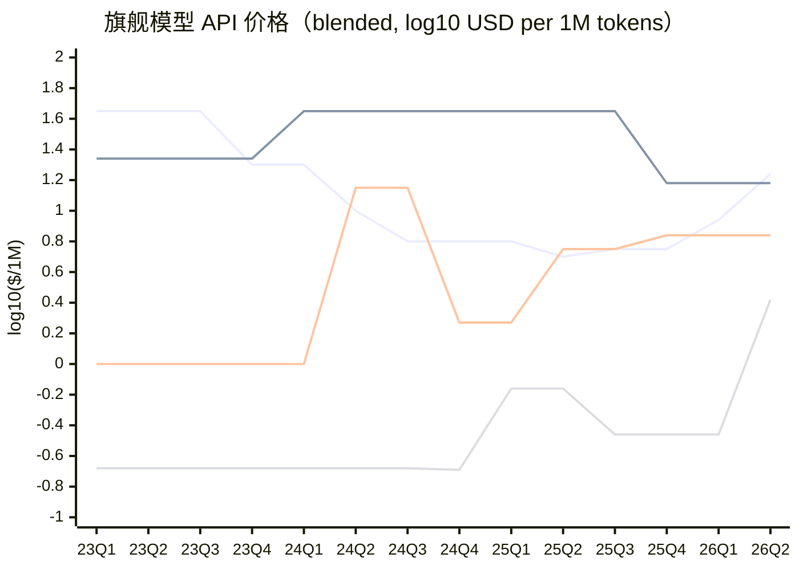
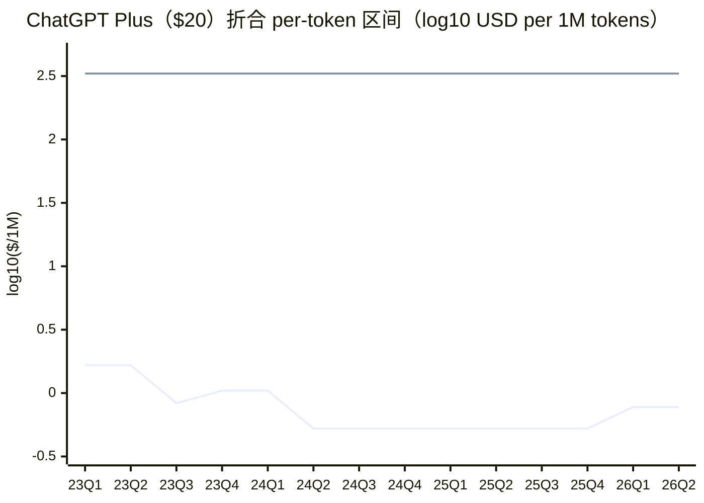

# AI 价格对比：旗舰 API 与套餐折合 per-token（2023–2026）

把两类价格归一到同一根轴 —— **USD / 1M tokens（blended，输入输出均值）**，取 log10，
便于跨品牌横向、跨时间纵向比较。数据源 `chat/token-price.csv`，本文由 `token-price.py` 生成。

## 折算算法

- **旗舰 API blended**：每家取「通用旗舰」模型链（OpenAI 的 GPT-4→GPT-5.5、Anthropic 的 Opus 线、
  Google 的 Gemini Pro 线、DeepSeek 的 chat 线），blended =（input + output）/ 2，按季度 forward-fill
  （价格在下次变动前保持有效）。DeepSeek input 取 cache-miss。
- **套餐折合 per-token**：套餐不按 token 计费，设 **每条消息 = 2000 token**（1k 入 + 1k 出）。
  - **最低（地板，重度用户）** = 月价 ÷（把配额用满时的月 token 数）。按 /N 小时 的配额取理论满载（24×7）。
  - **最高（天花板，轻度用户）** = 月价 ÷（轻度基线 **30 条/月** 的 token 数）。
  - 区间 [最低, 最高] 夹住该套餐相对 API 逐 token 价的位置：榨满时通常比 API 便宜（被补贴），
    轻用时远贵于 API。
- **对数轴**：价格跨约三个数量级（DeepSeek ~$0.2/1M 到 GPT-4 ~$45/1M），故 Y 轴为 log10($/1M)。
  xychart-beta 无图例，线序见每图正文。

## 图1：旗舰模型 API 价格随时间变化

线序（自上而下按图例）：OpenAI / Anthropic / Google / DeepSeek。

- **OpenAI**：2023-03 起；终值（gpt-5.5）blended $17.50/1M（in $5 / out $30），log10=1.243
- **Anthropic**：2023-11 起；终值（Claude Opus 4.8）blended $15.00/1M（in $5 / out $25），log10=1.176
- **Google**：2023-12 起；终值（Gemini 3.1 Pro (<=200K)）blended $7.00/1M（in $2 / out $12），log10=0.845
- **DeepSeek**：2024-05 起；终值（DeepSeek-V4 Pro (standard)）blended $2.61/1M（in $1.74 / out $3.48），log10=0.417

## 图2：ChatGPT Plus 折合 per-token 区间

两条线：上 = max（轻度天花板），下 = min（榨满地板）。Plus 月价始终 $20，故天花板恒为
$333/1M（轻度用户严重溢价）；地板随配额放宽而下探，榨满时一度低至
$0.52/1M（比同期旗舰 API 更便宜，即套餐补贴）。

## 套餐折合 per-token 对照表

每条消息按 2000 token 折算；月配额为理论满载；下限=榨满，上限=轻度（30 条/月）。

| 生效 | 套餐 | 月价 | 月配额(消息) | 折合下限 $/1M | 折合上限 $/1M |
|---|---|---|---|---|---|
| 2023-03 | ChatGPT Plus (GPT-4) | $20 | 6,000 | $1.67 | $333 |
| 2023-07 | ChatGPT Plus (GPT-4) | $20 | 12,000 | $0.83 | $333 |
| 2023-11 | ChatGPT Plus (GPT-4) | $20 | 9,600 | $1.04 | $333 |
| 2024-05 | ChatGPT Plus (GPT-4o) | $20 | 19,200 | $0.52 | $333 |
| 2024-09 | ChatGPT Plus (o1-preview) | $20 | 214 | $46.67 | $333 |
| 2025-01 | ChatGPT Plus (o3-mini) | $20 | 643 | $15.56 | $333 |
| 2025-02 | ChatGPT Plus (o3-mini-high/GPT-4.5) | $20 | 1,500 | $6.67 | $333 |
| 2025-04 | ChatGPT Plus (new limits) | $20 | 429 | $23.33 | $333 |
| 2025-08 | ChatGPT Plus (GPT-5 era) | $20 | 19,200 | $0.52 | $333 |
| 2026-03 | ChatGPT Plus (2026) | $20 | 12,857 | $0.78 | $333 |
| 2025-07 | ChatGPT Agent | $20 | 400 | $25.00 | $333 |
| 2023-09 | Claude Pro | $20 | 9,000 | $1.11 | $333 |

**不可折算的套餐**（配额为「无限」或相对量）：ChatGPT Pro $200、Claude Max 5x/20x（$100/$200）、
Cursor Ultra $200 等标称无限或「N× Pro」，地板随用量趋近于 0、无固定上限，故不入表。
示意：$200 套餐若月推 50M token → $4/1M；月推 200M → $1/1M —— 完全取决于用量。

## 旗舰 API 数据明细（blended 来源）

| 品牌 | 生效 | 模型 | 输入 $/1M | 输出 $/1M | blended $/1M |
|---|---|---|---|---|---|
| OpenAI | 2023-03 | gpt-4 (8K) | 30 | 60 | 45.00 |
| OpenAI | 2023-11 | gpt-4-turbo (1106-preview) | 10 | 30 | 20.00 |
| OpenAI | 2024-05 | gpt-4o-2024-05-13 | 5 | 15 | 10.00 |
| OpenAI | 2024-08 | gpt-4o-2024-08-06 | 2.5 | 10 | 6.25 |
| OpenAI | 2025-04 | gpt-4.1 | 2 | 8 | 5.00 |
| OpenAI | 2025-08 | gpt-5 | 1.25 | 10 | 5.62 |
| OpenAI | 2026-03 | gpt-5.4 | 2.5 | 15 | 8.75 |
| OpenAI | 2026-04 | gpt-5.5 | 5 | 30 | 17.50 |
| Anthropic | 2023-11 | Claude 2.1 | 11.02 | 32.68 | 21.85 |
| Anthropic | 2024-03 | Claude 3 Opus | 15 | 75 | 45.00 |
| Anthropic | 2025-05 | Claude Opus 4 | 15 | 75 | 45.00 |
| Anthropic | 2025-08 | Claude Opus 4.1 | 15 | 75 | 45.00 |
| Anthropic | 2025-11 | Claude Opus 4.5 | 5 | 25 | 15.00 |
| Anthropic | 2026-03 | Claude Opus 4.6 | 5 | 25 | 15.00 |
| Anthropic | 2026-04 | Claude Opus 4.7 | 5 | 25 | 15.00 |
| Anthropic | 2026-05 | Claude Opus 4.8 | 5 | 25 | 15.00 |
| Google | 2023-12 | Gemini 1.0 Pro | 0.5 | 1.5 | 1.00 |
| Google | 2024-05 | Gemini 1.5 Pro (<=128K) | 7 | 21 | 14.00 |
| Google | 2024-10 | Gemini 1.5 Pro (<=128K cut) | 1.25 | 2.5 | 1.88 |
| Google | 2025-06 | Gemini 2.5 Pro (<=200K) | 1.25 | 10 | 5.62 |
| Google | 2025-12 | Gemini 3.1 Pro (<=200K) | 2 | 12 | 7.00 |
| DeepSeek | 2024-05 | DeepSeek-V2 (deepseek-chat) | 0.14 | 0.28 | 0.21 |
| DeepSeek | 2024-08 | deepseek-chat V2 + context caching | 0.14 | 0.28 | 0.21 |
| DeepSeek | 2024-12 | DeepSeek-V3 (promo) | 0.14 | 0.27 | 0.21 |
| DeepSeek | 2025-02 | DeepSeek-V3 (standard) | 0.27 | 1.1 | 0.69 |
| DeepSeek | 2025-09 | DeepSeek-V3.1 (unified) | 0.56 | 1.68 | 1.12 |
| DeepSeek | 2025-09 | DeepSeek-V3.2-Exp | 0.28 | 0.42 | 0.35 |
| DeepSeek | 2026-04 | DeepSeek-V4 Pro (promo 75% off) | 0.435 | 0.87 | 0.65 |
| DeepSeek | 2026-06 | DeepSeek-V4 Pro (standard) | 1.74 | 3.48 | 2.61 |

## 假设与局限

- **每条消息 2000 token、轻度基线 30 条/月** 是折算口径，非厂商口径；
  改这两个常数会整体平移套餐曲线，但不改变品牌间相对关系（横向比较稳健）。
- **/N 小时配额按 24×7 满载折算**，是理论地板，真实重度用户达不到；用于界定区间下界。
- 套餐配额取自 CSV `usage_limit`，多为 Reddit 实测的某一时点观察（OpenAI 多次静默改配额），
  非厂商公布的稳定值；详见 CSV 中标 FLAG 的行。
- 旗舰链为「通用旗舰」判断：刻意排除一次性高价款（gpt-4.5-preview $75/$150）与推理专用款
  （o 系列、DeepSeek-R1），以保持各家可比的主力对话模型曲线。
- forward-fill 在模型未更新期间保持上次价格；各家曲线仅在其首个数据点之后有意义
  （季前为 pad 的平线）。
