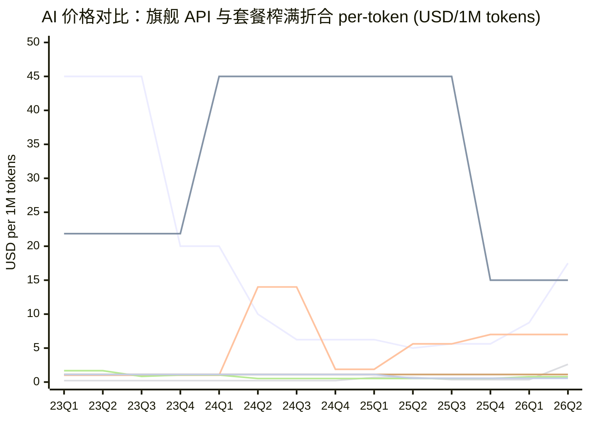

# AI 价格对比：旗舰 API 与套餐榨满折合 per-token（2023–2026）

各家旗舰 API 价、各家套餐「最高/最低折合 per-token」全部画在同一张图、同一根轴
（USD per 1M tokens，线性），便于横向（跨品牌）与纵向（跨时间）比较。
数据源 `chat/token-price.csv`，本文由 `token-price.py` 生成。

## 折算口径

- **旗舰 API blended** =（input + output）/ 2，按季度 forward-fill（价格在下次变动前有效）。
  DeepSeek input 取 cache-miss。旗舰链刻意排除一次性高价款（gpt-4.5-preview）与推理专用款（o 系列 / R1）。
- **套餐折合 per-token**：只看「把用量上限榨满」，不区分轻重用户。套餐不按 token 计费，
  故设 **每条消息 = 2000 token**（1k 入 + 1k 出）。折合 = 月价 ÷（月配额 × 每消息 token）。
  - **最高折合 = 最便宜的套餐榨满**（折扣率低、单价高）。
  - **最低折合 = 最贵的套餐榨满**（批量折扣大、单价低）。
  - 相对配额（如「20x Pro」）= 倍数 × Pro 的 token 配额。/N 小时 配额按理论满载（24×7）折算。

## 对比图

线序（颜色按此顺序）：

1. **OpenAI API** — 终值 $17.50/1M
2. **Anthropic API** — 终值 $15.00/1M
3. **Google API** — 终值 $7.00/1M
4. **DeepSeek API** — 终值 $2.61/1M
5. **OpenAI 套餐 Plus 榨满** — 终值 $0.78/1M
6. **Anthropic 套餐最高 (Pro 榨满)** — 终值 $1.11/1M
7. **Anthropic 套餐最低 (Max20x 榨满)** — 终值 $0.56/1M

## 套餐榨满折合明细

| 品牌 | 生效 | 套餐 | 月价 | 榨满折合 $/1M |
|---|---|---|---|---|
| OpenAI | 2023-03 | ChatGPT Plus | $20 | 1.67 |
| OpenAI | 2023-07 | ChatGPT Plus | $20 | 0.83 |
| OpenAI | 2023-11 | ChatGPT Plus | $20 | 1.04 |
| OpenAI | 2024-05 | ChatGPT Plus | $20 | 0.52 |
| OpenAI | 2025-08 | ChatGPT Plus | $20 | 0.52 |
| OpenAI | 2026-03 | ChatGPT Plus | $20 | 0.78 |
| Anthropic | 2023-09 | Claude Pro | $20 | 1.11 |
| Anthropic | 2025-04 | Claude Max 5x | $100 | 1.11 |
| Anthropic | 2025-04 | Claude Max 20x | $200 | 0.56 |

Anthropic 关系：Max 5x 折合 = Pro 折合（$100/5x = $20/1x）；Max 20x 折合 = Pro 的一半
（$200/20x = $10/1x），故 20x 是各家可量化套餐里 per-token 最低的。

## 旗舰 API 数据明细（blended 来源）

| 品牌 | 生效 | 模型 | 输入 $/1M | 输出 $/1M | blended $/1M |
|---|---|---|---|---|---|
| OpenAI | 2023-03 | gpt-4 (8K) | 30 | 60 | 45.00 |
| OpenAI | 2023-11 | gpt-4-turbo (1106-preview) | 10 | 30 | 20.00 |
| OpenAI | 2024-05 | gpt-4o-2024-05-13 | 5 | 15 | 10.00 |
| OpenAI | 2024-08 | gpt-4o-2024-08-06 | 2.5 | 10 | 6.25 |
| OpenAI | 2025-04 | gpt-4.1 | 2 | 8 | 5.00 |
| OpenAI | 2025-08 | gpt-5 | 1.25 | 10 | 5.62 |
| OpenAI | 2026-03 | gpt-5.4 | 2.5 | 15 | 8.75 |
| OpenAI | 2026-04 | gpt-5.5 | 5 | 30 | 17.50 |
| Anthropic | 2023-11 | Claude 2.1 | 11.02 | 32.68 | 21.85 |
| Anthropic | 2024-03 | Claude 3 Opus | 15 | 75 | 45.00 |
| Anthropic | 2025-05 | Claude Opus 4 | 15 | 75 | 45.00 |
| Anthropic | 2025-08 | Claude Opus 4.1 | 15 | 75 | 45.00 |
| Anthropic | 2025-11 | Claude Opus 4.5 | 5 | 25 | 15.00 |
| Anthropic | 2026-03 | Claude Opus 4.6 | 5 | 25 | 15.00 |
| Anthropic | 2026-04 | Claude Opus 4.7 | 5 | 25 | 15.00 |
| Anthropic | 2026-05 | Claude Opus 4.8 | 5 | 25 | 15.00 |
| Google | 2023-12 | Gemini 1.0 Pro | 0.5 | 1.5 | 1.00 |
| Google | 2024-05 | Gemini 1.5 Pro (<=128K) | 7 | 21 | 14.00 |
| Google | 2024-10 | Gemini 1.5 Pro (<=128K cut) | 1.25 | 2.5 | 1.88 |
| Google | 2025-06 | Gemini 2.5 Pro (<=200K) | 1.25 | 10 | 5.62 |
| Google | 2025-12 | Gemini 3.1 Pro (<=200K) | 2 | 12 | 7.00 |
| DeepSeek | 2024-05 | DeepSeek-V2 (deepseek-chat) | 0.14 | 0.28 | 0.21 |
| DeepSeek | 2024-08 | deepseek-chat V2 + context caching | 0.14 | 0.28 | 0.21 |
| DeepSeek | 2024-12 | DeepSeek-V3 (promo) | 0.14 | 0.27 | 0.21 |
| DeepSeek | 2025-02 | DeepSeek-V3 (standard) | 0.27 | 1.1 | 0.69 |
| DeepSeek | 2025-09 | DeepSeek-V3.1 (unified) | 0.56 | 1.68 | 1.12 |
| DeepSeek | 2025-09 | DeepSeek-V3.2-Exp | 0.28 | 0.42 | 0.35 |
| DeepSeek | 2026-04 | DeepSeek-V4 Pro (promo 75% off) | 0.435 | 0.87 | 0.65 |
| DeepSeek | 2026-06 | DeepSeek-V4 Pro (standard) | 1.74 | 3.48 | 2.61 |

## 假设与局限

- **每条消息 2000 token** 是折算口径，非厂商口径；改它会整体平移套餐线，
  但不改品牌间相对关系。
- **可量化套餐有限**：OpenAI 只有 Plus（$20）配额可量化，Pro（$200）标称无限无法榨满，
  故 OpenAI 只有一条套餐线（最高=最低）。Anthropic 借「N× Pro」相对配额得到 Pro→Max20x 的高低区间。
  Google（Advanced/Ultra 无数字配额）、DeepSeek（免费无付费档）、Cursor（按量透传 ≈ API 价）
  无法独立折算，未入图。
- 套餐配额取自 CSV `usage_limit`，多为 Reddit 实测的某一时点观察（OpenAI 多次静默改配额），
  Claude Pro 后期叠加的周限未量化；详见 CSV 中标 FLAG 的行。
- forward-fill 在未更新期间保持上次值；各家线仅在其首个数据点后有意义（季前为 pad 平线）。
- Y 轴线性、单位 USD/1M：早期旗舰 API（GPT-4 / Opus $45）拉高量程，近年低价区（套餐榨满
  $0.5–1.7、DeepSeek API $0.2–2.6）会挤在底部——这本身即结论：套餐榨满的 per-token 远低于
  同期旗舰 API 列表价（即套餐补贴），而 DeepSeek API 又低于所有人。
